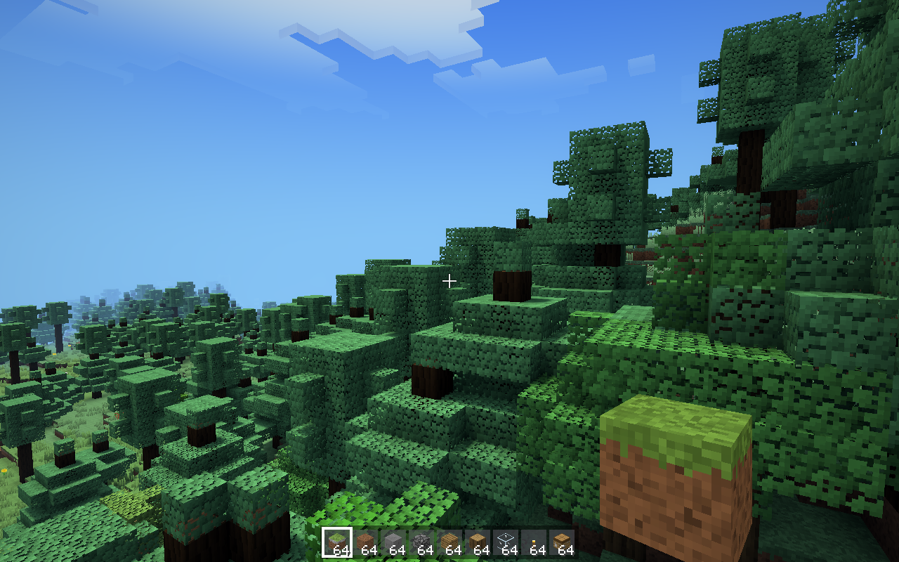
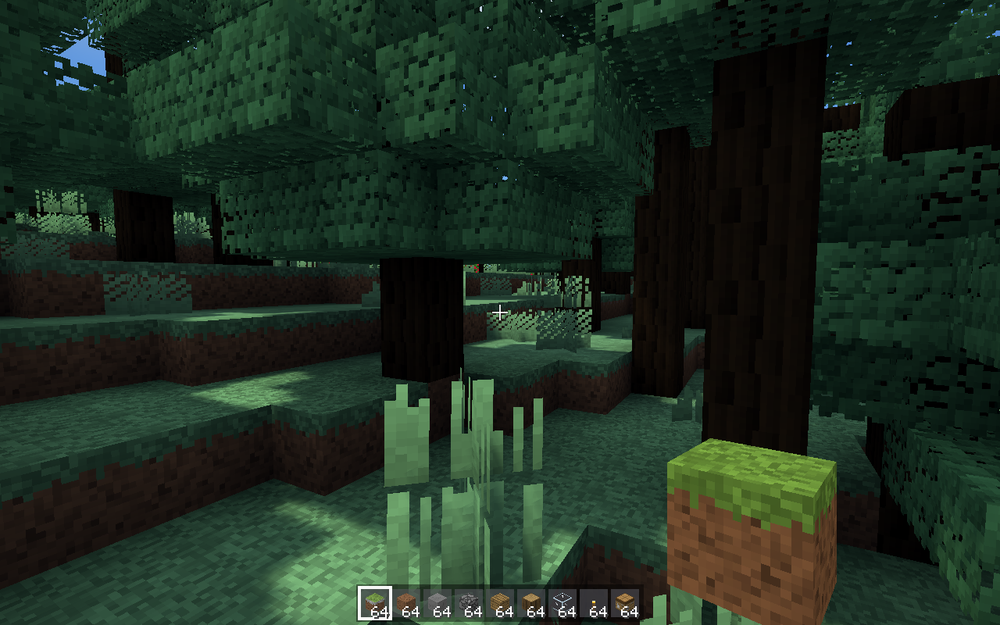
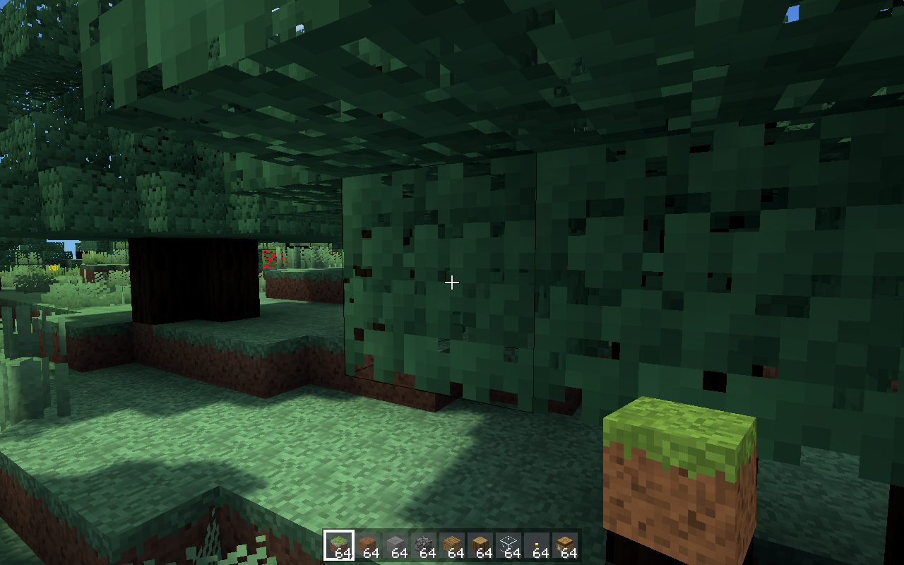
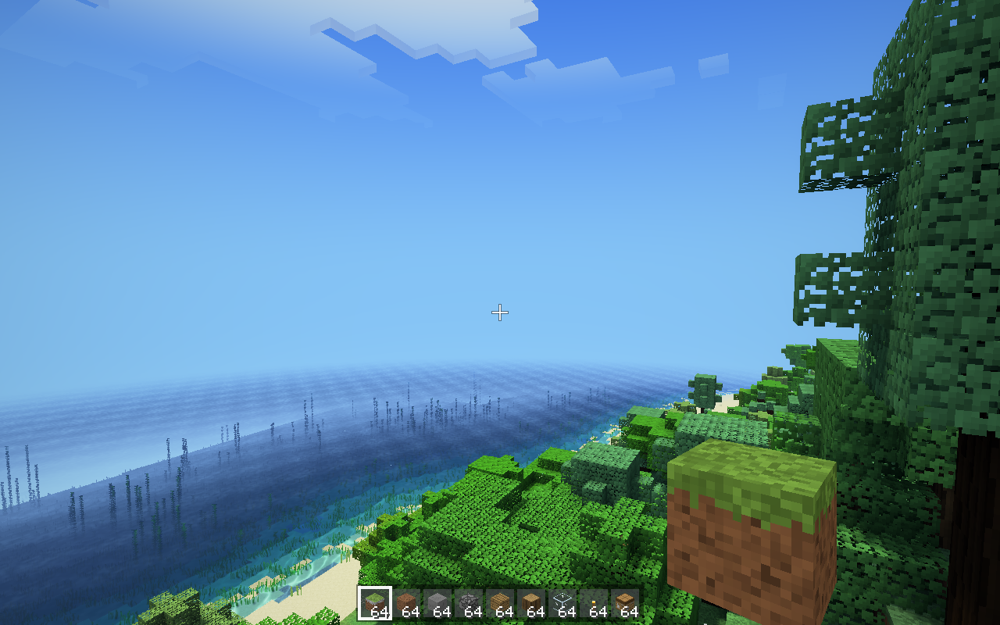
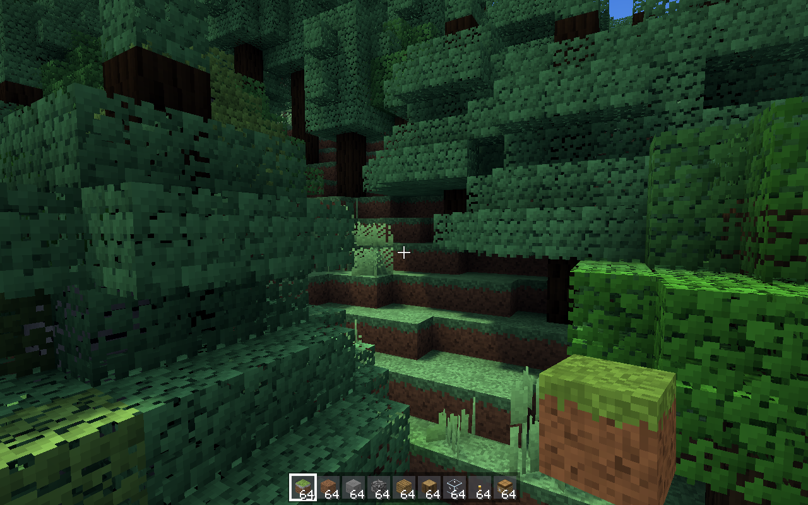

# Blocksmith CI snapshots

Commit `bd4a908e79c9ee7b7c93c0e7af810fc09421d51f` on `claude/serene-bardeen-tu35re` — build: **success**, benchmarks: **failure**, snapshots: **failure**

Run: https://github.com/remingtonangus-lang/blocksmith/actions/runs/36923469095

```
memory: resident 181 MB  (section meshes 32 MB)
wrote snaps/vehicle_hud.png
textures without a painter: missing
light probe: eye sky 15 block 0 in air; floor+1 (y 93) sky 15 block 0 in air, daylight 1.0
seed 12345  pos 8.5 157.0 8.5  rd 8  chunks 297  (drawn 75)
gen 166 ms  mesh(all, parallel) 223 ms  mesh(1 section) 0.65 ms  quads 996045 opaque / 49989 water
frame (encode+GPU, offscreen, median of 30) 8.31 ms  biome forest
mesh slabs 36 MB, chunks 297 (block+light arrays 28 MB), Metal allocated 146 MB
memory: resident 210 MB  (section meshes 32 MB)
wrote snaps/tv_map.png
textures without a painter: missing
light probe: eye sky 15 block 0 in air; floor+1 (y 93) sky 15 block 0 in air, daylight 1.0
seed 12345  pos 8.5 157.0 8.5  rd 8  chunks 297  (drawn 71)
gen 169 ms  mesh(all, parallel) 221 ms  mesh(1 section) 0.63 ms  quads 996045 opaque / 49989 water
frame (encode+GPU, offscreen, median of 30) 3.48 ms  biome forest
mesh slabs 36 MB, chunks 297 (block+light arrays 28 MB), Metal allocated 117 MB
memory: resident 180 MB  (section meshes 32 MB)
wrote snaps/controls_ref.png
textures without a painter: missing
light probe: eye sky 15 block 0 in air; floor+1 (y 93) sky 15 block 0 in air, daylight 1.0
seed 12345  pos 8.5 157.0 8.5  rd 8  chunks 297  (drawn 75)
gen 161 ms  mesh(all, parallel) 257 ms  mesh(1 section) 0.63 ms  quads 996045 opaque / 49989 water
frame (encode+GPU, offscreen, median of 30) 6.01 ms  biome forest
mesh slabs 36 MB, chunks 297 (block+light arrays 28 MB), Metal allocated 146 MB
memory: resident 209 MB  (section meshes 32 MB)
wrote snaps/tv_hud.png
textures without a painter: missing
light probe: eye sky 15 block 0 in air; floor+1 (y 93) sky 15 block 0 in air, daylight 1.0
seed 12345  pos 8.5 157.0 8.5  rd 8  chunks 297  (drawn 71)
gen 176 ms  mesh(all, parallel) 222 ms  mesh(1 section) 0.64 ms  quads 996045 opaque / 49989 water
frame (encode+GPU, offscreen, median of 30) 3.42 ms  biome forest
mesh slabs 36 MB, chunks 297 (block+light arrays 28 MB), Metal allocated 117 MB
memory: resident 181 MB  (section meshes 32 MB)
wrote snaps/furnace.png
textures without a painter: missing
light probe: eye sky 15 block 0 in air; floor+1 (y 93) sky 15 block 0 in air, daylight 1.0
seed 12345  pos 8.5 158.0 8.5  rd 8  chunks 297  (drawn 69)
gen 159 ms  mesh(all, parallel) 218 ms  mesh(1 section) 0.72 ms  quads 996045 opaque / 49989 water
frame (encode+GPU, offscreen, median of 30) 2.82 ms  biome forest
mesh slabs 36 MB, chunks 297 (block+light arrays 28 MB), Metal allocated 117 MB
memory: resident 182 MB  (section meshes 32 MB)
wrote snaps/drops.png
textures without a painter: missing
light probe: eye sky 15 block 0 in air; floor+1 (y 93) sky 15 block 0 in air, daylight 1.0
seed 12345  pos 8.5 157.0 8.5  rd 8  chunks 297  (drawn 71)
gen 193 ms  mesh(all, parallel) 293 ms  mesh(1 section) 0.72 ms  quads 996045 opaque / 49989 water
frame (encode+GPU, offscreen, median of 30) 3.37 ms  biome forest
mesh slabs 36 MB, chunks 297 (block+light arrays 28 MB), Metal allocated 117 MB
memory: resident 180 MB  (section meshes 32 MB)
wrote snaps/subtitles.png
textures without a painter: missing
light probe: eye sky 15 block 0 in air; floor+1 (y 93) sky 15 block 0 in air, daylight 1.0
seed 12345  pos 8.5 157.0 8.5  rd 8  chunks 297  (drawn 71)
gen 206 ms  mesh(all, parallel) 218 ms  mesh(1 section) 0.65 ms  quads 996045 opaque / 49989 water
frame (encode+GPU, offscreen, median of 30) 3.43 ms  biome forest
mesh slabs 36 MB, chunks 297 (block+light arrays 28 MB), Metal allocated 117 MB
memory: resident 181 MB  (section meshes 32 MB)
wrote snaps/survival.png
sim 12.0 s: tick avg 0.35 ms, worst 6.84 ms | pos -3.7 155.0 6.7 | health 20 hunger 20 | mobs 113 | fluid pending 942 | items held 571, dropped 4
textures without a painter: missing
light probe: eye sky 12 block 0 in air; floor+1 (y 91) sky 11 block 0 in air, daylight 1.0
seed 12345  pos 8.5 157.0 8.5  rd 8  chunks 316  (drawn 77)
gen 159 ms  mesh(all, parallel) 214 ms  mesh(1 section) 0.66 ms  quads 996045 opaque / 49989 water
frame (encode+GPU, offscreen, median of 30) 3.29 ms  biome forest
mesh slabs 40 MB, chunks 316 (block+light arrays 30 MB), Metal allocated 121 MB
memory: resident 196 MB  (section meshes 35 MB)
wrote snaps/sim.png
FAIL mountainWindLoop: silent (peak 0.000), too quiet (rms 0.0000)
FAIL snowWindLoop: silent (peak 0.000), too quiet (rms 0.0000)
  Blocks: 190 sounds
  Hostile Mobs: 197 sounds
  Friendly Mobs: 176 sounds
  Players: 127 sounds
  Ambient: 42 sounds
  Weather: 8 sounds
  Interface: 5 sounds
  wrote 32 soundscapes to build/sounds/scapes
  slowest renders: place_glass 18 ms, beaconActivate 16 ms, endPortalOpen 15 ms, hiveLoop 14 ms, endLoop 14 ms, swampInsectsLoop 13 ms
synthesized 745 sounds (659.6 s of audio) in 3108 ms, 2 failed
snap.sh: line 95: exit 1
```
### Synthesized sounds
- [*.wav](sounds/*.wav)
### aerial

### aerial16

### aerial16_424242

### aerial16_777

### aerial16_fast

### aerial24

### biome_badlands

### biome_birch_forest

### biome_cherry_grove

### biome_dark_forest

### biome_desert

### biome_jagged_peaks

### biome_jungle

### biome_mangrove_swamp

### biome_savanna

### biome_swamp

### biome_taiga

### biome_warm_ocean

### bugnotes

### clouds

### controls_ref

### crack

### crafting

### creative

### down

### drops

### forest

### forest_in

### furnace

### ground16

### ground16_fast

### inventory

### inventory_pad

### lake

### lake_glint

### meadow

### night

### ocean_night_777

### ocean_night_777_fast

### padmap

### padtest

### physicstest

### relief_1

### relief_12345

### relief_424242

### relief_777

### relief_98765

### ship_airship

### ship_boat

### ship_car

### ship_carriage

### ship_deck

### ship_frigate

### ship_gunboat

### ship_plane

### shore

### sim

### snowy

### spawn

### stars

### subtitles

### sunset

### sunset_fast

### sunset_sun

### survival

### terrain_1

### terrain_12345

### terrain_424242

### terrain_777

### terrain_98765

### torches

### torches_day

### torches_near

### tour_12345_aerial

### tour_12345_ground

### tour_1_aerial

### tour_1_ground

### tour_424242_aerial

### tour_424242_ground

### tour_777_aerial

### tour_777_ground

### tour_98765_aerial

### tour_98765_ground

### tour_coast

### tour_mesa

### tour_peaks

### tour_river

### tour_river_777

### tour_snowline

### tv_combat

### tv_confirm

### tv_hud

### tv_keyboard

### tv_map

### tv_options

### tv_title

### tv_worlds

### underwater

### underwater_up

### vehicle_hud

### water_flow

