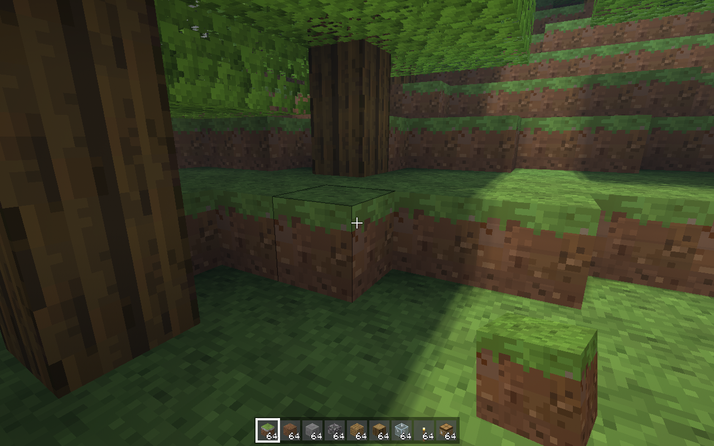

# Blocksmith fast lane

Commit `50286b677609780a48e44e9b6508ec4fae845e15` on `claude/project-thread-27glmf`: build **success**, snapshot **success**

Run: https://github.com/remingtonangus-lang/blocksmith/actions/runs/38056189768

### Build errors
```
```
### Type-check (warnings, slowest first)
```
5561 Sources/PlaytestPM9BTests.swift:94
5406 Sources/PlaytestPM9BTests.swift:95
4278 Sources/Mob.swift:448
3420 Sources/Mob.swift:448
2306 Sources/InputMatrix.swift:83
1529 Sources/AshSites.swift:127
767 Sources/main.swift:1388
730 Sources/main.swift:1388
604 Sources/CapitalShips.swift:1304
596 Sources/CapitalShips.swift:1304
593 Sources/CapitalShips.swift:1309
592 Sources/CapitalShips.swift:1309
370 Sources/Cinematic.swift:141
364 Sources/CapitalBases.swift:288
352 Sources/Cinematic.swift:141
346 Sources/BaseTests.swift:107
344 Sources/BaseTests.swift:107
338 Sources/main.swift:1388
275 Sources/ShipCombat.swift:135
252 Sources/Cinematic.swift:141
227 Sources/CapitalBasesWork.swift:251
226 Sources/BaseTests.swift:107
220 Sources/TexturesHD.swift:3990
208 Sources/main.swift:1359
207 Sources/CapitalBasesWork.swift:251
195 Sources/main.swift:1483
195 Sources/TexturesHD.swift:2749
193 Sources/Mesher.swift:95
189 Sources/CapitalBasesWork.swift:251
185 Sources/FlightModel.swift:113
184 Sources/GameCircuit.swift:262
181 Sources/GameCircuit.swift:262
173 Sources/GameCircuit.swift:262
170 Sources/Ships.swift:110
165 Sources/AshSites.swift:64
164 Sources/TerrainTools.swift:81
155 Sources/Banners.swift:215
```
### Snapshot
```
posecheck: 568 raised limbs checked, 0 failed
textures: 1721 layers at 16 px, BC3, 0.6 MB with mips (build 979 ms, upload 503 ms)
light probe: eye sky 15 block 0 in air; floor+1 (y 72) sky 15 block 0 in air, daylight 1.0
imagecheck fast.png magenta=0.00000 black=0.0000 white=0.0008 std=29.3 hash=bfaecea078e1823d
imagecheck fast.png magenta=0.00000 black=0.0000 white=0.0008 std=29.3 hash=bfaecea078e1823d
seed 12345  pos 31.5 136.0 29.5  rd 4  chunks 109  (drawn 29)
gen 9856 ms  mesh(all, parallel) 19318 ms  mesh(1 section) 103.01 ms  quads 313011 opaque / 479 water
frame (encode+GPU, offscreen, median of 30) 9.14 ms  biome forest
mesh slabs 12 MB, chunks 109 (block+light arrays 10 MB), Metal allocated 113 MB
memory: resident 152 MB  (section meshes 10 MB)
wrote snaps/fast.png
imagecheck: 1 frames, no flags
```

