# Blocksmith CI snapshots (heavy lane)

Commit `d876ec33994d439dab95679521eda2764f2fd293` on `claude/bs-destruction`: build **success**, heavy jobs **failure**
- checks: success
- perf: success
- play: success
- shots: success
- smoke: success
- tours: failure

Run: https://github.com/remingtonangus-lang/blocksmith/actions/runs/37304754050

```
textures without a painter: missing
textures: 1680 layers at 128 px, BC3, 35.0 MB with mips (build 806 ms, upload 271 ms)
light probe: eye sky 15 block 6 in air; floor+1 (y 69) sky 15 block 8 in bush, daylight 1.0
imagecheck agent_door_777.png magenta=0.00000 black=0.0000 white=0.0008 std=48.9 hash=37da6e2bf39a6da5
imagecheck agent_door_777.png magenta=0.00000 black=0.0000 white=0.0008 std=48.9 hash=37da6e2bf39a6da5
seed 777  pos 959.5 138.0 272.5  rd 8  chunks 297  (drawn 82)
gen 247 ms  mesh(all, parallel) 242 ms  mesh(1 section) 1.16 ms  quads 779989 opaque / 11900 water
frame (encode+GPU, offscreen, median of 30) 5.88 ms  biome plains
mesh slabs 28 MB, chunks 297 (block+light arrays 26 MB), Metal allocated 178 MB
memory: resident 234 MB  (section meshes 24 MB)
wrote snaps/agent_door_777.png
naming audit: 5947 names, 0 flagged
selftest: 1000 blocks, 99 mob kinds, 4/4 special recipes, bundle fill 32/64, 83 advancements
selftest ok: 179 mobs after 3 s
textures without a painter: missing
textures: 1680 layers at 128 px, BC3, 35.0 MB with mips (build 987 ms, upload 300 ms)
light probe: eye sky 15 block 0 in air; floor+1 (y 70) sky 15 block 0 in air, daylight 1.0
imagecheck selftest.png magenta=0.00000 black=0.0002 white=0.0561 std=62.0 hash=81d19b5d440c24d4
imagecheck selftest.png magenta=0.00000 black=0.0002 white=0.0561 std=62.0 hash=81d19b5d440c24d4
seed 12345  pos -87.5 135.0 104.5  rd 8  chunks 297  (drawn 78)
gen 258 ms  mesh(all, parallel) 198 ms  mesh(1 section) 0.28 ms  quads 794205 opaque / 16674 water
frame (encode+GPU, offscreen, median of 30) 7.68 ms  biome plains
mesh slabs 32 MB, chunks 297 (block+light arrays 26 MB), Metal allocated 182 MB
memory: resident 241 MB  (section meshes 25 MB)
wrote snaps/selftest.png
structure village at 14 129 -322 (38 pieces, framed)
textures without a painter: missing
textures: 1680 layers at 128 px, BC3, 35.0 MB with mips (build 933 ms, upload 319 ms)
light probe: eye sky 15 block 0 in air; floor+1 (y 136) sky 15 block 0 in air, daylight 1.0
imagecheck flicker_village.png magenta=0.00000 black=0.0000 white=0.0008 std=56.3 hash=bb95016e74aca586 flicker=0.00021
imagecheck flicker_village.png magenta=0.00000 black=0.0000 white=0.0008 std=56.3 hash=bb95016e74aca586 flicker=0.00021
seed 12345  pos -24.8 218.4 -355.8  rd 8  chunks 297  (drawn 80)
gen 313 ms  mesh(all, parallel) 444 ms  mesh(1 section) 0.82 ms  quads 1632459 opaque / 12810 water
frame (encode+GPU, offscreen, median of 30) 9.32 ms  biome taiga
mesh slabs 56 MB, chunks 297 (block+light arrays 37 MB), Metal allocated 206 MB
memory: resident 273 MB  (section meshes 50 MB)
wrote snaps/flicker_village.png
textures without a painter: missing
textures: 1680 layers at 128 px, BC3, 35.0 MB with mips (build 970 ms, upload 325 ms)
light probe: eye sky 15 block 0 in air; floor+1 (y 87) sky 15 block 0 in air, daylight 1.0
imagecheck flicker_forest.png magenta=0.00000 black=0.0000 white=0.0008 std=53.1 hash=d22bfd38a7d832e7 flicker=0.00002
imagecheck flicker_forest.png magenta=0.00000 black=0.0000 white=0.0008 std=53.1 hash=d22bfd38a7d832e7 flicker=0.00002
seed 12345  pos -135.5 173.0 -39.5  rd 8  chunks 297  (drawn 79)
gen 292 ms  mesh(all, parallel) 296 ms  mesh(1 section) 0.95 ms  quads 1136052 opaque / 9408 water
frame (encode+GPU, offscreen, median of 30) 7.05 ms  biome forest
mesh slabs 40 MB, chunks 297 (block+light arrays 29 MB), Metal allocated 178 MB
memory: resident 238 MB  (section meshes 35 MB)
wrote snaps/flicker_forest.png
textures without a painter: missing
textures: 1680 layers at 128 px, BC3, 35.0 MB with mips (build 861 ms, upload 278 ms)
light probe: eye sky 15 block 6 in air; floor+1 (y 70) sky 15 block 0 in air, daylight 1.0
imagecheck flicker_build.png magenta=0.00000 black=0.0000 white=0.0012 std=40.0 hash=c13f54a8dbf88b03 flicker=0.00020
imagecheck flicker_build.png magenta=0.00000 black=0.0000 white=0.0012 std=40.0 hash=c13f54a8dbf88b03 flicker=0.00020
seed 12345  pos -87.5 140.0 104.5  rd 8  chunks 297  (drawn 75)
gen 299 ms  mesh(all, parallel) 232 ms  mesh(1 section) 0.28 ms  quads 794418 opaque / 16674 water
frame (encode+GPU, offscreen, median of 30) 5.59 ms  biome plains
mesh slabs 28 MB, chunks 297 (block+light arrays 26 MB), Metal allocated 166 MB
memory: resident 234 MB  (section meshes 25 MB)
wrote snaps/flicker_build.png
imagecheck: 199 frames, duplicate_frame 1
```
### Benchmarks (vs perf/baseline.json)
```
bench: device Apple Paravirtual device, 3 cores, seed 12345
bench: calibration 1.44 ms (min 1.40, max 1.60) [0]
bench: gen starts
bench gen: structure starts for the sample (cold) 0.53 ms/chunk
bench gen slow chunk -80,-25: 4.5 ms (plants 1.6, caves 1.2, ores 0.7; starts 0.0, place 0.2)
bench gen slow chunk 32,-17: 2.6 ms (caves 1.3, columns 0.4, stone 0.4; starts 0.0, place 0.1)
bench gen slow chunk 46,9: 2.5 ms (caves 1.0, columns 0.3, ores 0.2; starts 0.0, place 0.7)
bench gen phases (ms/chunk): columns 0.25, stone 0.14, surface 0.03, caves 0.81, ores 0.24, trees 0.05, plants 0.15, starts 0.01, structures 0.05
bench gen structure starts (ms over 24 chunks): village 5.4, pillager_outpost 2.9, mineshaft 2.0, fossil 0.9, military_base 0.7, shipwreck 0.7, ocean_ruin 0.6, desert_well 0.5
bench gen: stone-fill interpolation vs Lattice.sample: 0 mismatching samples (must be 0)
bench gen: 1.81 ms/chunk (p95 2.57, max 4.49) single-thread | 1929 chunks/s parallel
bench: gen took 0.5 s (live worlds 0, games 0)
bench: mesh starts
bench mesh: 2.21 ms/chunk (24 sections, 91 non-empty), section mean 92 us p95 464 us max 638 us, 4652 quads/chunk
bench mesh_lod1: 1.92 ms/chunk (24 sections, 47 non-empty), section mean 80 us p95 388 us max 480 us, 1251 quads/chunk
bench: mesh took 0.5 s (live worlds 0, games 0)
bench: startup starts
bench startup: world+game init 5 ms, first load (r 4) 159 ms, renderer 1974 ms (textures 824 ms, shaders 0 ms), fill rd 12 3.21 s
bench: startup took 7.4 s (live worlds 0, games 0)
bench: frame starts
bench frame 800p rd 16: encode p50 0.78 ms, GPU p50 2.68 ms (max 3.51), 260 chunks drawn
bench frame 1080p rd 16: encode p50 0.82 ms, GPU p50 3.25 ms (max 4.16), 277 chunks drawn
bench frame 4k rd 16: encode p50 0.80 ms, GPU p50 4.58 ms (max 5.60), 277 chunks drawn
bench frame: 575 visible sections, 951 draw calls, 188k quads
bench: frame took 3.8 s (live worlds 1, games 0)
bench: edit starts
bench edit: break mean 0.59 ms max 0.71 ms, place mean 0.59 ms max 0.69 ms (synchronous remesh)
bench: edit took 0.7 s (live worlds 1, games 0)
bench: mobs starts
bench mobs: tick 0.25 ms empty, 0.94 ms with 150 mobs (p95 2.56, max 5.77), 207 alive
bench: mobs took 0.8 s (live worlds 1, games 0)
bench: save starts
bench save: 145 chunks, save 1.09 ms/chunk (main thread 2.6 ms total, unchanged re-save 1.0 ms), load 0.19 ms/chunk (145 ok), 5.0 KB/chunk
bench: save took 0.8 s (live worlds 1, games 0)
bench: tnt starts
bench tnt: blast mean 1.71 ms max 1.87 ms (main thread) | re-mesh done in 0.08 s, tick p95 13.73 max 13.73 ms
bench: tnt took 0.7 s (live worlds 2, games 0)
bench: fluids starts
bench fluids: tick p50 0.40 p95 1.65 max 4.78 ms, 3532 sections re-meshed in 6 s, 1629 cells still pending
bench: fluids took 6.6 s (live worlds 2, games 0)
bench: ships starts
bench ships: edit remesh 3.08 ms, blast 2.44 ms + remesh 4.16 ms (3027 blocks left, 1 pieces split off)
bench ships: drawing two vessels at 1080p adds 0.14 ms encode, 0.49 ms GPU (66 draw calls)
bench ships: docked 3066 blocks in 15.25 ms (world remesh 0.02 s), assembled 3027 in 15.74 ms
bench ships: frigate 3027 blocks spawn 1.08 ms, mesh 2.16 ms; tick 0.47 ms (p95 1.17), physics 0.16 ms; collide 2.43 us near ships, 0.56 us far; 13 ships
bench: ships took 2.4 s (live worlds 2, games 0)
bench: worlds still alive after the scenes: 2
bench: live world: jobs 0, queue ops 0, gen in flight 0, results 0/0, chunks 997
bench: live world: jobs 0, queue ops 0, gen in flight 0, results 0/0, chunks 193
bench: wrote 105 metrics to snaps/bench_part_0.json
bench: device Apple Paravirtual device, 3 cores, seed 12345
bench: flight8 starts
bench flight8: frame p50 2.71 p95 5.79 p99 11.86 max 33.53 ms, 3 hitches >25 ms | tick p95 1.91 (update p95 0.66, max 8.41) encode p95 1.97 GPU p95 4.78 ms
bench flight8: coverage min 92% mean 99% | gen 24 chunks/s (2.9 ms each on a worker) mesh 597 sections/s (225 us each) | realtime 1.00x
bench flight8: 328 chunks, chunk data 34 MB, meshes 35 MB (slabs 48 MB), resident peak 200 MB, preload 444 ms
bench: flight8 took 14.3 s (live worlds 0, games 0)
bench: worlds still alive after the scenes: 0
bench: wrote 36 metrics to snaps/bench_part_flight8.json
bench: device Apple Paravirtual device, 3 cores, seed 12345
bench: flight16 starts
bench flight16: frame p50 4.25 p95 6.83 p99 10.38 max 20.72 ms, 0 hitches >25 ms | tick p95 3.07 (update p95 1.24, max 5.53) encode p95 3.57 GPU p95 5.30 ms
bench flight16: coverage min 96% mean 99% | gen 44 chunks/s (2.4 ms each on a worker) mesh 2369 sections/s (178 us each) | realtime 1.00x
bench flight16: 1056 chunks, chunk data 113 MB, meshes 75 MB (slabs 92 MB), resident peak 343 MB, preload 1855 ms
bench: flight16 took 15.9 s (live worlds 0, games 0)
bench: worlds still alive after the scenes: 0
bench: wrote 36 metrics to snaps/bench_part_flight16.json
bench: device Apple Paravirtual device, 3 cores, seed 12345
bench: flight24 starts
bench flight24: frame p50 6.95 p95 10.75 p99 17.10 max 27.35 ms, 1 hitches >25 ms | tick p95 5.20 (update p95 2.20, max 7.29) encode p95 6.01 GPU p95 9.27 ms
bench flight24: coverage min 96% mean 99% | gen 64 chunks/s (2.6 ms each on a worker) mesh 3718 sections/s (199 us each) | realtime 1.00x
bench flight24: 2176 chunks, chunk data 239 MB, meshes 128 MB (slabs 152 MB), resident peak 576 MB, preload 4467 ms
bench: flight24 took 18.4 s (live worlds 0, games 0)
bench: worlds still alive after the scenes: 0
bench: wrote 36 metrics to snaps/bench_part_flight24.json
bench: merged 207 metrics into snaps/bench.json
```
| metric | baseline | now | worse by |
|---|---|---|---|
| edit.break_ms_max | 0.6 | 0.711 | 1.19x |
| edit.break_ms_mean | 0.447 | 0.593 | 1.33x ⚠️ worse |
| edit.break_ms_p50 | 0.595 | 0.586 | 0.98x |
| edit.place_ms_max | 0.732 | 0.686 | 0.94x |
| edit.place_ms_mean | 0.455 | 0.592 | 1.30x ⚠️ worse |
| edit.place_ms_p50 | 0.595 | 0.587 | 0.99x |
| flight16.arena_free_mb | 0.864 | 3.956 | 4.58x ⚠️ worse |
| flight16.chunk_mb | 103.906 | 113.141 | 1.09x |
| flight16.chunks | 1056 | 1056 | 1.00x |
| flight16.coverage_mean | 0.991 | 0.992 | 1.00x |
| flight16.coverage_min | 0.962 | 0.962 | 1.00x |
| flight16.cull_ms_p50 | 0.708 | 0.37 | 0.52x ✅ better |
| flight16.cull_ms_p95 | 1.152 | 0.984 | 0.85x |
| flight16.cull_walked_sections | 2817 | 2435 | 0.86x |
| flight16.draw_calls | 1434 | 1210 | 0.84x |
| flight16.drawn_kquads | 475.516 | 300.238 | 0.63x ✅ better |
| flight16.encode_ms_p50 | 1.494 | 1.271 | 0.85x |
| flight16.encode_ms_p95 | 2.361 | 3.574 | 1.51x ⚠️ worse |
| flight16.frame_ms_max | 12.652 | 20.716 | 1.64x ⚠️ worse |
| flight16.frame_ms_p50 | 4.807 | 4.247 | 0.88x |
| flight16.frame_ms_p95 | 5.8 | 6.83 | 1.18x |
| flight16.frame_ms_p99 | 7.443 | 10.381 | 1.39x ⚠️ worse |
| flight16.gen_chunks_per_s | 43.68 | 43.706 | 1.00x |
| flight16.gpu_ms_p50 | 4.804 | 4.152 | 0.86x |
| flight16.gpu_ms_p95 | 5.71 | 5.302 | 0.93x |
| flight16.hitches | 0 | 0 | 1.00x |
| flight16.mesh_mb | 81.28 | 75.214 | 0.93x |
| flight16.mesh_sections_per_s | 1972.83 | 2368.97 | 0.83x |
| flight16.preload_ms | 1871.23 | 1854.76 | 0.99x |
| flight16.realtime | 0.998 | 0.999 | 1.00x |
| flight16.resident_peak_mb | 285.862 | 342.534 | 1.20x |
| flight16.slab_mb | 96 | 92 | 0.96x |
| flight16.tick_ms_max | 8.551 | 17.308 | 2.02x ⚠️ worse |
| flight16.tick_ms_p50 | 0.388 | 1.181 | 3.04x ⚠️ worse |
| flight16.tick_ms_p95 | 2.08 | 3.069 | 1.48x ⚠️ worse |
| flight16.update_ms_max | 8.289 | 5.529 | 0.67x ✅ better |
| flight16.update_ms_p50 | 0.017 | 0.218 | 12.82x ⚠️ worse |
| flight16.update_ms_p95 | 1.74 | 1.243 | 0.71x ✅ better |
| flight16.worker_gen_ms | 2.022 | 2.399 | 1.19x |
| flight16.worker_mesh_us | 177.949 | 178.433 | 1.00x |
| flight24.arena_free_mb | 0.427 | 4.214 | 9.87x ⚠️ worse |
| flight24.chunk_mb | 222.438 | 239.281 | 1.08x |
| flight24.chunks | 2176 | 2176 | 1.00x |
| flight24.coverage_mean | 0.994 | 0.99 | 1.00x |
| flight24.coverage_min | 0.974 | 0.964 | 1.01x |
| flight24.cull_ms_p50 | 1.198 | 0.971 | 0.81x |
| flight24.cull_ms_p95 | 2.767 | 2.917 | 1.05x |
| flight24.cull_walked_sections | 7607 | 8001 | 1.05x |
| flight24.draw_calls | 3175 | 3021 | 0.95x |
| flight24.drawn_kquads | 821.704 | 591.253 | 0.72x ✅ better |
| flight24.encode_ms_p50 | 2.473 | 2.353 | 0.95x |
| flight24.encode_ms_p95 | 5.237 | 6.008 | 1.15x |
| flight24.frame_ms_max | 13.319 | 27.351 | 2.05x ⚠️ worse |
| flight24.frame_ms_p50 | 7.72 | 6.952 | 0.90x |
| flight24.frame_ms_p95 | 9.472 | 10.75 | 1.13x |
| flight24.frame_ms_p99 | 10.337 | 17.097 | 1.65x ⚠️ worse |
| flight24.gen_chunks_per_s | 63.73 | 63.743 | 1.00x |
| flight24.gpu_ms_p50 | 7.718 | 6.778 | 0.88x |
| flight24.gpu_ms_p95 | 9.428 | 9.271 | 0.98x |
| flight24.hitches | 0 | 1 | infx ⚠️ worse |
| flight24.mesh_mb | 131.138 | 128.114 | 0.98x |
| flight24.mesh_sections_per_s | 2455.22 | 3717.6 | 0.66x ✅ better |
| flight24.preload_ms | 4742.83 | 4467.17 | 0.94x |
| flight24.realtime | 1 | 1 | 1.00x |
| flight24.resident_peak_mb | 512.018 | 575.722 | 1.12x |
| flight24.slab_mb | 148 | 152 | 1.03x |
| flight24.tick_ms_max | 11.61 | 18.152 | 1.56x ⚠️ worse |
| flight24.tick_ms_p50 | 0.401 | 1.899 | 4.74x ⚠️ worse |
| flight24.tick_ms_p95 | 2.942 | 5.203 | 1.77x ⚠️ worse |
| flight24.update_ms_max | 4.586 | 7.286 | 1.59x ⚠️ worse |
| flight24.update_ms_p50 | 0.015 | 0.896 | 59.73x ⚠️ worse |
| flight24.update_ms_p95 | 2.535 | 2.203 | 0.87x |
| flight24.worker_gen_ms | 2.355 | 2.627 | 1.12x |
| flight24.worker_mesh_us | 177.947 | 199.397 | 1.12x |
| flight8.arena_free_mb | 2.438 | 5.218 | 2.14x ⚠️ worse |
| flight8.chunk_mb | 30.25 | 33.828 | 1.12x |
| flight8.chunks | 328 | 328 | 1.00x |
| flight8.coverage_mean | 0.99 | 0.995 | 0.99x |
| flight8.coverage_min | 0.924 | 0.924 | 1.00x |
| flight8.cull_ms_p50 | 0.204 | 0.089 | 0.44x ✅ better |
| flight8.cull_ms_p95 | 0.305 | 0.249 | 0.82x |
| flight8.cull_walked_sections | 517 | 378 | 0.73x ✅ better |
| flight8.draw_calls | 463 | 256 | 0.55x ✅ better |
| flight8.drawn_kquads | 211.463 | 97.139 | 0.46x ✅ better |
| flight8.encode_ms_p50 | 0.562 | 0.635 | 1.13x |
| flight8.encode_ms_p95 | 0.832 | 1.97 | 2.37x ⚠️ worse |
| flight8.frame_ms_max | 13.232 | 33.529 | 2.53x ⚠️ worse |
| flight8.frame_ms_p50 | 2.588 | 2.705 | 1.05x |
| flight8.frame_ms_p95 | 3.197 | 5.793 | 1.81x ⚠️ worse |
| flight8.frame_ms_p99 | 4.401 | 11.86 | 2.69x ⚠️ worse |
| flight8.gen_chunks_per_s | 23.603 | 23.679 | 1.00x |
| flight8.gpu_ms_p50 | 2.579 | 2.651 | 1.03x |
| flight8.gpu_ms_p95 | 3.081 | 4.784 | 1.55x ⚠️ worse |
| flight8.hitches | 0 | 3 | infx ⚠️ worse |
| flight8.mesh_mb | 40.975 | 34.838 | 0.85x |
| flight8.mesh_sections_per_s | 506.848 | 597.466 | 0.85x |
| flight8.preload_ms | 1398.04 | 443.73 | 0.32x ✅ better |
| flight8.realtime | 0.994 | 0.997 | 1.00x |
| flight8.resident_peak_mb | 124.705 | 200.095 | 1.60x ⚠️ worse |
| flight8.slab_mb | 52 | 48 | 0.92x |
| flight8.tick_ms_max | 12.539 | 11.661 | 0.93x |
| flight8.tick_ms_p50 | 0.158 | 0.593 | 3.75x ⚠️ worse |
| flight8.tick_ms_p95 | 1.223 | 1.907 | 1.56x ⚠️ worse |
| flight8.update_ms_max | 12.421 | 8.411 | 0.68x ✅ better |
| flight8.update_ms_p50 | 0.01 | 0.01 | 1.00x |
| flight8.update_ms_p95 | 0.869 | 0.659 | 0.76x ✅ better |
| flight8.worker_gen_ms | 3.236 | 2.939 | 0.91x |
| flight8.worker_mesh_us | 181.115 | 224.763 | 1.24x |
| fluids.pending | 240 | 1629 | 6.79x ⚠️ worse |
| fluids.remeshed_sections | 2605 | 3532 | 1.36x ⚠️ worse |
| fluids.tick_ms_max | 3.42 | 4.78 | 1.40x ⚠️ worse |
| fluids.tick_ms_p50 | 0.226 | 0.401 | 1.77x ⚠️ worse |
| fluids.tick_ms_p95 | 1.872 | 1.652 | 0.88x |
| frame.draw_calls | 1076 | 951 | 0.88x |
| frame.drawn_chunks | 272 | 277 | 1.02x |
| frame.drawn_kquads | 178.99 | 188.48 | 1.05x |
| frame.mesh_mb | 57.324 | 65.782 | 1.15x |
| frame.visible_sections | 686 | 575 | 0.84x |
| frame_1080p.encode_ms_max | 1.123 | 2.084 | 1.86x ⚠️ worse |
| frame_1080p.encode_ms_p50 | 0.625 | 0.819 | 1.31x ⚠️ worse |
| frame_1080p.gpu_ms_max | 2.632 | 4.164 | 1.58x ⚠️ worse |
| frame_1080p.gpu_ms_p50 | 2.308 | 3.253 | 1.41x ⚠️ worse |
| frame_4k.encode_ms_max | 1.603 | 1.039 | 0.65x ✅ better |
| frame_4k.encode_ms_p50 | 0.691 | 0.795 | 1.15x |
| frame_4k.gpu_ms_max | 4.083 | 5.602 | 1.37x ⚠️ worse |
| frame_4k.gpu_ms_p50 | 3.521 | 4.578 | 1.30x ⚠️ worse |
| frame_800p.encode_ms_max | 0.755 | 0.943 | 1.25x |
| frame_800p.encode_ms_p50 | 0.608 | 0.785 | 1.29x |
| frame_800p.gpu_ms_max | 2.405 | 3.509 | 1.46x ⚠️ worse |
| frame_800p.gpu_ms_p50 | 2.068 | 2.679 | 1.30x |
| gen.chunk_ms_max | 3.382 | 4.492 | 1.33x ⚠️ worse |
| gen.chunk_ms_mean | 2.082 | 1.815 | 0.87x |
| gen.chunk_ms_p95 | 3.325 | 2.566 | 0.77x |
| gen.lattice_mismatches | 0 | 0 | 1.00x |
| gen.parallel_chunks_per_s | 1683.33 | 1928.56 | 0.87x |
| gen.starts_cold_ms | – | 0.531 | new |
| gen.terrain_hash | 1238443285367868 | 1841051858670656 | ⚠️ changed |
| genphase.caves_ms | – | 0.814 | new |
| genphase.columns_ms | – | 0.247 | new |
| genphase.ores_ms | – | 0.242 | new |
| genphase.plants_ms | – | 0.153 | new |
| genphase.starts_ms | – | 0.009 | new |
| genphase.stone_ms | – | 0.144 | new |
| genphase.structures_ms | – | 0.048 | new |
| genphase.surface_ms | – | 0.027 | new |
| genphase.trees_ms | – | 0.051 | new |
| mesh.chunk_ms_max | 5.758 | 2.459 | 0.43x ✅ better |
| mesh.chunk_ms_mean | 3.347 | 2.211 | 0.66x ✅ better |
| mesh.quads_per_chunk | 3763.89 | 4652.22 | 1.24x |
| mesh.section_us_max | 1621.01 | 638.008 | 0.39x ✅ better |
| mesh.section_us_mean | 139.451 | 92.109 | 0.66x ✅ better |
| mesh.section_us_p95 | 686.049 | 463.963 | 0.68x ✅ better |
| mesh_lod1.chunk_ms_max | 5.44 | 2.246 | 0.41x ✅ better |
| mesh_lod1.chunk_ms_mean | 3.042 | 1.919 | 0.63x ✅ better |
| mesh_lod1.quads_per_chunk | 783.333 | 1251.67 | 1.60x ⚠️ worse |
| mesh_lod1.section_us_max | 1477.96 | 479.937 | 0.32x ✅ better |
| mesh_lod1.section_us_mean | 126.754 | 79.95 | 0.63x ✅ better |
| mesh_lod1.section_us_p95 | 568.032 | 388.026 | 0.68x ✅ better |
| mobs.per_mob_us | 1.608 | 4.607 | 2.87x ⚠️ worse |
| mobs.tick_150_ms_max | 1.25 | 5.77 | 4.62x ⚠️ worse |
| mobs.tick_150_ms_mean | 0.272 | 0.941 | 3.46x ⚠️ worse |
| mobs.tick_150_ms_p95 | 0.439 | 2.556 | 5.82x ⚠️ worse |
| mobs.tick_base_ms_mean | 0.031 | 0.25 | 8.06x ⚠️ worse |
| mobs.tick_base_ms_p95 | 0.082 | 1.242 | 15.15x ⚠️ worse |
| save.chunk_kb | 4.471 | 5.015 | 1.12x |
| save.chunk_ms | 2.896 | 1.091 | 0.38x ✅ better |
| save.load_chunk_ms | 0.587 | 0.195 | 0.33x ✅ better |
| save.main_thread_ms | 5.206 | 2.626 | 0.50x ✅ better |
| save.unchanged_resave_ms | 2.544 | 1.021 | 0.40x ✅ better |
| ships.assemble_ms | 19.313 | 15.738 | 0.81x |
| ships.assemble_remesh_s | 0.027 | 0.013 | 0.48x ✅ better |
| ships.blast_ms | 2.675 | 2.445 | 0.91x |
| ships.blast_remesh_ms | 5.466 | 4.158 | 0.76x ✅ better |
| ships.collide_far_us | 0.214 | 0.56 | 2.62x ⚠️ worse |
| ships.collide_us | 1.047 | 2.426 | 2.32x ⚠️ worse |
| ships.dock_ms | 12.056 | 15.246 | 1.26x |
| ships.dock_remesh_s | 0.036 | 0.017 | 0.47x ✅ better |
| ships.draw_calls | 66 | 66 | 1.00x |
| ships.edit_ms_max | 0.887 | 0.54 | 0.61x ✅ better |
| ships.edit_ms_mean | 0.505 | 0.257 | 0.51x ✅ better |
| ships.edit_remesh_ms | 3.642 | 3.077 | 0.84x |
| ships.frame_encode_ms | 0.023 | 0.137 | 5.96x ⚠️ worse |
| ships.frame_gpu_ms | -0.228 | 0.494 | infx ⚠️ worse |
| ships.mesh_frigate_ms | 3.066 | 2.164 | 0.71x ✅ better |
| ships.physics_ms_mean | 0.165 | 0.156 | 0.95x |
| ships.physics_ms_p95 | 0.213 | 0.262 | 1.23x |
| ships.spawn_frigate_ms | 2.358 | 1.078 | 0.46x ✅ better |
| ships.tick_ms_max | 0.522 | 3.638 | 6.97x ⚠️ worse |
| ships.tick_ms_mean | 0.219 | 0.468 | 2.14x ⚠️ worse |
| ships.tick_ms_p95 | 0.302 | 1.174 | 3.89x ⚠️ worse |
| startup.fill_rd12_s | 4.324 | 3.213 | 0.74x ✅ better |
| startup.first_load_ms | 206.958 | 159.074 | 0.77x ✅ better |
| startup.renderer_init_again_ms | 27.582 | 956.17 | 34.67x ⚠️ worse |
| startup.renderer_init_ms | 817.522 | 1974.38 | 2.42x ⚠️ worse |
| startup.shader_compile_ms | 0.347 | 0.295 | 0.85x |
| startup.since_launch_s | 5.923 | 8.165 | 1.38x ⚠️ worse |
| startup.textures_ms | 26.537 | 823.698 | 31.04x ⚠️ worse |
| startup.world_init_ms | 2.198 | 4.581 | 2.08x ⚠️ worse |
| tnt.blast_ms_max | 8.579 | 1.867 | 0.22x ✅ better |
| tnt.blast_ms_mean | 2.904 | 1.711 | 0.59x ✅ better |
| tnt.remesh_s | 0.087 | 0.079 | 0.91x |
| tnt.tick_ms_max | 5.414 | 13.732 | 2.54x ⚠️ worse |
| tnt.tick_ms_p50 | 4.529 | 7.633 | 1.69x ⚠️ worse |
| tnt.tick_ms_p95 | 5.414 | 13.732 | 2.54x ⚠️ worse |
### Smoke test
```
smoke rd 8 mob drawing: mobs 81 (0 within 32), 23148 vertices written, 23148 drawn via Fancy buffer, 84 culled, 0 dropped (buffer full)
smoke rd 8 split: t 20 s player 2 at 10.3 149.0 8.3 ground yes water no menu none
smoke rd 8: menu tour starts with PauseMenu, paused true
smoke rd 8: menu tour: 21 screens, 197 rows hovered; 20 block screens opened
smoke rd 8 Fancy: 30 s, frame 16.0 ms, resident 278 MB, Metal 216 MB, mobs 82, coverage 100%
smoke rd 8 mob drawing: mobs 82 (0 within 32), 31608 vertices written, 31608 drawn via Fancy buffer, 59 culled, 0 dropped (buffer full)
smoke rd 8 split: t 30 s player 2 at 14.7 150.0 3.3 ground yes water no menu none
smoke rd 8 Fancy: 40 s, frame 30.0 ms, resident 465 MB, Metal 252 MB, mobs 104, coverage 90%
smoke rd 8 mob drawing: mobs 104 (0 within 32), 16020 vertices written, 16020 drawn via Fancy buffer, 46 culled, 0 dropped (buffer full)
smoke rd 8 split: t 40 s player 2 at 14.3 152.0 -1.7 ground yes water no menu none
smoke rd 8 Fancy: 50 s, frame 16.0 ms, resident 687 MB, Metal 280 MB, mobs 172, coverage 95%
smoke rd 8 mob drawing: mobs 172 (0 within 32), 25632 vertices written, 25632 drawn via Fancy buffer, 82 culled, 0 dropped (buffer full)
smoke rd 8 split: t 50 s player 2 at 14.3 152.0 -1.7 ground yes water no menu none
smoke rd 8 Fancy: 60 s, frame 59.4 ms, resident 884 MB, Metal 284 MB, mobs 111, coverage 100%
smoke rd 8 mob drawing: mobs 111 (0 within 32), 21348 vertices written, 21348 drawn via Fancy buffer, 41 culled, 0 dropped (buffer full)
smoke rd 8: 3600 frames in 74.5 s wall, frame p50 17.05 p95 40.03 p99 65.02 max 808.66 ms, coverage min 90%, mobs max 207, travelled 3187 blocks, resident peak 880 MB, menu closed
smoke rd 8: mobs dropped for a full mob buffer: at most 0 in a frame (the farthest first)
smoke rd 8 split screen: player 2 moved 12 blocks
smoke rd 8: FAIL player 2 barely moved
smoke: PASS at render distance 8 16 24 24f 8c
```
### Playthrough
```
playthrough: seed 12345
---- spawn (0.0 s wall, 0 s game)
PASS spawn: standing on solid ground (oak_leaves at y 90)
PASS spawn: not in water or lava
PASS spawn: alive and healthy
---- gather + craft (0.5 s wall, 3 s game)
PASS gather: logs mined by hand (3)
INFO bulk: +3 oak_log (more trees)
PASS craft: 24 oak_planks
PASS craft: crafting table + wooden pickaxe
---- stone age (1.2 s wall, 14 s game)
PASS hold wooden pickaxe
PASS mine: 3 cobblestone with a wooden pickaxe (3 mined; bare hand would take 7.5 s and drop nothing)
INFO bulk: +8 cobblestone (more stone)
PASS craft: stone pickaxe + furnace
---- iron age (1.3 s wall, 19 s game)
PASS worldgen: iron ore within 64 blocks of spawn
PASS rules: wooden pickaxe can't harvest iron ore
PASS mine: raw iron with a stone pickaxe (1)
INFO coal from ore: 1
INFO bulk: +5 raw_iron (more iron ore)
PASS place: furnace placed with a right click (furnace[south])
PASS smelt: 6 iron ingots after 83 s
INFO bulk: +1 flint (gravel)
PASS craft: iron pickaxe + flint and steel
---- diamonds (3.1 s wall, 83 s game)
PASS worldgen: diamond ore within 80 blocks of spawn
PASS rules: stone pickaxe can't harvest diamond ore
PASS mine: diamond with an iron pickaxe at y -59 (1, 1 ore)
INFO bulk: +4 diamond (more diamonds)
INFO bulk: +3 string (spiders)
INFO bulk: +4 flint (gravel)
INFO bulk: +4 feather (chickens)
PASS craft: diamond pickaxe, sword, bow, 16 arrows
INFO bulk: +19 diamond (more diamonds)
INFO bulk: +5 gold_ingot (gold ore)
PASS armour: 19 armour points worn
---- obsidian + portal (3.3 s wall, 85 s game)
PASS fluids: water on a lava source makes obsidian (got obsidian)
PASS rules: iron pickaxe can't harvest obsidian
PASS rules: obsidian takes 9.4 s with a diamond pickaxe (9.4)
PASS mine: obsidian with a diamond pickaxe (1)
INFO bulk: +9 obsidian (more obsidian)
PASS portal: flint and steel lights the frame (nether_portal)
PASS portal: standing in the portal for 4 s goes to the Emberdeep
---- emberdeep (4.2 s wall, 103 s game)
PASS emberdeep: arrived inside a portal
PASS emberdeep: arrival portal is safe
PASS emberdeep: nearest fortress 138 blocks from the portal
PASS fortress: 4 cinderwisp spawner(s)
PASS fortress: the spawner makes cinderwisps
PASS fortress: 7 cinder rods from 21 cinderwisps in 409 s
INFO cinder rod rate 0.33 per kill (reference 0.5 without looting)
PASS fortress: cinder rod rate 0.33 per kill is plausible (reference 0.5)
---- void pearls (10.7 s wall, 515 s game)
PASS voidwalkers: 12 void pearls from 22 kills
---- back to the surface (17.4 s wall, 765 s game)
PASS portal: back to the Surface through the arrival portal
PASS portal: returned to the portal we built (0 blocks off)
---- seeker eyes (17.7 s wall, 770 s game)
PASS craft: 12 seeker eyes
PASS worldgen: nearest stronghold 1727 blocks from the origin (first ring 1280-2816)
PASS seeker eye: thrown with a right click
PASS seeker eye: flew 11.6 blocks toward the stronghold
PASS seeker eye: drops or shatters after its flight
---- stronghold (17.8 s wall, 774 s game)
PASS stronghold: portal room with 12 hollow gate frames
INFO stronghold: 3 frames already hold an eye
PASS hollow gate: 12/12 frames filled with right clicks
PASS hollow gate: the 3x3 gate opens (9/9)
---- the hollow (18.1 s wall, 775 s game)
PASS hollow gate: stepping in goes to the Hollow
PASS hollow: arrived on the obsidian platform at 100 49 0
PASS hollow: standing safely on the platform
PASS hollow: exactly one Hollow Wyrm (1)
PASS hollow: 10 hollow crystals on the spikes (10)
PASS wyrm: 200 health (200)
INFO fountain at y 58, spikes [76, 79, 82, 85, 88, 91, 94, 97, 100, 103]
---- crystals (18.3 s wall, 786 s game)
PASS crystals: all destroyed (10 by arrow, 0 up close, 0 left)
INFO crystal explosions cost 1518 health so far (topped up)
---- hollow wyrm fight (18.7 s wall, 808 s game)
PASS wyrm: defeated in 80 s (3 perches, 23 sword hits, 15 arrows for 43 damage, health left 1)
INFO wyrm fight: player took 132 damage (half-hearts, healed by the test)
PASS wyrm: death sequence finishes
PASS wyrm: 12000 XP (12000 points, level 17 -> 68)
PASS wyrm: gone after dying
PASS exit portal: active (24 gate blocks)
PASS egg: the wyrm egg sits on the exit portal (4)
PASS rift: a hollow rift gateway opened on the ring
---- egg (20.0 s wall, 901 s game)
INFO bag full: dropped 2 leather, 6 bone, 1 gold_ingot, 4 rotten_flesh, 4 crimson_roots, 9 crimson_nylium
PASS egg: hitting the egg makes it teleport (1 hops)
PASS egg: collected by dropping it onto a torch (1)
---- rift (20.1 s wall, 907 s game)
INFO bulk: +2 ender_pearl (spare pearls)
PASS rift: teleports to the far islands (1040 blocks out)
PASS rift: landed on solid ground (end_stone)
PASS rift: a return rift near the landing spot
---- hollow spire (20.1 s wall, 910 s game)
PASS spire: nearest hollow spire 1371 blocks from the landing spot (with ship)
INFO spire: 6 shellsentries
PASS spire: the ship's hold has glider wings
PASS wings: open with space while falling
PASS wings: glided 106 blocks while dropping 27
PASS rift: the return rift leads back to the central island (90 blocks out)
---- save + reload (20.4 s wall, 918 s game)
PASS reload: back in the Hollow (end)
PASS reload: wyrm stays defeated (true, 1 rifts)
PASS reload: the egg is still in the inventory
PASS reload: exit portal still open (24)
PASS reload: no new wyrm appears
---- credits (20.6 s wall, 918 s game)
PASS exit portal: the credits roll
PASS credits: back on the Surface after the credits
PASS credits: at the spawn point
PASS credits: alive at home
---- blight (20.9 s wall, 974 s game)
INFO bulk: +4 soul_sand (emberdeep soul sand valley)
INFO bulk: +3 wither_skeleton_skull (blight skeletons (2.5% each))
PASS blight: soul sand T + three skulls summons the Blight
PASS blight: charging after the summon
PASS blight: 11 s charge ends at full health (300/300) with a blast
---- blight fight (28.9 s wall, 988 s game)
INFO bulk: Smite V on the sword, Power V on the bow
INFO bulk: +1 golden_helmet (armour)
INFO bulk: +1 diamond_chestplate (armour)
INFO bulk: +1 diamond_leggings (armour)
INFO bulk: +1 diamond_boots (armour)
PASS armour: 19 armour points worn
PASS blight: defeated in 35 s (14 arrows for 164 damage, 8 sword hits)
PASS blight: arrows bounce off its armour below half health (0 damage from 3)
INFO blight fight: player took 105 damage (healed by the test); 8 of 8 sword hits landed for 154
INFO bag full: dropped 3 dirt, 12 tall_grass, 1 crimson_fungus, 6 nether_bricks, 12 weeping_vines
PASS blight: the Blight Star drops and is picked up (1)
INFO bulk: +5 glass (sand + furnace)
INFO bulk: +3 obsidian (obsidian)
PASS craft: beacon from the Blight Star
---- advancements (31.7 s wall, 1081 s game)
PASS advancement nether/obtain_blaze_rod
PASS advancement end/root
PASS advancement end/kill_dragon
PASS advancement end/dragon_egg
PASS advancement end/enter_end_gateway
PASS advancement nether/summon_wither
INFO 21 advancements earned: adventure/kill_a_mob, adventure/root, adventure/shoot_arrow, end/dragon_egg, end/elytra, end/enter_end_gateway, end/kill_dragon, end/root, enter_the_end, enter_the_nether, form_obsidian, iron_tools, mine_stone, nether/find_fortress, nether/obtain_blaze_rod, nether/root, nether/summon_wither, root, shiny_gear, smelt_iron, upgrade_tools
---- summary (31.8 s wall, 1082 s game)
INFO deaths: 0, damage healed by the test: 1822 half-hearts
playthrough: 0 failed checks, 1082 s of game time in 31.8 s wall
```
### Synthesized sounds
- [bell.wav](sounds/bell.wav)
- [birdCall.wav](sounds/birdCall.wav)
- [break_glass.wav](sounds/break_glass.wav)
- [break_wood.wav](sounds/break_wood.wav)
- [bulletWhizz.wav](sounds/bulletWhizz.wav)
- [bullet_impact_metal.wav](sounds/bullet_impact_metal.wav)
- [carriageTreadLoop.wav](sounds/carriageTreadLoop.wav)
- [chestOpen.wav](sounds/chestOpen.wav)
- [doorOpen.wav](sounds/doorOpen.wav)
- [dragonGrowl.wav](sounds/dragonGrowl.wav)
- [engineFullLoop.wav](sounds/engineFullLoop.wav)
- [explode.wav](sounds/explode.wav)
- [frigateDroneLoop.wav](sounds/frigateDroneLoop.wav)
- [gun_0.wav](sounds/gun_0.wav)
- [gun_1.wav](sounds/gun_1.wav)
- [gun_10.wav](sounds/gun_10.wav)
- [gun_2.wav](sounds/gun_2.wav)
- [gun_3.wav](sounds/gun_3.wav)
- [gun_4.wav](sounds/gun_4.wav)
- [gun_5.wav](sounds/gun_5.wav)
- [gun_9.wav](sounds/gun_9.wav)
- [gun_distant_0.wav](sounds/gun_distant_0.wav)
- [gun_reload_0.wav](sounds/gun_reload_0.wav)
- [hullCreak.wav](sounds/hullCreak.wav)
- [levelUp.wav](sounds/levelUp.wav)
- [lever.wav](sounds/lever.wav)
- [mob_cow_ambient.wav](sounds/mob_cow_ambient.wav)
- [mob_enderman_ambient.wav](sounds/mob_enderman_ambient.wav)
- [mob_ghast_ambient.wav](sounds/mob_ghast_ambient.wav)
- [mob_skeleton_hurt.wav](sounds/mob_skeleton_hurt.wav)
- [mob_villager_ambient.wav](sounds/mob_villager_ambient.wav)
- [mob_warden_death.wav](sounds/mob_warden_death.wav)
- [mob_zombie_ambient.wav](sounds/mob_zombie_ambient.wav)
- [mountainWindLoop.wav](sounds/mountainWindLoop.wav)
- [note_0_12.wav](sounds/note_0_12.wav)
- [owlHoot.wav](sounds/owlHoot.wav)
- [pistonExtend.wav](sounds/pistonExtend.wav)
- [place_metal.wav](sounds/place_metal.wav)
- [propFastLoop.wav](sounds/propFastLoop.wav)
- [riverLoop.wav](sounds/riverLoop.wav)
- [shipCollideHard.wav](sounds/shipCollideHard.wav)
- [soldier_1_alert.wav](sounds/soldier_1_alert.wav)
- [soldier_3_death.wav](sounds/soldier_3_death.wav)
- [step_gravel.wav](sounds/step_gravel.wav)
- [step_stone.wav](sounds/step_stone.wav)
- [step_wood.wav](sounds/step_wood.wav)
- [thunder.wav](sounds/thunder.wav)
- [thunderFar.wav](sounds/thunderFar.wav)
- [villager_work_0.wav](sounds/villager_work_0.wav)
- [wardenRoar.wav](sounds/wardenRoar.wav)
- [waterfallLoop.wav](sounds/waterfallLoop.wav)
- [wingRushLoop.wav](sounds/wingRushLoop.wav)
- [witherSpawn.wav](sounds/witherSpawn.wav)
### advancements

### aerial

### aerial16

### aerial16_424242

### aerial16_777

### aerial16_fast

### aerial24

### agent_door_777

### ancient_city

### animals1

### animals2

### animals3

### anvil

### aquatic

### armor

### ashen_grove

### ashen_inside

### ashen_night

### atlas_0

### atlas_1

### atlas_2

### atlas_3

### audiotest

### banners

### base_air

### base_crawler

### base_lockdown

### base_patrol

### base_rebuild

### basetest_air

### basetest_crawler

### basetest_lockdown

### basetest_patrol
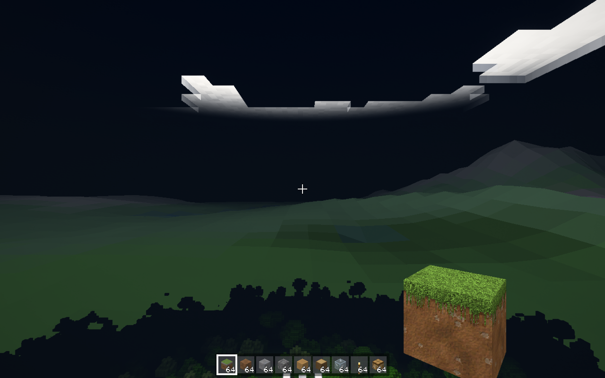
### basetest_rebuild

### bastion

### bastion_far

### beacon

### biome_badlands

### biome_birch_forest

### biome_cherry_grove

### biome_dark_forest

### biome_desert

### biome_jagged_peaks

### biome_jungle

### biome_mangrove_swamp

### biome_savanna

### biome_swamp

### biome_taiga

### biome_warm_ocean

### boats

### book

### boom_night

### brewing

### bugnotes

### cactus_far

### cactus_far_nolod

### cactus_mid

### cactus_mid_fast

### canyon

### canyon_floor

### capitaltest

### captains

### cave_dark

### cave_dark_bright

### cave_dark_fast

### cave_dark_mobs

### cave_dark_moody

### cave_torches

### chips

### citadel_far

### citadel_gate

### citadel_plaza

### citadel_top

### citadel_turret

### climate_1

### climate_12345

### climate_424242

### climate_777

### climate_98765

### clouds

### collapse_bridge_0
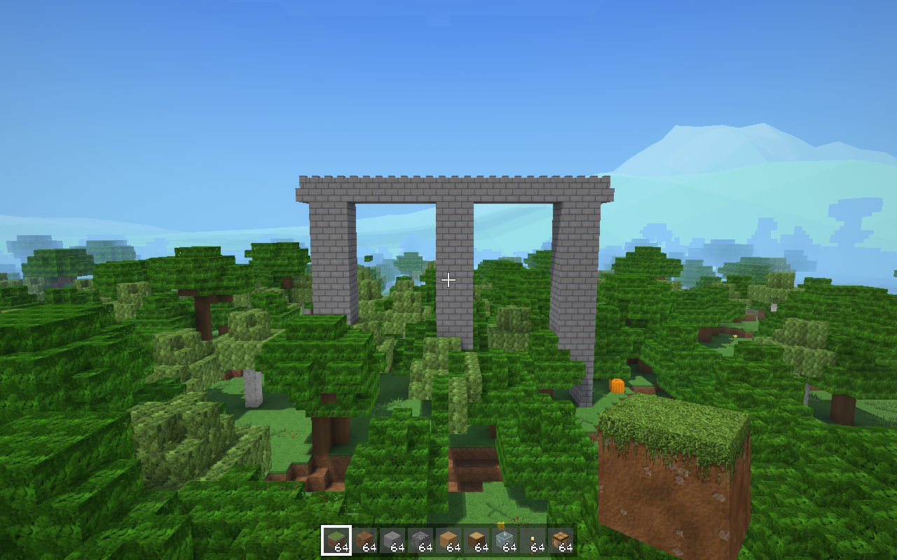
### collapse_bridge_12
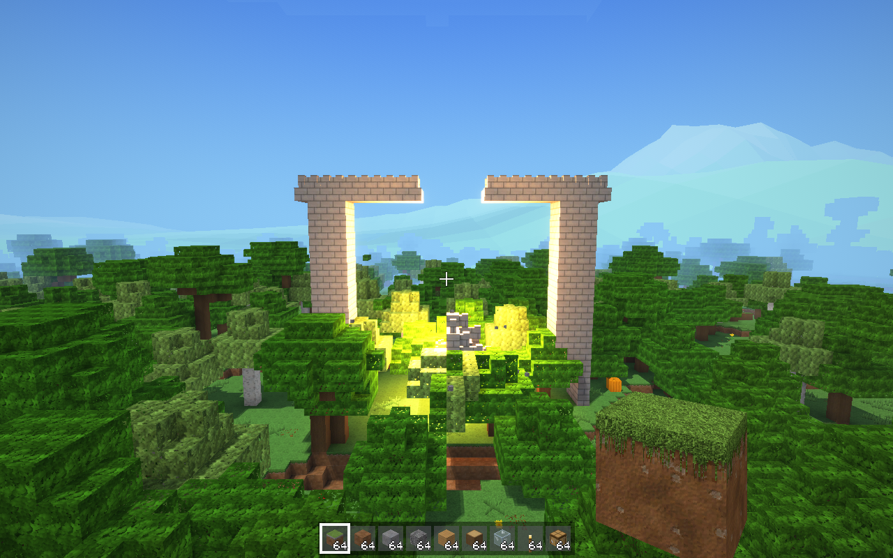
### collapse_bridge_2.5
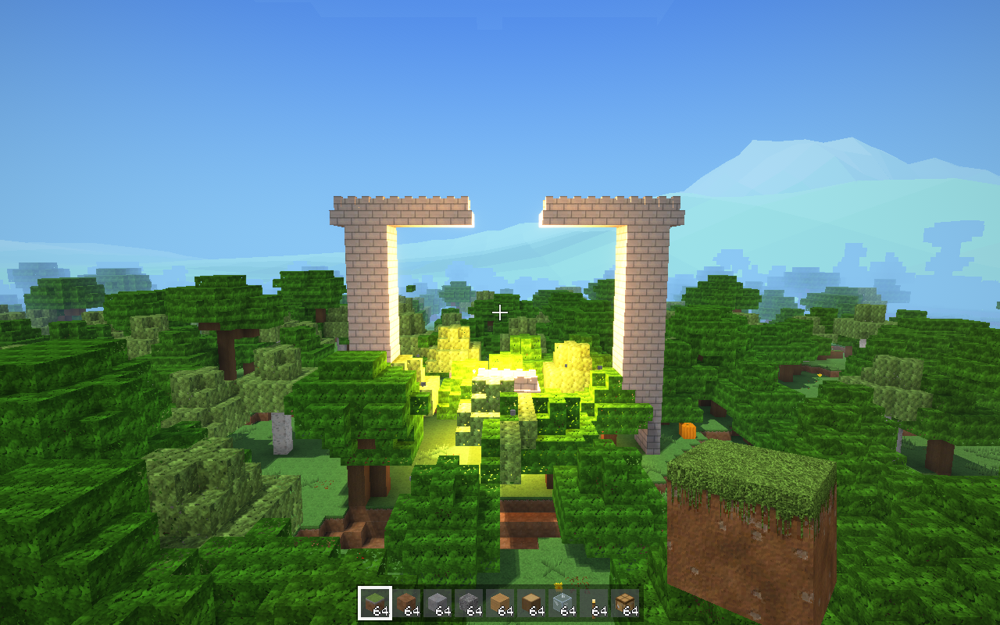
### collapse_dropship_8
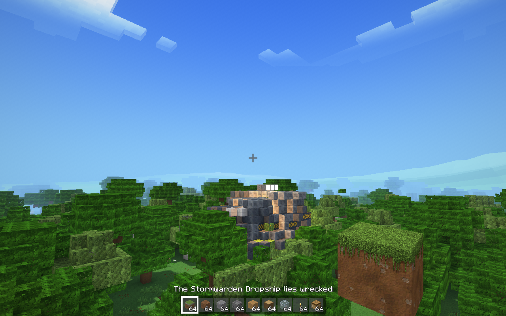
### collapse_frigate_3
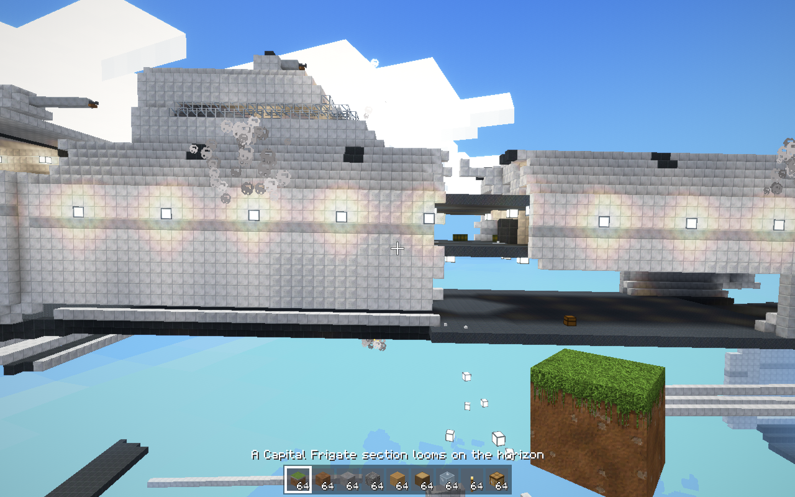
### collapse_frigate_40
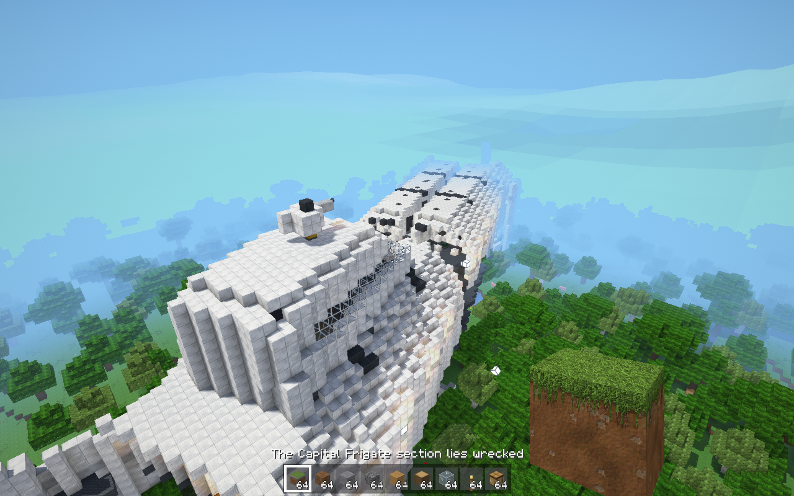
### collapse_tower_12
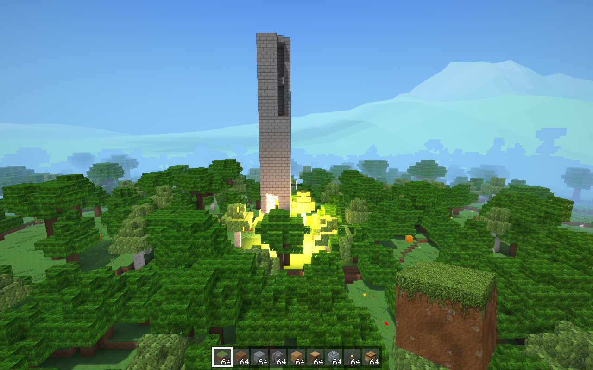
### collapse_tower_2
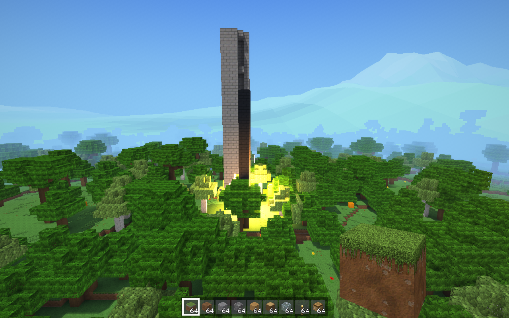
### collapse_wreck_30
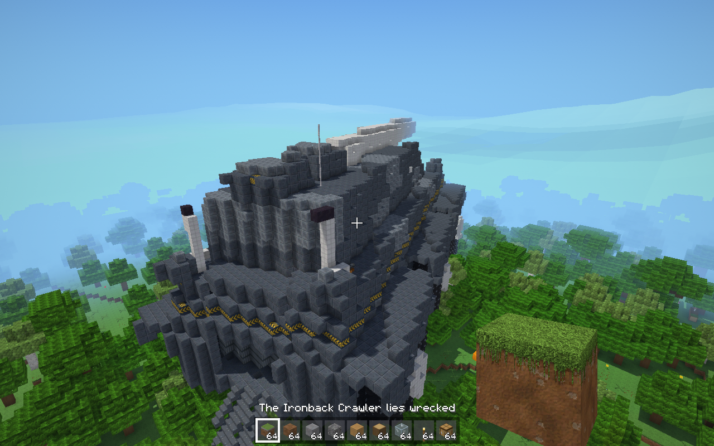
### commands

### controls_ref

### coop

### copper

### copper_golems

### crack

### craftbook

### crafting

### create

### creative

### credits

### dark_forest

### death

### deck_gun

### decor

### deep_dark

### desert_temple

### desert_temple_inside

### desert_well

### down

### dripstone_caves

### drops

### effects

### ember_basalt

### ember_crimson

### ember_soul

### ember_warped

### enchant

### end

### end_city

### end_outer

### end_top

### farm_variants

### firefight

### fireworks

### flicker_build

### flicker_forest

### flicker_village

### flight_heli

### flight_plane

### flighttest

### forest

### forest_fast

### forest_in

### forest_nobase

### forest_nocull

### forest_verify

### fortress

### fortress_far

### furnace

### gallery_build

### gallery_build_night

### gallery_color

### gallery_copper

### gallery_copper_night

### gallery_earth

### gallery_ember

### gallery_hollow

### gallery_ores

### gallery_plants

### gallery_stone

### gallery_wood

### gencheck_leak_1

### gencheck_leak_2

### ground16

### ground16_fast

### gun_aim

### gun_hip

### gun_scope

### hdatlas

### heads

### hisser

### horizon_ring

### horizon_ring_evening

### hostile

### in_lava

### inventory

### inventory_pad

### jungle_temple

### lake

### lake_glint

### leak_12345

### loom

### lush_caves

### magic_blocks

### mansion

### mansion_inside

### map

### meadow

### mineshaft

### mineshaft_torches

### mob_shadows

### mobcheck

### mobs

### mobs_g

### mobs_new

### mobtests

### monument

### musiccheck

### nether

### nether_mobs

### nether_wide

### night

### ocean_night_777

### ocean_night_777_fast

### ocean_ruin

### options

### outpost

### outpost_close

### padmap

### padtest

### pathtest

### pause

### photo_dof

### photo_dof_far

### physicstest

### plantcheck

### portal

### rain

### recipes

### redstone

### relief_1

### relief_12345

### relief_424242

### relief_777

### relief_98765

### ruined_portal

### seabed_deep

### seabed_deep_far

### seabed_warm

### selftest

### ship_airship

### ship_battle

### ship_boat

### ship_capitalbattle

### ship_car

### ship_carriage

### ship_crawler

### ship_deck

### ship_frigate

### ship_frigate_bow

### ship_frigate_corridor
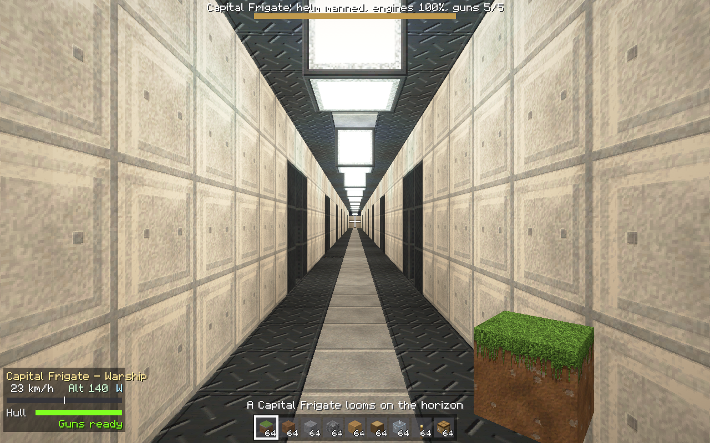
### ship_frigate_deck

### ship_frigate_hangar
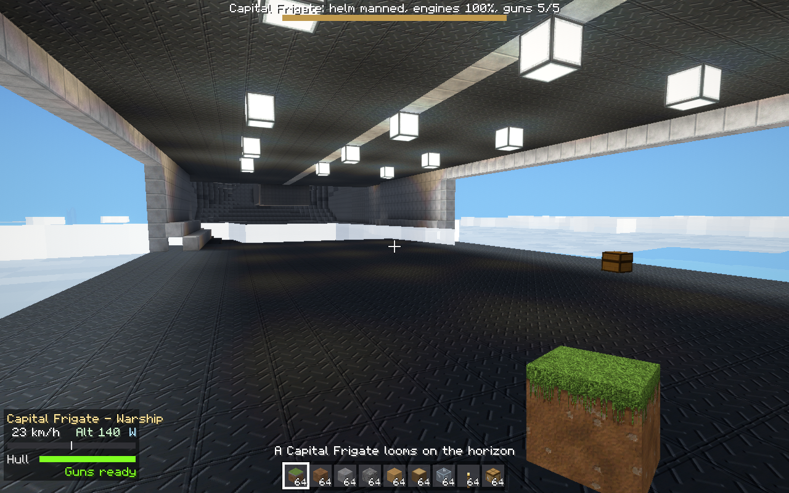
### ship_frigate_room
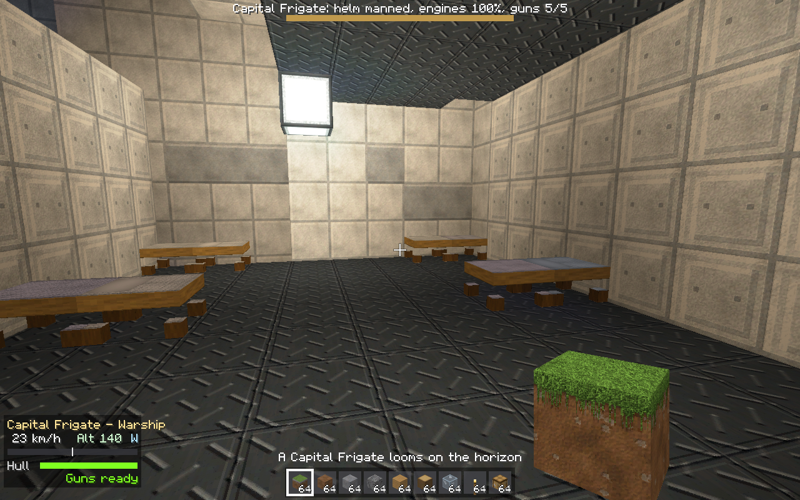
### ship_frigate_side

### ship_frigate_top

### ship_gunboat

### ship_plane

### ship_warfrigate

### ship_warfrigate_corridor
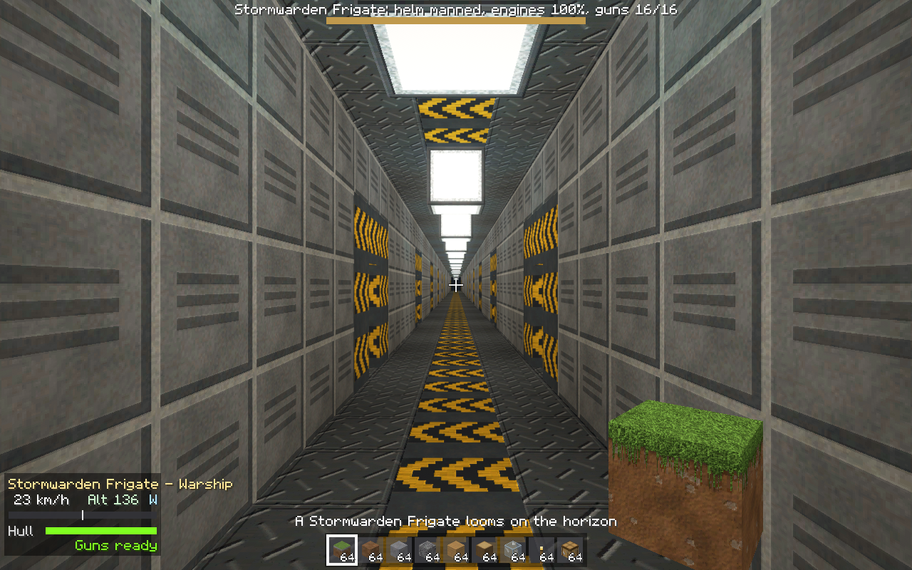
### ship_warfrigate_hangar
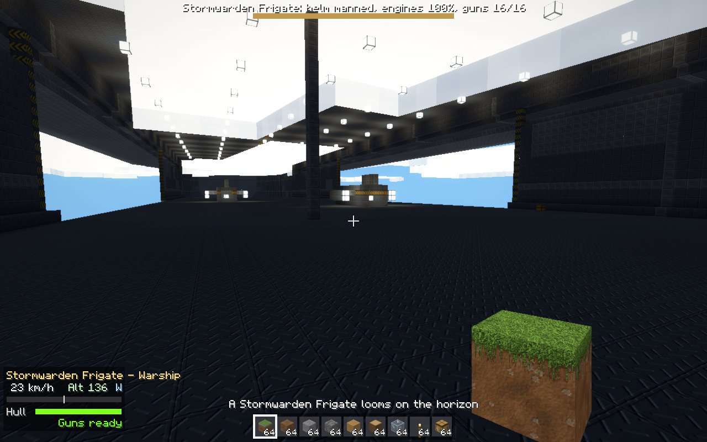
### ship_warfrigate_room
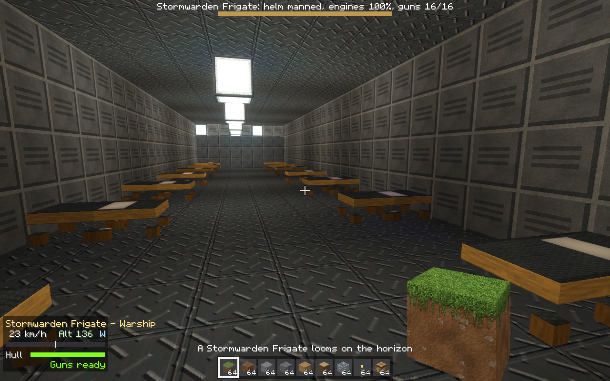
### shipwreck

### shore

### sim

### smoke_rd16

### smoke_rd24

### smoke_rd8

### snowfall

### snowslope

### snowy

### soldier_actions

### soldier_actions_heavy

### soldier_closeup

### soldier_ranks_aim

### soldier_ranks_back

### soldier_ranks_front

### soldier_ranks_night_back

### soldier_ranks_night_front

### soldier_ranks_night_side

### soldier_ranks_side

### soldier_squad

### soldier_squad_night

### soldier_stations

### soldiers

### spawn

### spawn_portal_check

### spear_hold

### spire

### spire_horizon

### spire_inside

### stars

### steelhold

### steelhold_armory

### steelhold_armory_close

### steelhold_armory_fast

### steelhold_armory_swords

### steelhold_command

### steelhold_fight

### steelhold_gate

### stronghold

### subtitles

### sunset

### sunset_fast

### sunset_sun

### survival

### temple

### temple2

### terrain_1

### terrain_12345

### terrain_424242

### terrain_777

### terrain_98765

### texsrc_cc0_cliff

### texsrc_cc0_forest

### texsrc_cc0_village

### texsrc_gemini_cliff

### texsrc_gemini_forest

### texsrc_gemini_village

### texsrc_procedural_cliff

### texsrc_procedural_forest

### texsrc_procedural_village

### third_back

### third_front

### third_swim

### thunder

### title

### torches

### torches_day

### torches_near

### tour_12345_aerial

### tour_12345_low

### tour_1_aerial

### tour_1_low

### tour_424242_aerial

### tour_424242_low

### tour_777_aerial

### tour_777_aerial_fast

### tour_777_aerial_nocull

### tour_777_low

### tour_98765_aerial

### tour_98765_low

### tour_coast

### tour_delta

### tour_delta_777

### tour_desert

### tour_forest_floor

### tour_jungle

### tour_lake

### tour_lake_424242

### tour_mesa

### tour_peaks

### tour_river

### tour_river_777

### tour_snowline

### trade

### trail_ruins

### trial_chambers

### tv_combat

### tv_confirm

### tv_coop

### tv_coop_side

### tv_craftbook

### tv_craftbook2

### tv_craftbook_all

### tv_hud

### tv_keyboard

### tv_map

### tv_options

### tv_title

### tv_worlds

### underwater

### underwater_up

### vehicle_hud

### village

### village2

### village3

### village_street

### village_top

### villager_jobs

### villagers

### volcano_crater

### volcano_dusk

### volcano_far

### volcano_horizon

### volcano_horizon_night

### water_flow

