# Blocksmith CI snapshots (heavy lane)

Commit `dfe3d88c859ca2c9cae3da5184bfe527c985cb14` on `claude/bs-destruction`: build **success**, heavy jobs **failure**
- checks: failure
- perf: success
- play: success
- shots: success
- smoke: success
- tours: failure

Run: https://github.com/remingtonangus-lang/blocksmith/actions/runs/38862550216

```
gen 402 ms  mesh(all, parallel) 378 ms  mesh(1 section) 0.74 ms  quads 835232 opaque / 19278 water
frame (encode+GPU, offscreen, median of 30) 6.17 ms  biome beach
mesh slabs 32 MB, chunks 297 (block+light arrays 27 MB), Metal allocated 170 MB
memory: resident 225 MB  (section meshes 26 MB)
wrote snaps/leak_12345.png
textures: 1711 layers at 128 px, BC3, 35.7 MB with mips (build 781 ms, upload 288 ms)
light probe: eye sky 15 block 6 in air; floor+1 (y 69) sky 15 block 8 in bush, daylight 1.0
imagecheck agent_door_777.png magenta=0.00000 black=0.0000 white=0.0008 std=52.3 hash=043bcce9ab8d04e0
imagecheck agent_door_777.png magenta=0.00000 black=0.0000 white=0.0008 std=52.3 hash=043bcce9ab8d04e0
seed 777  pos 959.5 138.0 272.5  rd 8  chunks 297  (drawn 84)
gen 307 ms  mesh(all, parallel) 342 ms  mesh(1 section) 1.16 ms  quads 752386 opaque / 422 water
frame (encode+GPU, offscreen, median of 30) 5.00 ms  biome plains
mesh slabs 28 MB, chunks 297 (block+light arrays 27 MB), Metal allocated 178 MB
memory: resident 249 MB  (section meshes 23 MB)
wrote snaps/agent_door_777.png
naming audit: 6682 names, 0 flagged
selftest: 1195 blocks, 104 mob kinds, 4/4 special recipes, bundle fill 32/64, 87 advancements
selftest ok: 110 mobs after 3 s
textures: 1711 layers at 128 px, BC3, 35.7 MB with mips (build 836 ms, upload 294 ms)
light probe: eye sky 15 block 0 in air; floor+1 (y 70) sky 15 block 0 in air, daylight 1.0
imagecheck selftest.png magenta=0.00000 black=0.0000 white=0.0008 std=19.5 hash=41da9e385c96481d
imagecheck selftest.png magenta=0.00000 black=0.0000 white=0.0008 std=19.5 hash=41da9e385c96481d
seed 12345  pos -87.5 135.0 104.5  rd 8  chunks 297  (drawn 78)
gen 356 ms  mesh(all, parallel) 312 ms  mesh(1 section) 0.31 ms  quads 800253 opaque / 6822 water
frame (encode+GPU, offscreen, median of 30) 5.96 ms  biome plains
mesh slabs 28 MB, chunks 297 (block+light arrays 27 MB), Metal allocated 178 MB
memory: resident 235 MB  (section meshes 25 MB)
wrote snaps/selftest.png
structure village at 14 129 -322 (38 pieces, framed)
textures: 1711 layers at 128 px, BC3, 35.7 MB with mips (build 959 ms, upload 353 ms)
light probe: eye sky 15 block 0 in air; floor+1 (y 136) sky 15 block 0 in air, daylight 1.0
imagecheck flicker_village.png magenta=0.00000 black=0.0000 white=0.0008 std=55.5 hash=12e598bb8d18b6fd flicker=0.00012
imagecheck flicker_village.png magenta=0.00000 black=0.0000 white=0.0008 std=55.5 hash=12e598bb8d18b6fd flicker=0.00012
seed 12345  pos -24.8 218.4 -355.8  rd 8  chunks 297  (drawn 80)
gen 351 ms  mesh(all, parallel) 631 ms  mesh(1 section) 1.01 ms  quads 1643475 opaque / 75 water
frame (encode+GPU, offscreen, median of 30) 5.49 ms  biome taiga
mesh slabs 56 MB, chunks 297 (block+light arrays 38 MB), Metal allocated 206 MB
memory: resident 283 MB  (section meshes 50 MB)
wrote snaps/flicker_village.png
textures: 1711 layers at 128 px, BC3, 35.7 MB with mips (build 913 ms, upload 298 ms)
light probe: eye sky 15 block 0 in air; floor+1 (y 87) sky 15 block 0 in air, daylight 1.0
imagecheck flicker_forest.png magenta=0.00000 black=0.0000 white=0.0008 std=51.6 hash=d8b4a475fff1291c flicker=0.00001
imagecheck flicker_forest.png magenta=0.00000 black=0.0000 white=0.0008 std=51.6 hash=d8b4a475fff1291c flicker=0.00001
seed 12345  pos -135.5 173.0 -39.5  rd 8  chunks 297  (drawn 79)
gen 367 ms  mesh(all, parallel) 443 ms  mesh(1 section) 1.24 ms  quads 1169814 opaque / 73 water
frame (encode+GPU, offscreen, median of 30) 6.41 ms  biome forest
mesh slabs 40 MB, chunks 297 (block+light arrays 30 MB), Metal allocated 178 MB
memory: resident 249 MB  (section meshes 36 MB)
wrote snaps/flicker_forest.png
textures: 1711 layers at 128 px, BC3, 35.7 MB with mips (build 665 ms, upload 236 ms)
light probe: eye sky 15 block 6 in air; floor+1 (y 70) sky 15 block 0 in air, daylight 1.0
imagecheck flicker_build.png magenta=0.00000 black=0.0000 white=0.0012 std=38.6 hash=85a3a640bf9cf273 flicker=0.00006
imagecheck flicker_build.png magenta=0.00000 black=0.0000 white=0.0012 std=38.6 hash=85a3a640bf9cf273 flicker=0.00006
seed 12345  pos -87.5 140.0 104.5  rd 8  chunks 297  (drawn 75)
gen 323 ms  mesh(all, parallel) 274 ms  mesh(1 section) 0.40 ms  quads 800454 opaque / 6822 water
frame (encode+GPU, offscreen, median of 30) 5.21 ms  biome plains
mesh slabs 28 MB, chunks 297 (block+light arrays 27 MB), Metal allocated 166 MB
memory: resident 234 MB  (section meshes 25 MB)
wrote snaps/flicker_build.png
imagecheck: 199 frames, no flags
```
### Benchmarks (vs perf/baseline.json)
```
bench: device Apple Paravirtual device, 3 cores, seed 12345
bench: calibration 1.88 ms (min 1.37, max 3.16) [0]
bench: gen starts
bench gen: structure starts for the sample (cold) 1.92 ms/chunk
bench gen slow chunk -80,-25: 6.3 ms (plants 3.4, caves 1.3, columns 0.4; starts 0.0, place 0.4)
bench gen slow chunk -59,14: 5.6 ms (caves 0.8, ores 0.3, columns 0.2; starts 0.0, place 3.9)
bench gen slow chunk -24,-21: 4.2 ms (caves 1.8, ores 0.9, plants 0.4; starts 0.0, place 0.3)
bench gen phases (ms/chunk): columns 0.27, stone 0.22, surface 0.03, caves 0.99, ores 0.26, trees 0.06, plants 0.29, starts 0.01, structures 0.22
bench gen structure starts (ms over 24 chunks): capital_city 37.4, military_base 29.4, village 14.6, pillager_outpost 6.5, temple 3.5, mineshaft 1.4, mansion 1.2, trail_ruins 1.0
bench gen: stone-fill interpolation vs Lattice.sample: 0 mismatching samples (must be 0)
bench gen: 2.44 ms/chunk (p95 5.57, max 6.30) single-thread | 791 chunks/s parallel
bench: gen took 0.8 s (live worlds 0, games 0)
bench: mesh starts
bench mesh: 6.00 ms/chunk (24 sections, 81 non-empty), section mean 250 us p95 964 us max 4799 us, 4942 quads/chunk
bench mesh_lod1: 5.88 ms/chunk (24 sections, 81 non-empty), section mean 245 us p95 1033 us max 1663 us, 2515 quads/chunk
bench: mesh took 0.9 s (live worlds 0, games 0)
bench: startup starts
bench startup: world+game init 23 ms, first load (r 4) 226 ms, renderer 2196 ms (textures 908 ms, shaders 0 ms), fill rd 12 4.80 s
bench: startup took 9.6 s (live worlds 0, games 0)
bench: frame starts
bench frame 800p rd 16: encode p50 1.43 ms, GPU p50 4.21 ms (max 7.93), 258 chunks drawn
bench frame 1080p rd 16: encode p50 0.90 ms, GPU p50 4.21 ms (max 5.43), 270 chunks drawn
bench frame 4k rd 16: encode p50 1.36 ms, GPU p50 7.62 ms (max 8.91), 270 chunks drawn
bench frame: 697 visible sections, 1221 draw calls, 253k quads
bench: frame took 5.2 s (live worlds 1, games 0)
bench: edit starts
bench edit: break mean 1.02 ms max 2.01 ms, place mean 0.97 ms max 2.01 ms (synchronous remesh)
bench: edit took 1.2 s (live worlds 1, games 0)
bench: mobs starts
bench mobs: tick 0.43 ms empty, 0.80 ms with 150 mobs (p95 2.18, max 3.38), 160 alive
bench: mobs took 1.0 s (live worlds 1, games 0)
bench: save starts
bench save: 145 chunks, save 2.59 ms/chunk (main thread 4.2 ms total, unchanged re-save 3.3 ms), load 0.40 ms/chunk (145 ok), 6.2 KB/chunk
bench: save took 1.3 s (live worlds 1, games 0)
bench: tnt starts
bench tnt: blast mean 1.81 ms max 5.17 ms (main thread) | re-mesh done in 0.13 s, tick p95 7.49 max 7.49 ms
bench: tnt took 1.0 s (live worlds 1, games 0)
bench: fluids starts
bench fluids: tick p50 0.47 p95 2.23 max 9.72 ms, 6559 sections re-meshed in 6 s, 1146 cells still pending
bench: fluids took 6.8 s (live worlds 1, games 0)
bench: ships starts
bench ships: edit remesh 3.83 ms, blast 2.48 ms + remesh 5.61 ms (3038 blocks left, 1 pieces split off)
bench ships: drawing two vessels at 1080p adds -0.54 ms encode, 0.23 ms GPU (66 draw calls)
bench ships: docked 3078 blocks in 19.46 ms (world remesh 0.11 s), assembled 3058 in 17.85 ms
bench ships: frigate 3038 blocks spawn 5.38 ms, mesh 6.71 ms; tick 0.63 ms (p95 1.42), physics 0.28 ms; collide 1.02 us near ships, 0.26 us far; 13 ships
bench: ships took 3.4 s (live worlds 1, games 0)
bench: worlds still alive after the scenes: 1
bench: live world: jobs 0, queue ops 0, gen in flight 0, results 0/0, chunks 997
bench: wrote 105 metrics to snaps/bench_part_0.json
bench: device Apple Paravirtual device, 3 cores, seed 12345
bench: flight8 starts
bench flight8: frame p50 2.65 p95 5.90 p99 10.51 max 24.39 ms, 0 hitches >25 ms | tick p95 1.70 (update p95 0.68, max 9.40) encode p95 1.32 GPU p95 5.67 ms
bench flight8: coverage min 92% mean 99% | gen 24 chunks/s (2.8 ms each on a worker) mesh 945 sections/s (339 us each) | realtime 1.00x
bench flight8: 328 chunks, chunk data 25 MB, meshes 24 MB (slabs 40 MB), resident peak 197 MB, preload 609 ms
bench: flight8 took 15.2 s (live worlds 0, games 0)
bench: worlds still alive after the scenes: 0
bench: wrote 36 metrics to snaps/bench_part_flight8.json
bench: device Apple Paravirtual device, 3 cores, seed 12345
bench: flight16 starts
bench flight16: frame p50 3.37 p95 5.60 p99 10.82 max 30.05 ms, 2 hitches >25 ms | tick p95 2.08 (update p95 0.96, max 7.34) encode p95 2.12 GPU p95 4.88 ms
bench flight16: coverage min 75% mean 86% | gen 43 chunks/s (2.4 ms each on a worker) mesh 3219 sections/s (287 us each) | realtime 1.00x
bench flight16: 1052 chunks, chunk data 86 MB, meshes 46 MB (slabs 72 MB), resident peak 326 MB, preload 2018 ms
bench: flight16 took 16.4 s (live worlds 0, games 0)
bench: worlds still alive after the scenes: 0
bench: wrote 36 metrics to snaps/bench_part_flight16.json
bench: device Apple Paravirtual device, 3 cores, seed 12345
bench: flight24 starts
bench flight24: frame p50 3.87 p95 5.86 p99 6.68 max 19.61 ms, 0 hitches >25 ms | tick p95 1.69 (update p95 0.65, max 2.35) encode p95 2.43 GPU p95 5.72 ms
bench flight24: coverage min 72% mean 83% | gen 21 chunks/s (1.9 ms each on a worker) mesh 3277 sections/s (286 us each) | realtime 1.00x
bench flight24: 1658 chunks, chunk data 142 MB, meshes 68 MB (slabs 100 MB), resident peak 485 MB, preload 4000 ms
bench: flight24 took 18.1 s (live worlds 0, games 0)
bench: worlds still alive after the scenes: 0
bench: wrote 36 metrics to snaps/bench_part_flight24.json
bench: merged 207 metrics into snaps/bench.json
```
| metric | baseline | now | worse by |
|---|---|---|---|
| edit.break_ms_max | 0.6 | 2.014 | 3.36x ⚠️ worse |
| edit.break_ms_mean | 0.447 | 1.023 | 2.29x ⚠️ worse |
| edit.break_ms_p50 | 0.595 | 0.837 | 1.41x ⚠️ worse |
| edit.place_ms_max | 0.732 | 2.005 | 2.74x ⚠️ worse |
| edit.place_ms_mean | 0.455 | 0.966 | 2.12x ⚠️ worse |
| edit.place_ms_p50 | 0.595 | 0.826 | 1.39x ⚠️ worse |
| flight16.arena_free_mb | 0.864 | 16.14 | 18.68x ⚠️ worse |
| flight16.chunk_mb | 103.906 | 85.521 | 0.82x |
| flight16.chunks | 1056 | 1052 | 1.00x |
| flight16.coverage_mean | 0.991 | 0.858 | 1.16x |
| flight16.coverage_min | 0.962 | 0.747 | 1.29x |
| flight16.cull_ms_p50 | 0.708 | 0.326 | 0.46x ✅ better |
| flight16.cull_ms_p95 | 1.152 | 0.903 | 0.78x |
| flight16.cull_walked_sections | 2817 | 1568 | 0.56x ✅ better |
| flight16.draw_calls | 1434 | 968 | 0.68x ✅ better |
| flight16.drawn_kquads | 475.516 | 188.368 | 0.40x ✅ better |
| flight16.encode_ms_p50 | 1.494 | 0.819 | 0.55x ✅ better |
| flight16.encode_ms_p95 | 2.361 | 2.119 | 0.90x |
| flight16.frame_ms_max | 12.652 | 30.055 | 2.38x ⚠️ worse |
| flight16.frame_ms_p50 | 4.807 | 3.374 | 0.70x ✅ better |
| flight16.frame_ms_p95 | 5.8 | 5.6 | 0.97x |
| flight16.frame_ms_p99 | 7.443 | 10.824 | 1.45x ⚠️ worse |
| flight16.gen_chunks_per_s | 43.68 | 43.149 | 1.01x |
| flight16.gpu_ms_p50 | 4.804 | 3.358 | 0.70x ✅ better |
| flight16.gpu_ms_p95 | 5.71 | 4.875 | 0.85x |
| flight16.hitches | 0 | 2 | infx ⚠️ worse |
| flight16.mesh_mb | 81.28 | 46.429 | 0.57x ✅ better |
| flight16.mesh_sections_per_s | 1972.83 | 3218.77 | 0.61x ✅ better |
| flight16.preload_ms | 1871.23 | 2017.77 | 1.08x |
| flight16.realtime | 0.998 | 0.998 | 1.00x |
| flight16.resident_peak_mb | 285.862 | 325.987 | 1.14x |
| flight16.slab_mb | 96 | 72 | 0.75x ✅ better |
| flight16.tick_ms_max | 8.551 | 24.622 | 2.88x ⚠️ worse |
| flight16.tick_ms_p50 | 0.388 | 0.638 | 1.64x ⚠️ worse |
| flight16.tick_ms_p95 | 2.08 | 2.081 | 1.00x |
| flight16.update_ms_max | 8.289 | 7.344 | 0.89x |
| flight16.update_ms_p50 | 0.017 | 0.274 | 16.12x ⚠️ worse |
| flight16.update_ms_p95 | 1.74 | 0.961 | 0.55x ✅ better |
| flight16.worker_gen_ms | 2.022 | 2.392 | 1.18x |
| flight16.worker_mesh_us | 177.949 | 287.311 | 1.61x ⚠️ worse |
| flight24.arena_free_mb | 0.427 | 23.685 | 55.47x ⚠️ worse |
| flight24.chunk_mb | 222.438 | 141.851 | 0.64x ✅ better |
| flight24.chunks | 2176 | 1658 | 0.76x ✅ better |
| flight24.coverage_mean | 0.994 | 0.829 | 1.20x |
| flight24.coverage_min | 0.974 | 0.715 | 1.36x ⚠️ worse |
| flight24.cull_ms_p50 | 1.198 | 0.608 | 0.51x ✅ better |
| flight24.cull_ms_p95 | 2.767 | 1.257 | 0.45x ✅ better |
| flight24.cull_walked_sections | 7607 | 3518 | 0.46x ✅ better |
| flight24.draw_calls | 3175 | 1075 | 0.34x ✅ better |
| flight24.drawn_kquads | 821.704 | 204.292 | 0.25x ✅ better |
| flight24.encode_ms_p50 | 2.473 | 1.242 | 0.50x ✅ better |
| flight24.encode_ms_p95 | 5.237 | 2.427 | 0.46x ✅ better |
| flight24.frame_ms_max | 13.319 | 19.612 | 1.47x ⚠️ worse |
| flight24.frame_ms_p50 | 7.72 | 3.874 | 0.50x ✅ better |
| flight24.frame_ms_p95 | 9.472 | 5.864 | 0.62x ✅ better |
| flight24.frame_ms_p99 | 10.337 | 6.675 | 0.65x ✅ better |
| flight24.gen_chunks_per_s | 63.73 | 20.507 | 3.11x ⚠️ worse |
| flight24.gpu_ms_p50 | 7.718 | 3.868 | 0.50x ✅ better |
| flight24.gpu_ms_p95 | 9.428 | 5.719 | 0.61x ✅ better |
| flight24.hitches | 0 | 0 | 1.00x |
| flight24.mesh_mb | 131.138 | 67.897 | 0.52x ✅ better |
| flight24.mesh_sections_per_s | 2455.22 | 3277.09 | 0.75x ✅ better |
| flight24.preload_ms | 4742.83 | 3999.71 | 0.84x |
| flight24.realtime | 1 | 0.996 | 1.00x |
| flight24.resident_peak_mb | 512.018 | 485.191 | 0.95x |
| flight24.slab_mb | 148 | 100 | 0.68x ✅ better |
| flight24.tick_ms_max | 11.61 | 9.388 | 0.81x |
| flight24.tick_ms_p50 | 0.401 | 0.547 | 1.36x ⚠️ worse |
| flight24.tick_ms_p95 | 2.942 | 1.689 | 0.57x ✅ better |
| flight24.update_ms_max | 4.586 | 2.351 | 0.51x ✅ better |
| flight24.update_ms_p50 | 0.015 | 0.253 | 16.87x ⚠️ worse |
| flight24.update_ms_p95 | 2.535 | 0.651 | 0.26x ✅ better |
| flight24.worker_gen_ms | 2.355 | 1.884 | 0.80x |
| flight24.worker_mesh_us | 177.947 | 285.837 | 1.61x ⚠️ worse |
| flight8.arena_free_mb | 2.438 | 10.824 | 4.44x ⚠️ worse |
| flight8.chunk_mb | 30.25 | 25.32 | 0.84x |
| flight8.chunks | 328 | 328 | 1.00x |
| flight8.coverage_mean | 0.99 | 0.993 | 1.00x |
| flight8.coverage_min | 0.924 | 0.924 | 1.00x |
| flight8.cull_ms_p50 | 0.204 | 0.088 | 0.43x ✅ better |
| flight8.cull_ms_p95 | 0.305 | 0.273 | 0.90x |
| flight8.cull_walked_sections | 517 | 359 | 0.69x ✅ better |
| flight8.draw_calls | 463 | 336 | 0.73x ✅ better |
| flight8.drawn_kquads | 211.463 | 82.249 | 0.39x ✅ better |
| flight8.encode_ms_p50 | 0.562 | 0.476 | 0.85x |
| flight8.encode_ms_p95 | 0.832 | 1.322 | 1.59x ⚠️ worse |
| flight8.frame_ms_max | 13.232 | 24.387 | 1.84x ⚠️ worse |
| flight8.frame_ms_p50 | 2.588 | 2.652 | 1.02x |
| flight8.frame_ms_p95 | 3.197 | 5.903 | 1.85x ⚠️ worse |
| flight8.frame_ms_p99 | 4.401 | 10.513 | 2.39x ⚠️ worse |
| flight8.gen_chunks_per_s | 23.603 | 23.704 | 1.00x |
| flight8.gpu_ms_p50 | 2.579 | 2.642 | 1.02x |
| flight8.gpu_ms_p95 | 3.081 | 5.672 | 1.84x ⚠️ worse |
| flight8.hitches | 0 | 0 | 1.00x |
| flight8.mesh_mb | 40.975 | 24.345 | 0.59x ✅ better |
| flight8.mesh_sections_per_s | 506.848 | 944.983 | 0.54x ✅ better |
| flight8.preload_ms | 1398.04 | 608.775 | 0.44x ✅ better |
| flight8.realtime | 0.994 | 0.998 | 1.00x |
| flight8.resident_peak_mb | 124.705 | 196.658 | 1.58x ⚠️ worse |
| flight8.slab_mb | 52 | 40 | 0.77x ✅ better |
| flight8.tick_ms_max | 12.539 | 23.934 | 1.91x ⚠️ worse |
| flight8.tick_ms_p50 | 0.158 | 0.425 | 2.69x ⚠️ worse |
| flight8.tick_ms_p95 | 1.223 | 1.699 | 1.39x ⚠️ worse |
| flight8.update_ms_max | 12.421 | 9.403 | 0.76x ✅ better |
| flight8.update_ms_p50 | 0.01 | 0.007 | 0.70x ✅ better |
| flight8.update_ms_p95 | 0.869 | 0.684 | 0.79x |
| flight8.worker_gen_ms | 3.236 | 2.765 | 0.85x |
| flight8.worker_mesh_us | 181.115 | 338.521 | 1.87x ⚠️ worse |
| fluids.pending | 240 | 1146 | 4.78x ⚠️ worse |
| fluids.remeshed_sections | 2605 | 6559 | 2.52x ⚠️ worse |
| fluids.tick_ms_max | 3.42 | 9.722 | 2.84x ⚠️ worse |
| fluids.tick_ms_p50 | 0.226 | 0.468 | 2.07x ⚠️ worse |
| fluids.tick_ms_p95 | 1.872 | 2.231 | 1.19x |
| frame.draw_calls | 1076 | 1221 | 1.13x |
| frame.drawn_chunks | 272 | 270 | 0.99x |
| frame.drawn_kquads | 178.99 | 253.057 | 1.41x ⚠️ worse |
| frame.mesh_mb | 57.324 | 53.594 | 0.93x |
| frame.visible_sections | 686 | 697 | 1.02x |
| frame_1080p.encode_ms_max | 1.123 | 2.579 | 2.30x ⚠️ worse |
| frame_1080p.encode_ms_p50 | 0.625 | 0.901 | 1.44x ⚠️ worse |
| frame_1080p.gpu_ms_max | 2.632 | 5.426 | 2.06x ⚠️ worse |
| frame_1080p.gpu_ms_p50 | 2.308 | 4.212 | 1.82x ⚠️ worse |
| frame_4k.encode_ms_max | 1.603 | 27.716 | 17.29x ⚠️ worse |
| frame_4k.encode_ms_p50 | 0.691 | 1.365 | 1.98x ⚠️ worse |
| frame_4k.gpu_ms_max | 4.083 | 8.913 | 2.18x ⚠️ worse |
| frame_4k.gpu_ms_p50 | 3.521 | 7.617 | 2.16x ⚠️ worse |
| frame_800p.encode_ms_max | 0.755 | 2.751 | 3.64x ⚠️ worse |
| frame_800p.encode_ms_p50 | 0.608 | 1.426 | 2.35x ⚠️ worse |
| frame_800p.gpu_ms_max | 2.405 | 7.928 | 3.30x ⚠️ worse |
| frame_800p.gpu_ms_p50 | 2.068 | 4.215 | 2.04x ⚠️ worse |
| gen.chunk_ms_max | 3.382 | 6.299 | 1.86x ⚠️ worse |
| gen.chunk_ms_mean | 2.082 | 2.442 | 1.17x |
| gen.chunk_ms_p95 | 3.325 | 5.574 | 1.68x ⚠️ worse |
| gen.lattice_mismatches | 0 | 0 | 1.00x |
| gen.parallel_chunks_per_s | 1683.33 | 791.426 | 2.13x ⚠️ worse |
| gen.starts_cold_ms | – | 1.921 | new |
| gen.terrain_hash | 1238443285367868 | 2875621164255659 | ⚠️ changed |
| genphase.caves_ms | – | 0.987 | new |
| genphase.columns_ms | – | 0.271 | new |
| genphase.ores_ms | – | 0.258 | new |
| genphase.plants_ms | – | 0.292 | new |
| genphase.starts_ms | – | 0.009 | new |
| genphase.stone_ms | – | 0.216 | new |
| genphase.structures_ms | – | 0.218 | new |
| genphase.surface_ms | – | 0.029 | new |
| genphase.trees_ms | – | 0.055 | new |
| mesh.chunk_ms_max | 5.758 | 10.233 | 1.78x ⚠️ worse |
| mesh.chunk_ms_mean | 4.38 | 6.004 | 1.37x ⚠️ worse |
| mesh.quads_per_chunk | 4996 | 4942.22 | 0.99x |
| mesh.section_us_max | 1621.01 | 4799.01 | 2.96x ⚠️ worse |
| mesh.section_us_mean | 139.451 | 250.167 | 1.79x ⚠️ worse |
| mesh.section_us_p95 | 686.049 | 963.926 | 1.41x ⚠️ worse |
| mesh_lod1.chunk_ms_max | 5.44 | 7.259 | 1.33x ⚠️ worse |
| mesh_lod1.chunk_ms_mean | 4.1 | 5.884 | 1.44x ⚠️ worse |
| mesh_lod1.quads_per_chunk | 2535 | 2515.56 | 0.99x |
| mesh_lod1.section_us_max | 1477.96 | 1662.97 | 1.13x |
| mesh_lod1.section_us_mean | 126.754 | 245.162 | 1.93x ⚠️ worse |
| mesh_lod1.section_us_p95 | 568.032 | 1032.95 | 1.82x ⚠️ worse |
| mobs.per_mob_us | 1.608 | 2.443 | 1.52x ⚠️ worse |
| mobs.tick_150_ms_max | 1.25 | 3.38 | 2.70x ⚠️ worse |
| mobs.tick_150_ms_mean | 0.272 | 0.796 | 2.93x ⚠️ worse |
| mobs.tick_150_ms_p95 | 0.439 | 2.181 | 4.97x ⚠️ worse |
| mobs.tick_base_ms_mean | 0.031 | 0.43 | 13.87x ⚠️ worse |
| mobs.tick_base_ms_p95 | 0.082 | 1.986 | 24.22x ⚠️ worse |
| save.chunk_kb | 4.471 | 6.207 | 1.39x ⚠️ worse |
| save.chunk_ms | 2.896 | 2.593 | 0.90x |
| save.load_chunk_ms | 0.587 | 0.399 | 0.68x ✅ better |
| save.main_thread_ms | 5.206 | 4.187 | 0.80x |
| save.unchanged_resave_ms | 2.544 | 3.257 | 1.28x |
| ships.assemble_ms | 19.313 | 17.847 | 0.92x |
| ships.assemble_remesh_s | 0.027 | 0.037 | 1.37x ⚠️ worse |
| ships.blast_ms | 2.675 | 2.481 | 0.93x |
| ships.blast_remesh_ms | 5.466 | 5.605 | 1.03x |
| ships.collide_far_us | 0.214 | 0.261 | 1.22x |
| ships.collide_us | 1.047 | 1.025 | 0.98x |
| ships.dock_ms | 12.056 | 19.459 | 1.61x ⚠️ worse |
| ships.dock_remesh_s | 0.036 | 0.108 | 3.00x ⚠️ worse |
| ships.draw_calls | 66 | 66 | 1.00x |
| ships.edit_ms_max | 0.887 | 1.068 | 1.20x |
| ships.edit_ms_mean | 0.505 | 0.589 | 1.17x |
| ships.edit_remesh_ms | 3.642 | 3.832 | 1.05x |
| ships.frame_encode_ms | 0.023 | -0.539 | -23.43x ✅ better |
| ships.frame_gpu_ms | -0.228 | 0.227 | infx ⚠️ worse |
| ships.mesh_frigate_ms | 3.066 | 6.71 | 2.19x ⚠️ worse |
| ships.physics_ms_mean | 0.165 | 0.281 | 1.70x ⚠️ worse |
| ships.physics_ms_p95 | 0.213 | 0.591 | 2.77x ⚠️ worse |
| ships.spawn_frigate_ms | 2.358 | 5.385 | 2.28x ⚠️ worse |
| ships.tick_ms_max | 0.522 | 8.602 | 16.48x ⚠️ worse |
| ships.tick_ms_mean | 0.219 | 0.626 | 2.86x ⚠️ worse |
| ships.tick_ms_p95 | 0.302 | 1.418 | 4.70x ⚠️ worse |
| startup.fill_rd12_s | 4.324 | 4.802 | 1.11x |
| startup.first_load_ms | 206.958 | 226.073 | 1.09x |
| startup.renderer_init_again_ms | 27.582 | 1045.28 | 37.90x ⚠️ worse |
| startup.renderer_init_ms | 817.522 | 2195.67 | 2.69x ⚠️ worse |
| startup.shader_compile_ms | 0.347 | 0.455 | 1.31x ⚠️ worse |
| startup.since_launch_s | 5.923 | 10.967 | 1.85x ⚠️ worse |
| startup.textures_ms | 26.537 | 908.339 | 34.23x ⚠️ worse |
| startup.world_init_ms | 2.198 | 22.614 | 10.29x ⚠️ worse |
| tnt.blast_ms_max | 8.579 | 5.169 | 0.60x ✅ better |
| tnt.blast_ms_mean | 2.904 | 1.809 | 0.62x ✅ better |
| tnt.remesh_s | 0.087 | 0.128 | 1.47x ⚠️ worse |
| tnt.tick_ms_max | 5.414 | 7.49 | 1.38x ⚠️ worse |
| tnt.tick_ms_p50 | 4.529 | 1.828 | 0.40x ✅ better |
| tnt.tick_ms_p95 | 5.414 | 7.49 | 1.38x ⚠️ worse |
### Smoke test
```
smoke rd 8 mob drawing: mobs 24 (1 within 32), 4428 vertices written, 4428 drawn via Fancy buffer, 32 culled, 0 dropped (buffer full)
smoke rd 8 memory: chunks alive 439, loaded 439; stashed mobs 1; map cells 2511; block entities 39; gravity queue 0; fluid pending 126; jobs 0; NaN quarantined: player 0, mobs 0, ships 0
smoke rd 8 split: t 30 s player 2 at 4724.4 122.0 1673.6 ground yes water yes menu none
smoke rd 8 Fancy: 40 s, frame 11.5 ms, resident 360 MB, Metal 269 MB, mobs 28, coverage 100%
smoke rd 8 mob drawing: mobs 28 (0 within 32), 4788 vertices written, 4788 drawn via Fancy buffer, 18 culled, 0 dropped (buffer full)
smoke rd 8 memory: chunks alive 667, loaded 667; stashed mobs 35; map cells 13961; block entities 142; gravity queue 0; fluid pending 125; jobs 1; NaN quarantined: player 0, mobs 0, ships 0
smoke rd 8 split: t 40 s player 2 at 4754.0 118.0 1637.2 ground yes water yes menu none
smoke rd 8 Fancy: 50 s, frame 11.4 ms, resident 387 MB, Metal 277 MB, mobs 44, coverage 86%
smoke rd 8 mob drawing: mobs 44 (0 within 32), 7560 vertices written, 7560 drawn via Fancy buffer, 28 culled, 0 dropped (buffer full)
smoke rd 8 memory: chunks alive 663, loaded 663; stashed mobs 152; map cells 25673; block entities 309; gravity queue 0; fluid pending 0; jobs 16; NaN quarantined: player 0, mobs 0, ships 0
smoke rd 8 split: t 50 s player 2 at 4783.5 118.0 1600.7 ground yes water yes menu none
smoke rd 8 Fancy: 60 s, frame 20.2 ms, resident 384 MB, Metal 277 MB, mobs 2, coverage 93%
smoke rd 8 mob drawing: mobs 2 (0 within 32), 1548 vertices written, 1548 drawn via Fancy buffer, 1 culled, 0 dropped (buffer full)
smoke rd 8 memory: chunks alive 665, loaded 665; stashed mobs 243; map cells 37467; block entities 449; gravity queue 0; fluid pending 0; jobs 15; NaN quarantined: player 0, mobs 0, ships 0
smoke rd 8: worst frame 514 ms at 0.0 s (frame 0): Game.tick 4 ms, render + GPU 510 ms; frames over 100 ms: 1
smoke rd 8: 3600 frames in 60.1 s wall, frame p50 11.43 p95 19.43 p99 39.97 max 514.20 ms, coverage min 64%, mobs max 62, travelled 3218 blocks, resident peak 389 MB, menu closed
smoke rd 8: mobs dropped for a full mob buffer: at most 0 in a frame (the farthest first)
smoke rd 8 split screen: player 2 moved 219 blocks
smoke rd 8 split screen: PASS
smoke: PASS at render distance 8 16 24 24f 8c
```
### Playthrough
```
PASS gather: logs mined by hand (3)
INFO bulk: +3 dark_oak_log (more trees)
PASS craft: 24 dark_oak_planks
PASS craft: crafting table + wooden pickaxe
---- stone age (0.5 s wall, 14 s game)
PASS hold wooden pickaxe
PASS mine: 2 cobblestone with a wooden pickaxe (3 mined; bare hand would take 7.5 s and drop nothing)
INFO bulk: +9 cobblestone (more stone)
PASS craft: stone pickaxe + furnace
---- iron age (0.7 s wall, 28 s game)
PASS worldgen: iron ore within 64 blocks of spawn
PASS rules: wooden pickaxe can't harvest iron ore
PASS mine: raw iron with a stone pickaxe (1)
INFO coal from ore: 0
INFO bulk: +5 raw_iron (more iron ore)
PASS place: furnace placed with a right click (furnace[south])
PASS smelt: 6 iron ingots after 105 s
INFO bulk: +1 flint (gravel)
PASS craft: iron pickaxe + flint and steel
---- diamonds (1.8 s wall, 105 s game)
PASS worldgen: diamond ore within 80 blocks of spawn
PASS rules: stone pickaxe can't harvest diamond ore
INFO titanium attempt 1 at 4696 -63 1754: mined yes, now lava, 0 drops near
PASS mine: raw titanium with an iron pickaxe at y -63 (1, 2 ores)
INFO bulk: +5 diamond (more diamonds)
INFO bulk: +3 string (spiders)
INFO bulk: +4 flint (gravel)
INFO bulk: +4 feather (chickens)
PASS craft: diamond pickaxe, sword, bow, 16 arrows
INFO bulk: +19 diamond (more diamonds)
INFO bulk: +5 gold_ingot (gold ore)
PASS armour: 19 armour points worn
---- obsidian + portal (2.5 s wall, 108 s game)
INFO fell into deep while mining; back to the surface
PASS fluids: water on a lava source makes obsidian (got obsidian)
PASS rules: iron pickaxe can't harvest obsidian
PASS rules: obsidian takes 9.4 s with a diamond pickaxe (9.4)
PASS mine: obsidian with a diamond pickaxe (1)
INFO bulk: +9 obsidian (more obsidian)
PASS portal: flint and steel lights the frame (nether_portal)
PASS portal: standing in the portal for 4 s goes to the Emberdeep
---- emberdeep (3.6 s wall, 134 s game)
PASS emberdeep: arrived inside a portal
PASS emberdeep: arrival portal is safe
PASS emberdeep: nearest fortress 337 blocks from the portal
PASS fortress: 2 cinderwisp spawner(s)
PASS fortress: the spawner makes cinderwisps
PASS fortress: 8 cinder rods from 17 cinderwisps in 315 s
INFO cinder rod rate 0.47 per kill (reference 0.5 without looting)
PASS fortress: cinder rod rate 0.47 per kill is plausible (reference 0.5)
---- void pearls (7.4 s wall, 451 s game)
PASS voidwalkers: 12 void pearls from 20 kills
---- back to the surface (8.5 s wall, 541 s game)
PASS portal: back to the Surface through the arrival portal
PASS portal: returned to the portal we built (0 blocks off)
---- seeker eyes (8.7 s wall, 546 s game)
PASS craft: 12 seeker eyes
PASS worldgen: nearest stronghold 1727 blocks from the origin (first ring 1280-2816)
PASS seeker eye: thrown with a right click
PASS seeker eye: flew 11.6 blocks toward the stronghold
PASS seeker eye: drops or shatters after its flight
INFO bulk: +1 ender_eye (eye shattered)
---- stronghold (8.8 s wall, 559 s game)
PASS stronghold: portal room with 12 hollow gate frames
INFO stronghold: 0 frames already hold an eye
PASS hollow gate: 12/12 frames filled with right clicks
PASS hollow gate: the 3x3 gate opens (9/9)
---- the hollow (9.1 s wall, 560 s game)
PASS hollow gate: stepping in goes to the Hollow
PASS hollow: arrived on the obsidian platform at 100 49 0
PASS hollow: standing safely on the platform
PASS hollow: exactly one Hollow Wyrm (1)
PASS hollow: 10 hollow crystals on the spikes (10)
PASS wyrm: 200 health (200)
INFO fountain at y 58, spikes [76, 79, 82, 85, 88, 91, 94, 97, 100, 103]
---- crystals (9.2 s wall, 571 s game)
PASS crystals: all destroyed (10 by arrow, 0 up close, 0 left)
INFO crystal explosions cost 129 health so far (topped up)
---- hollow wyrm fight (9.5 s wall, 594 s game)
PASS wyrm: defeated in 124 s (3 perches, 25 sword hits, 20 arrows for 67 damage, health left 1)
INFO wyrm fight: player took 43 damage (half-hearts, healed by the test)
PASS wyrm: death sequence finishes
PASS wyrm: 12000 XP (12000 points, level 14 -> 68)
PASS wyrm: gone after dying
PASS exit portal: active (24 gate blocks)
PASS egg: the wyrm egg sits on the exit portal (4)
PASS rift: a hollow rift gateway opened on the ring
---- egg (10.7 s wall, 731 s game)
PASS egg: hitting the egg makes it teleport (1 hops)
PASS egg: collected by dropping it onto a torch (1)
---- rift (10.8 s wall, 742 s game)
INFO bulk: +2 ender_pearl (spare pearls)
PASS rift: teleports to the far islands (1040 blocks out)
PASS rift: landed on solid ground (end_stone)
PASS rift: a return rift near the landing spot
---- hollow spire (10.9 s wall, 745 s game)
PASS spire: nearest hollow spire 1371 blocks from the landing spot (with ship)
INFO spire: 6 shellsentries
PASS spire: the ship's hold has glider wings
PASS wings: open with space while falling
PASS wings: glided 106 blocks while dropping 27
PASS rift: the return rift leads back to the central island (90 blocks out)
---- save + reload (11.0 s wall, 753 s game)
PASS reload: back in the Hollow (end)
PASS reload: wyrm stays defeated (true, 1 rifts)
PASS reload: the egg is still in the inventory
PASS reload: exit portal still open (24)
PASS reload: no new wyrm appears
---- credits (11.1 s wall, 753 s game)
PASS exit portal: the credits roll
PASS credits: back on the Surface after the credits
PASS credits: at the spawn point
PASS credits: alive at home
---- blight (11.3 s wall, 809 s game)
INFO bulk: +4 soul_sand (emberdeep soul sand valley)
INFO bulk: +3 wither_skeleton_skull (blight skeletons (2.5% each))
PASS blight: soul sand T + three skulls summons the Blight
PASS blight: charging after the summon
PASS blight: 11 s charge ends at full health (300/300) with a blast
---- blight fight (13.7 s wall, 822 s game)
INFO bulk: Smite V on the sword, Power V on the bow
INFO bulk: +1 golden_helmet (armour)
INFO bulk: +1 diamond_chestplate (armour)
INFO bulk: +1 diamond_leggings (armour)
INFO bulk: +1 diamond_boots (armour)
PASS armour: 19 armour points worn
INFO blight shot 0: arrow flew, speed 58.5, closest 3.41 to its middle, stuck no, dead yes, ends SIMD3<Float>(4722.5, 131.1803, 1783.4158) in air; blight 300 -> 285, inv 0.15, at SIMD3<Float>(4722.5, 132.71811, 1782.5243) (h 3.5, half-width 0.45)
INFO blight shot 1: arrow flew, speed 58.4, closest 2.37 to its middle, stuck no, dead yes, ends SIMD3<Float>(4722.4844, 131.45586, 1784.1293) in air; blight 285 -> 271, inv 0.15, at SIMD3<Float>(4722.5, 132.01112, 1783.5952) (h 3.5, half-width 0.45)
INFO blight shot 2: arrow flew, speed 58.4, closest 2.34 to its middle, stuck no, dead yes, ends SIMD3<Float>(4722.5186, 131.46733, 1784.1781) in air; blight 271 -> 255, inv 0.15, at SIMD3<Float>(4722.5, 131.98903, 1783.6143) (h 3.5, half-width 0.45)
INFO blight shot 3: arrow flew, speed 58.4, closest 2.34 to its middle, stuck no, dead yes, ends SIMD3<Float>(4722.513, 131.46721, 1784.1775) in air; blight 255 -> 236, inv 0.15, at SIMD3<Float>(4722.5, 131.98885, 1783.6143) (h 3.5, half-width 0.45)
INFO blight shot 4: arrow flew, speed 58.4, closest 2.34 to its middle, stuck no, dead yes, ends SIMD3<Float>(4722.498, 131.4668, 1784.1755) in air; blight 236 -> 219, inv 0.15, at SIMD3<Float>(4722.5, 131.98885, 1783.6143) (h 3.5, half-width 0.45)
INFO blight shot 5: arrow flew, speed 58.4, closest 2.34 to its middle, stuck no, dead yes, ends SIMD3<Float>(4722.497, 131.46652, 1784.1743) in air; blight 219 -> 200, inv 0.15, at SIMD3<Float>(4722.5, 131.98885, 1783.6143) (h 3.5, half-width 0.45)
PASS blight: defeated in 27 s (10 arrows for 164 damage, 8 sword hits)
PASS blight: arrows bounce off its armour below half health (0 damage from 3)
INFO blight fight: player took 96 damage (healed by the test); 8 of 8 sword hits landed for 148
PASS blight: the Blight Star drops and is picked up (1)
INFO bulk: +5 glass (sand + furnace)
INFO bulk: +3 obsidian (obsidian)
PASS craft: beacon from the Blight Star
---- advancements (14.8 s wall, 915 s game)
PASS advancement nether/obtain_blaze_rod
PASS advancement end/root
PASS advancement end/kill_dragon
PASS advancement end/dragon_egg
PASS advancement end/enter_end_gateway
PASS advancement nether/summon_wither
INFO 24 advancements earned: adventure/ash_vault, adventure/deep, adventure/kill_a_mob, adventure/root, adventure/shoot_arrow, end/dragon_egg, end/elytra, end/enter_end_gateway, end/kill_dragon, end/root, enter_the_end, enter_the_nether, follow_ender_eye, form_obsidian, iron_tools, mine_stone, nether/find_fortress, nether/obtain_blaze_rod, nether/root, nether/summon_wither, root, shiny_gear, smelt_iron, upgrade_tools
---- summary (14.8 s wall, 916 s game)
INFO deaths: 0, damage healed by the test: 321 half-hearts
playthrough: 0 failed checks, 916 s of game time in 14.8 s wall
```
### Synthesized sounds
- [bell.wav](sounds/bell.wav)
- [birdCall.wav](sounds/birdCall.wav)
- [break_glass.wav](sounds/break_glass.wav)
- [break_wood.wav](sounds/break_wood.wav)
- [bulletWhizz.wav](sounds/bulletWhizz.wav)
- [bullet_impact_metal.wav](sounds/bullet_impact_metal.wav)
- [carriageTreadLoop.wav](sounds/carriageTreadLoop.wav)
- [chestOpen.wav](sounds/chestOpen.wav)
- [doorOpen.wav](sounds/doorOpen.wav)
- [dragonGrowl.wav](sounds/dragonGrowl.wav)
- [engineFullLoop.wav](sounds/engineFullLoop.wav)
- [explode.wav](sounds/explode.wav)
- [frigateDroneLoop.wav](sounds/frigateDroneLoop.wav)
- [gun_0.wav](sounds/gun_0.wav)
- [gun_1.wav](sounds/gun_1.wav)
- [gun_10.wav](sounds/gun_10.wav)
- [gun_2.wav](sounds/gun_2.wav)
- [gun_3.wav](sounds/gun_3.wav)
- [gun_4.wav](sounds/gun_4.wav)
- [gun_5.wav](sounds/gun_5.wav)
- [gun_9.wav](sounds/gun_9.wav)
- [gun_distant_0.wav](sounds/gun_distant_0.wav)
- [gun_reload_0.wav](sounds/gun_reload_0.wav)
- [hullCreak.wav](sounds/hullCreak.wav)
- [levelUp.wav](sounds/levelUp.wav)
- [lever.wav](sounds/lever.wav)
- [mob_cow_ambient.wav](sounds/mob_cow_ambient.wav)
- [mob_enderman_ambient.wav](sounds/mob_enderman_ambient.wav)
- [mob_ghast_ambient.wav](sounds/mob_ghast_ambient.wav)
- [mob_skeleton_hurt.wav](sounds/mob_skeleton_hurt.wav)
- [mob_villager_ambient.wav](sounds/mob_villager_ambient.wav)
- [mob_warden_death.wav](sounds/mob_warden_death.wav)
- [mob_zombie_ambient.wav](sounds/mob_zombie_ambient.wav)
- [mountainWindLoop.wav](sounds/mountainWindLoop.wav)
- [note_0_12.wav](sounds/note_0_12.wav)
- [owlHoot.wav](sounds/owlHoot.wav)
- [pistonExtend.wav](sounds/pistonExtend.wav)
- [place_metal.wav](sounds/place_metal.wav)
- [propFastLoop.wav](sounds/propFastLoop.wav)
- [riverLoop.wav](sounds/riverLoop.wav)
- [shipCollideHard.wav](sounds/shipCollideHard.wav)
- [soldier_1_alert.wav](sounds/soldier_1_alert.wav)
- [soldier_3_death.wav](sounds/soldier_3_death.wav)
- [step_gravel.wav](sounds/step_gravel.wav)
- [step_stone.wav](sounds/step_stone.wav)
- [step_wood.wav](sounds/step_wood.wav)
- [thunder.wav](sounds/thunder.wav)
- [thunderFar.wav](sounds/thunderFar.wav)
- [villager_work_0.wav](sounds/villager_work_0.wav)
- [wardenRoar.wav](sounds/wardenRoar.wav)
- [waterfallLoop.wav](sounds/waterfallLoop.wav)
- [wingRushLoop.wav](sounds/wingRushLoop.wav)
- [witherSpawn.wav](sounds/witherSpawn.wav)
### advancements

### aerial

### aerial16

### aerial16_424242

### aerial16_777

### aerial16_fast

### aerial24

### agent_door_777

### ancient_city

### animals1

### animals2

### animals3

### anvil

### aquatic

### armor

### ashen_grove

### ashen_inside

### ashen_night

### atlas_0

### atlas_1

### atlas_2

### atlas_3

### audiotest

### banners

### base_air

### base_crawler

### base_lockdown

### base_patrol

### base_rebuild

### basetest_air

### basetest_crawler

### basetest_lockdown

### basetest_patrol

### basetest_rebuild

### bastion

### bastion_far

### beacon

### biome_badlands

### biome_birch_forest

### biome_cherry_grove

### biome_dark_forest

### biome_desert

### biome_jagged_peaks

### biome_jungle

### biome_mangrove_swamp

### biome_savanna

### biome_swamp

### biome_taiga

### biome_warm_ocean

### boats

### book

### boom_night

### brewing

### bugnotes

### cactus_far

### cactus_far_nolod

### cactus_mid

### cactus_mid_fast

### canyon

### canyon_floor

### capitaltest

### captains

### cave_dark

### cave_dark_bright

### cave_dark_fast

### cave_dark_mobs

### cave_dark_moody

### cave_torches

### chips

### citadel_far

### citadel_gate

### citadel_plaza

### citadel_top

### citadel_turret

### climate_1

### climate_12345

### climate_424242

### climate_777

### climate_98765

### clouds

### collapse_bridge_0
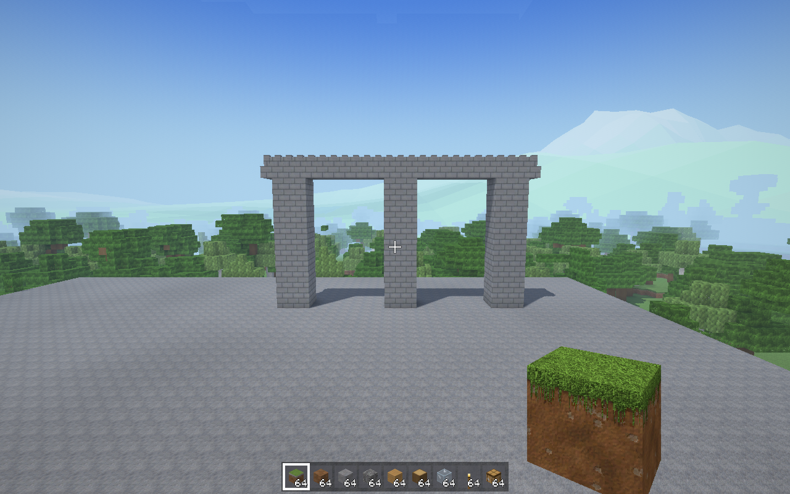
### collapse_bridge_12

### collapse_bridge_2.5
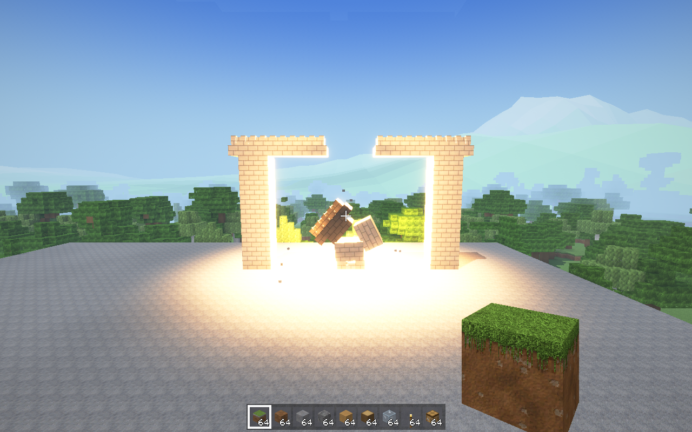
### collapse_dropship_8
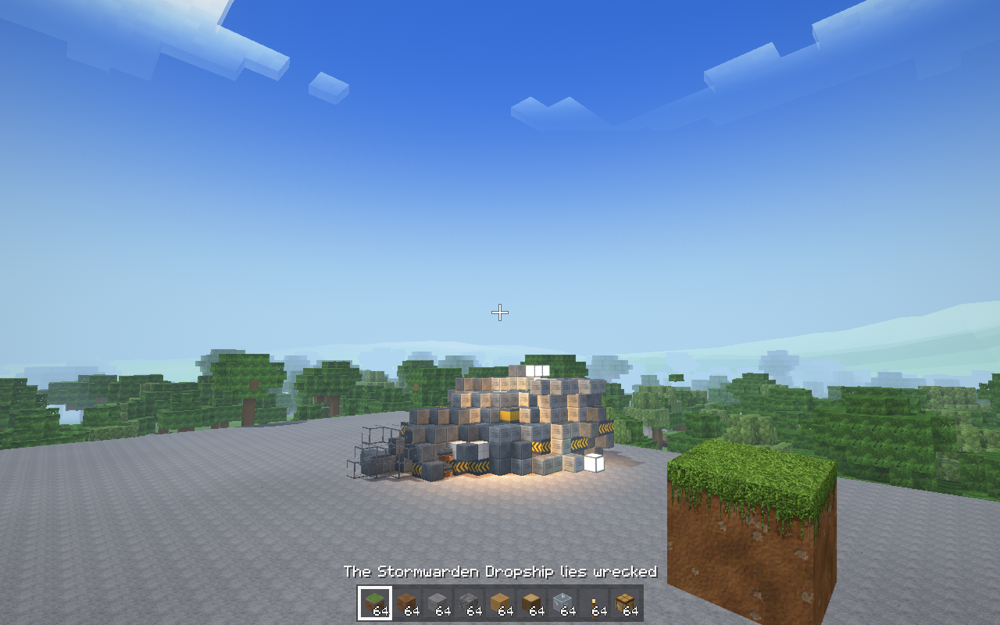
### collapse_frigate_3
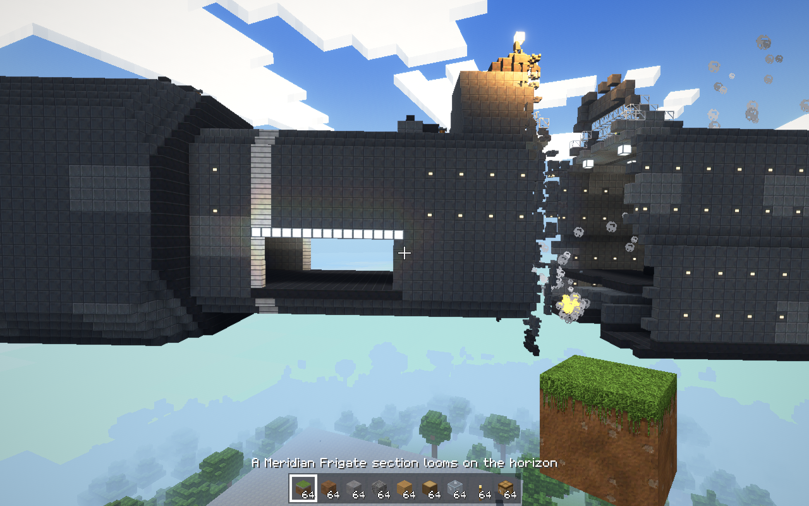
### collapse_frigate_40
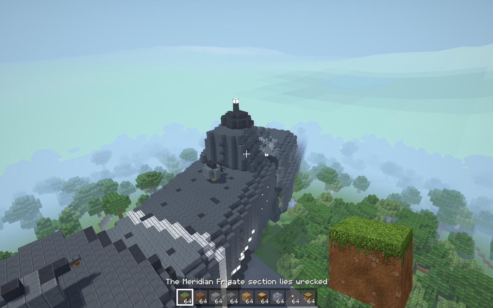
### collapse_tower_12
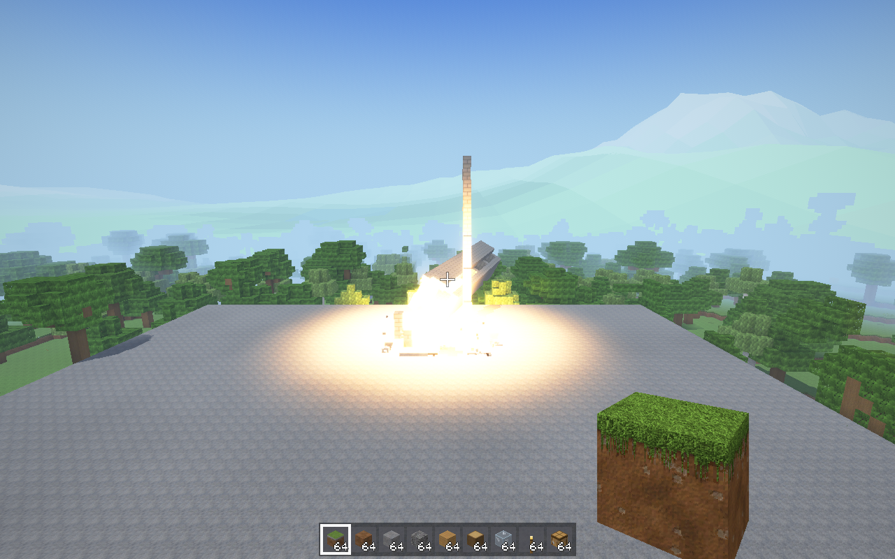
### collapse_tower_2
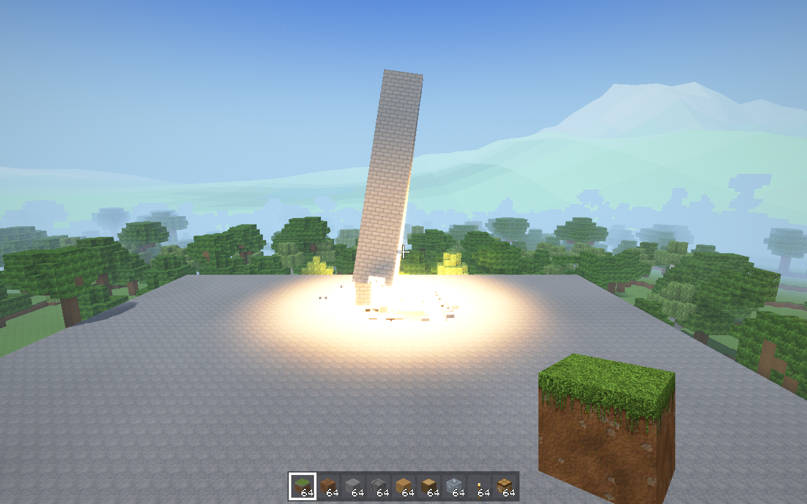
### collapse_wreck_30
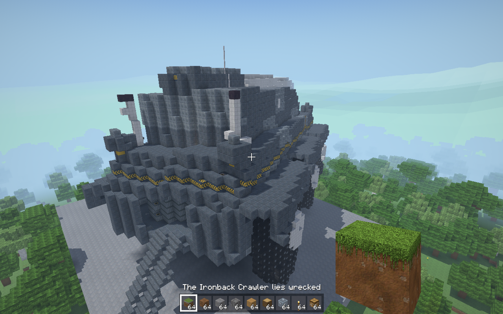
### commands

### controls_ref

### coop

### copper

### copper_golems

### coppertest

### crack

### craftbook

### crafting

### create

### creative

### credits

### dark_forest

### death

### deck_gun

### decor

### deep_dark

### desert_temple

### desert_temple_inside

### desert_well

### down

### dripstone_caves

### drops

### effects

### ember_basalt

### ember_crimson

### ember_soul

### ember_warped

### enchant

### end

### end_city

### end_outer

### end_top

### farm_variants

### firefight

### fireworks

### flicker_build

### flicker_forest

### flicker_village

### flight_heli

### flight_plane

### flighttest

### forest

### forest_fast

### forest_in

### forest_nobase

### forest_nocull

### forest_verify

### fortress

### fortress_far

### furnace

### gallery_build

### gallery_build_night

### gallery_color

### gallery_copper

### gallery_copper_night

### gallery_earth

### gallery_ember

### gallery_hollow

### gallery_ores

### gallery_plants

### gallery_stone

### gallery_wood

### gencheck_leak_1

### gencheck_leak_2

### ground16

### ground16_fast

### gun_aim

### gun_hip

### gun_scope

### hdatlas

### heads

### hisser

### horizon_ring

### horizon_ring_evening

### hostile

### in_lava

### inventory

### inventory_pad

### jungle_temple

### lake

### lake_glint

### leak_12345

### loom

### lush_caves

### magic_blocks

### mansion

### mansion_inside

### map

### meadow

### mineshaft

### mineshaft_torches

### mob_shadows

### mobcheck

### mobs

### mobs_g

### mobs_new

### mobtests

### monument

### musiccheck

### nether

### nether_mobs

### nether_wide

### night

### ocean_night_777

### ocean_night_777_fast

### ocean_ruin

### options

### outpost

### outpost_close

### padmap

### padtest

### pathtest

### pause

### photo_dof

### photo_dof_far

### physicstest

### plantcheck

### portal

### rain

### recipes

### redstone

### relief_1

### relief_12345

### relief_424242

### relief_777

### relief_98765

### ruined_portal

### rulescheck

### seabed_deep

### seabed_deep_far

### seabed_warm

### selftest

### ship_airship

### ship_battle

### ship_boat

### ship_capitalbattle

### ship_car

### ship_carriage

### ship_crawler

### ship_deck

### ship_frigate

### ship_frigate_bow

### ship_frigate_deck

### ship_frigate_side

### ship_frigate_top

### ship_gunboat

### ship_plane

### ship_warfrigate

### ship_warfrigate_corridor
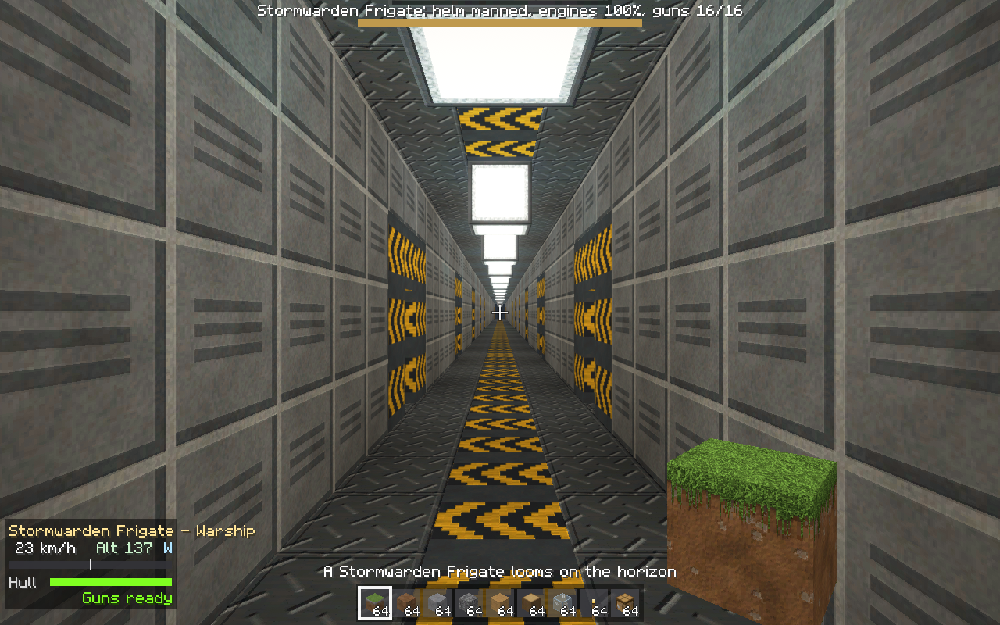
### ship_warfrigate_hangar
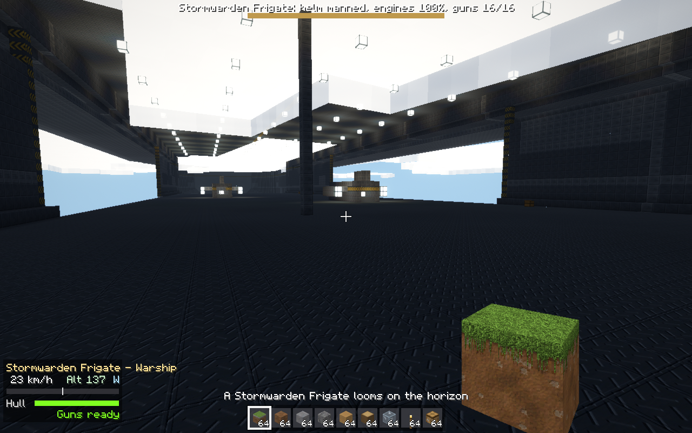
### ship_warfrigate_room
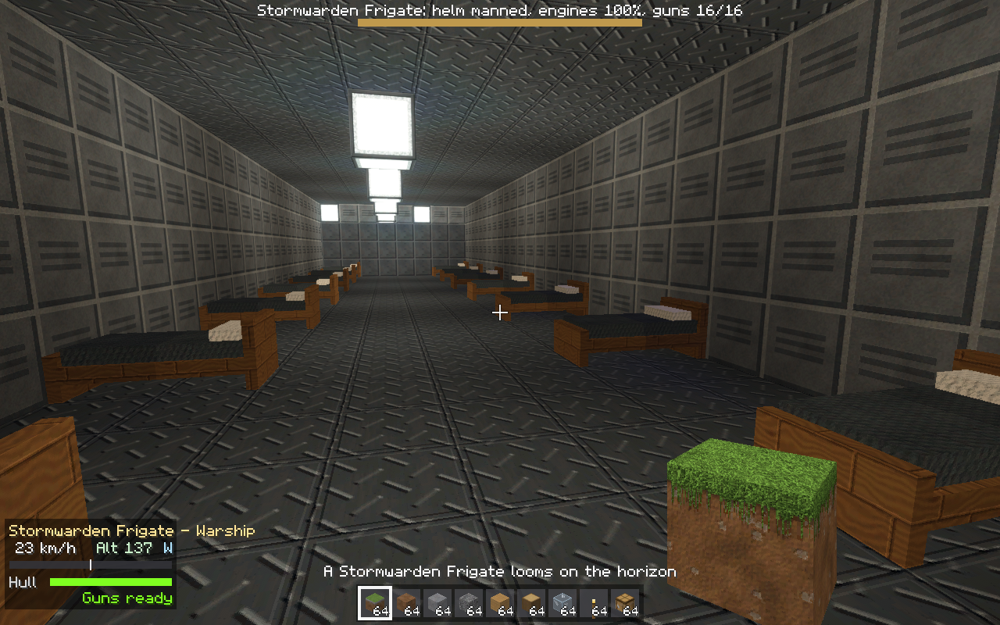
### shipwreck

### shore

### sim

### smoke_rd16

### smoke_rd24

### smoke_rd8

### snowfall

### snowslope

### snowy

### soldier_actions

### soldier_actions_heavy

### soldier_closeup

### soldier_ranks_aim

### soldier_ranks_back

### soldier_ranks_front

### soldier_ranks_night_back

### soldier_ranks_night_front

### soldier_ranks_night_side

### soldier_ranks_side

### soldier_squad

### soldier_squad_night

### soldier_stations

### soldiers

### spawn

### spawn_portal_check

### spear_hold

### spire

### spire_horizon

### spire_inside

### stars

### steelhold

### steelhold_armory

### steelhold_armory_close

### steelhold_armory_fast

### steelhold_armory_swords

### steelhold_command

### steelhold_fight

### steelhold_gate

### stronghold

### subtitles

### sunset

### sunset_fast

### sunset_sun

### survival

### temple

### temple2

### terrain_1

### terrain_12345

### terrain_424242

### terrain_777

### terrain_98765

### texsrc_cc0_cliff

### texsrc_cc0_forest

### texsrc_cc0_village

### texsrc_gemini_cliff

### texsrc_gemini_forest

### texsrc_gemini_village

### texsrc_procedural_cliff

### texsrc_procedural_forest

### texsrc_procedural_village

### third_back

### third_front

### third_swim

### thunder

### title

### torches

### torches_day

### torches_near

### tour_12345_aerial

### tour_12345_low

### tour_1_aerial

### tour_1_low

### tour_424242_aerial

### tour_424242_low

### tour_777_aerial

### tour_777_aerial_fast

### tour_777_aerial_nocull

### tour_777_low

### tour_98765_aerial

### tour_98765_low

### tour_coast

### tour_delta

### tour_delta_777

### tour_desert

### tour_forest_floor

### tour_jungle

### tour_lake

### tour_lake_424242

### tour_mesa

### tour_peaks

### tour_river

### tour_river_777

### tour_snowline

### trade

### trail_ruins

### trial_chambers

### tv_combat

### tv_confirm

### tv_coop

### tv_coop_side

### tv_craftbook

### tv_craftbook2

### tv_craftbook_all

### tv_hud

### tv_keyboard

### tv_map

### tv_options

### tv_title

### tv_worlds

### underwater

### underwater_up

### vehicle_hud

### village

### village2

### village3

### village_street

### village_top

### villager_jobs

### villagers

### volcano_crater

### volcano_dusk

### volcano_far

### volcano_horizon

### volcano_horizon_night

### water_flow

