# Voice bug notes 2026-10-10 (Quest)

Spoken while playing; transcribed by elevenlabs/scribe-v2. Written by `tools/quest-bugnotes.py` (rewritten each run; edit Status lines in a copy). 38 notes.

## 09:21:33 - Oh, never fixed that, did I?

- **Transcript:** Oh, never fixed that, did I?
- **Status:** open
- **Build:** 0.95 (2913b0a, M1-M4 (device-tested; ship riding, chests, comfort options, weapon wheel))
- **World:** Quest World (seed 2943808052895834412)
- **Dimension:** Surface
- **Biome:** Swamp
- **Position:** -532.6 66.0 -170.8
- **Facing:** north-west (yaw 320, pitch -24)
- **Held:** Dirt x4
- **Mount:** on foot
- **Looking at:** Grass Block at -535 65 -174
- **Mode:** Survival, health 20/20
- **Time:** day 3 11:16, clear
- **Fps:** 71
- **Levels:** mic -29 dBFS, game sound -28 dBFS
- **Length:** 3.0 s (voice 1.1 s)
- **Just before:** -10s opened PauseMenu; -10s message: Playtest build: voice bug notes ON, your speech is saved (Options > Interface); -7s closed PauseMenu; -6s message: 72 Hz to keep the frame rate (VR Comfort & Controls); -5s message: Sprinting: let the stick back to the middle to stop
- **Repro (Mac):** `./snap.sh note --seed 2943808052895834412 --x -532.6 --z -170.8 --yaw 40 --pitch -24 --time 0.220`
- **Audio (this Mac):** /Users/darthvadar/Documents/Blocksmith/QuestVoiceNotes/raw/vn-20261010-092133-027.aac

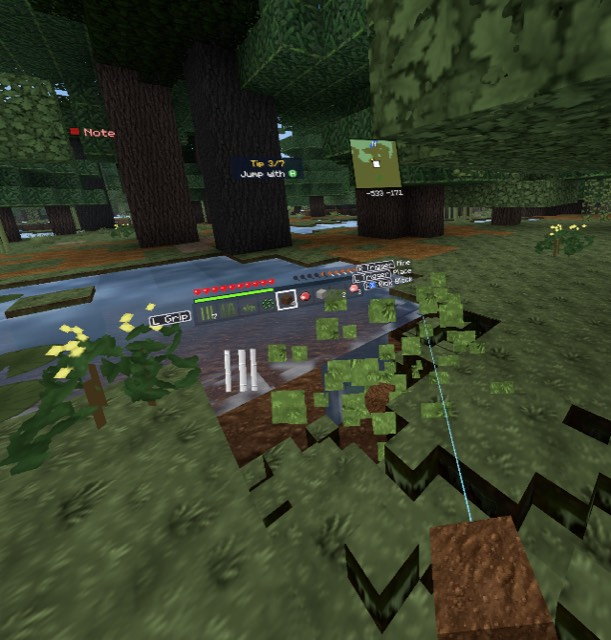

## 09:21:45 - Textures aren't good enough

- **Transcript:** Textures aren't good enough
- **Status:** open
- **Build:** 0.95 (2913b0a, M1-M4 (device-tested; ship riding, chests, comfort options, weapon wheel))
- **World:** Quest World (seed 2943808052895834412)
- **Dimension:** Surface
- **Biome:** Swamp
- **Position:** -539.4 66.0 -176.7
- **Facing:** north-west (yaw 310, pitch -42)
- **Held:** Dirt x4
- **Mount:** on foot
- **Looking at:** Podzol at -541 65 -178
- **Mode:** Survival, health 20/20
- **Time:** day 3 11:21, clear
- **Fps:** 72
- **Levels:** mic -30 dBFS, game sound -30 dBFS
- **Length:** 2.6 s (voice 0.9 s)
- **Just before:** -22s opened PauseMenu; -22s message: Playtest build: voice bug notes ON, your speech is saved (Options > Interface); -19s closed PauseMenu; -18s message: 72 Hz to keep the frame rate (VR Comfort & Controls); -17s message: Sprinting: let the stick back to the middle to stop; -12s opened PauseMenu; -4s closed PauseMenu
- **Repro (Mac):** `./snap.sh note --seed 2943808052895834412 --x -539.4 --z -176.7 --yaw 50 --pitch -42 --time 0.223`
- **Audio (this Mac):** /Users/darthvadar/Documents/Blocksmith/QuestVoiceNotes/raw/vn-20261010-092145-027.aac

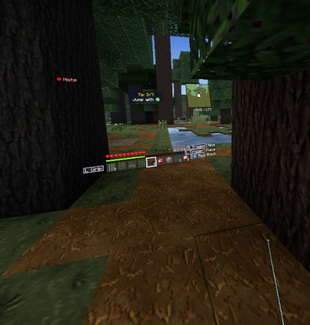

## 09:21:48 - This isn't... The trees are good. Grass sucks

- **Transcript:** This isn't... The trees are good. Grass sucks
- **Status:** open
- **Build:** 0.95 (2913b0a, M1-M4 (device-tested; ship riding, chests, comfort options, weapon wheel))
- **World:** Quest World (seed 2943808052895834412)
- **Dimension:** Surface
- **Biome:** Swamp
- **Position:** -545.5 66.0 -175.5
- **Facing:** south-west (yaw 223, pitch -10)
- **Held:** Dirt x4
- **Mount:** on foot
- **Looking at:** Spruce Log at -549 66 -173
- **Mode:** Survival, health 20/20
- **Time:** day 3 11:25, clear
- **Fps:** 72
- **Levels:** mic -38 dBFS, game sound -35 dBFS
- **Length:** 3.9 s (voice 1.5 s)
- **Just before:** -25s opened PauseMenu; -25s message: Playtest build: voice bug notes ON, your speech is saved (Options > Interface); -22s closed PauseMenu; -21s message: 72 Hz to keep the frame rate (VR Comfort & Controls); -20s message: Sprinting: let the stick back to the middle to stop; -15s opened PauseMenu; -7s closed PauseMenu
- **Repro (Mac):** `./snap.sh note --seed 2943808052895834412 --x -545.5 --z -175.5 --yaw 137 --pitch -10 --time 0.226`
- **Audio (this Mac):** /Users/darthvadar/Documents/Blocksmith/QuestVoiceNotes/raw/vn-20261010-092148-087.aac

## 09:21:53 - They're not

- **Transcript:** They're not
- **Status:** open
- **Build:** 0.95 (2913b0a, M1-M4 (device-tested; ship riding, chests, comfort options, weapon wheel))
- **World:** Quest World (seed 2943808052895834412)
- **Dimension:** Surface
- **Biome:** Swamp
- **Position:** -555.1 66.0 -175.6
- **Facing:** west (yaw 275, pitch -7)
- **Held:** Dirt x4
- **Mount:** on foot
- **Looking at:** Spruce Log at -560 67 -177
- **Mode:** Survival, health 20/20
- **Time:** day 3 11:31, clear
- **Fps:** 72
- **Levels:** mic -36 dBFS, game sound -30 dBFS
- **Length:** 1.9 s (voice 0.5 s)
- **Just before:** -27s closed PauseMenu; -26s message: 72 Hz to keep the frame rate (VR Comfort & Controls); -26s message: Sprinting: let the stick back to the middle to stop; -20s opened PauseMenu; -12s closed PauseMenu
- **Repro (Mac):** `./snap.sh note --seed 2943808052895834412 --x -555.1 --z -175.6 --yaw 85 --pitch -7 --time 0.230`
- **Audio (this Mac):** /Users/darthvadar/Documents/Blocksmith/QuestVoiceNotes/raw/vn-20261010-092153-467.aac

## 09:21:56 - Water's good

- **Transcript:** Water's good
- **Status:** open
- **Build:** 0.95 (2913b0a, M1-M4 (device-tested; ship riding, chests, comfort options, weapon wheel))
- **World:** Quest World (seed 2943808052895834412)
- **Dimension:** Surface
- **Biome:** Swamp
- **Position:** -566.4 66.0 -171.2
- **Facing:** west (yaw 262, pitch -39)
- **Held:** Dirt x4
- **Mount:** on foot
- **Looking at:** Grass Block at -570 65 -171
- **Mode:** Survival, health 20/20
- **Time:** day 3 11:35, clear
- **Fps:** 72
- **Levels:** mic -26 dBFS, game sound -27 dBFS
- **Length:** 1.7 s (voice 0.6 s)
- **Just before:** -30s message: 72 Hz to keep the frame rate (VR Comfort & Controls); -29s message: Sprinting: let the stick back to the middle to stop; -24s opened PauseMenu; -16s closed PauseMenu
- **Repro (Mac):** `./snap.sh note --seed 2943808052895834412 --x -566.4 --z -171.2 --yaw 98 --pitch -39 --time 0.233`
- **Audio (this Mac):** /Users/darthvadar/Documents/Blocksmith/QuestVoiceNotes/raw/vn-20261010-092156-987.aac

## 09:21:58 - Keep the water lily pads are good

- **Transcript:** Keep the water lily pads are good
- **Status:** open
- **Build:** 0.95 (2913b0a, M1-M4 (device-tested; ship riding, chests, comfort options, weapon wheel))
- **World:** Quest World (seed 2943808052895834412)
- **Dimension:** Surface
- **Biome:** Swamp
- **Position:** -573.5 65.3 -169.9
- **Facing:** north-west (yaw 300, pitch -50)
- **Held:** Dirt x4
- **Mount:** on foot
- **Looking at:** Grass Block at -576 64 -172
- **Mode:** Survival, health 20/20
- **Time:** day 3 11:38, clear
- **Fps:** 72
- **Levels:** mic -34 dBFS, game sound -33 dBFS
- **Length:** 2.9 s (voice 1.3 s)
- **Just before:** -26s opened PauseMenu; -18s closed PauseMenu
- **Repro (Mac):** `./snap.sh note --seed 2943808052895834412 --x -573.5 --z -169.9 --yaw 60 --pitch -50 --time 0.235`
- **Audio (this Mac):** /Users/darthvadar/Documents/Blocksmith/QuestVoiceNotes/raw/vn-20261010-092158-967.aac

## 09:22:23 - Too much vegetation seems to have fixed that

- **Transcript:** Too much vegetation seems to have fixed that
- **Status:** open
- **Build:** 0.95 (2913b0a, M1-M4 (device-tested; ship riding, chests, comfort options, weapon wheel))
- **World:** Quest World (seed 2943808052895834412)
- **Dimension:** Surface
- **Biome:** Beach
- **Position:** -1029.4 65.0 -110.1
- **Facing:** north (yaw 341, pitch -51)
- **Held:** Dirt x4
- **Mount:** on foot
- **Looking at:** Sand at -1030 64 -112
- **Mode:** Creative, health 20/20
- **Time:** day 3 12:02, clear
- **Fps:** 72
- **Levels:** mic -36 dBFS, game sound -24 dBFS
- **Length:** 3.8 s (voice 1.6 s)
- **Just before:** -19s message: No flying in survival; -18s opened PauseMenu; -15s message: Creative mode; -15s closed PauseMenu; -14s message: Flying; -9s walked into Dark Forest; -7s walked into Swamp; -5s message: Walking
- **Repro (Mac):** `./snap.sh note --seed 2943808052895834412 --x -1029.4 --z -110.1 --yaw 19 --pitch -51 --time 0.252`
- **Audio (this Mac):** /Users/darthvadar/Documents/Blocksmith/QuestVoiceNotes/raw/vn-20261010-092223-267.aac

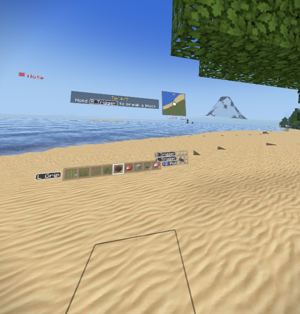

## 09:22:28 - Um, but yeah, the, uh, little bushes with the little yellow things on 

- **Transcript:** Um, but yeah, the, uh, little bushes with the little yellow things on top, they are not detailed enough
- **Status:** open
- **Build:** 0.95 (2913b0a, M1-M4 (device-tested; ship riding, chests, comfort options, weapon wheel))
- **World:** Quest World (seed 2943808052895834412)
- **Dimension:** Surface
- **Biome:** Beach
- **Position:** -1037.2 65.4 -109.9
- **Facing:** south-west (yaw 231, pitch -54)
- **Held:** Dirt x4
- **Mount:** on foot
- **Looking at:** Sand at -1039 63 -109
- **Mode:** Creative, health 20/20
- **Time:** day 3 12:08, clear
- **Fps:** 71
- **Levels:** mic -31 dBFS, game sound -29 dBFS
- **Length:** 8.4 s (voice 5.0 s)
- **Just before:** -24s message: No flying in survival; -23s opened PauseMenu; -20s message: Creative mode; -19s closed PauseMenu; -19s message: Flying; -13s walked into Dark Forest; -11s walked into Swamp; -10s message: Walking; -3s walked into Beach
- **Position at the end:** -1041.7 65.0 -102.2
- **Repro (Mac):** `./snap.sh note --seed 2943808052895834412 --x -1037.2 --z -109.9 --yaw 129 --pitch -54 --time 0.256`
- **Audio (this Mac):** /Users/darthvadar/Documents/Blocksmith/QuestVoiceNotes/raw/vn-20261010-092228-287.aac

## 09:22:37 - Um, ground's just def- very obviously not detailed enough with-- for t

- **Transcript:** Um, ground's just def- very obviously not detailed enough with-- for the grass. Water looks wonderful
- **Status:** open
- **Build:** 0.95 (2913b0a, M1-M4 (device-tested; ship riding, chests, comfort options, weapon wheel))
- **World:** Quest World (seed 2943808052895834412)
- **Dimension:** Surface
- **Biome:** Swamp
- **Position:** -1038.6 65.0 -100.3
- **Facing:** south-east (yaw 114, pitch -54)
- **Held:** Dirt x4
- **Mount:** on foot
- **Looking at:** Dirt at -1038 63 -100
- **Mode:** Creative, health 20/20
- **Time:** day 3 12:18, clear
- **Fps:** 71
- **Levels:** mic -36 dBFS, game sound -25 dBFS
- **Length:** 8.4 s (voice 4.2 s)
- **Just before:** -29s message: Creative mode; -28s closed PauseMenu; -28s message: Flying; -22s walked into Dark Forest; -20s walked into Swamp; -19s message: Walking; -12s walked into Beach; -0s walked into Swamp
- **While talking:** -5s walked into Swamp; -1s walked into Beach
- **Position at the end:** -1049.5 64.0 -101.2
- **Repro (Mac):** `./snap.sh note --seed 2943808052895834412 --x -1038.6 --z -100.3 --yaw -114 --pitch -54 --time 0.263`
- **Audio (this Mac):** /Users/darthvadar/Documents/Blocksmith/QuestVoiceNotes/raw/vn-20261010-092237-249.aac

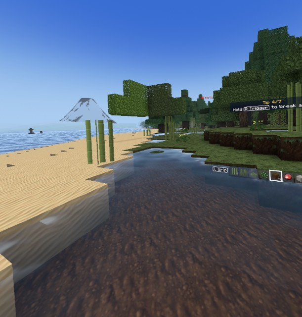

## 09:22:45 - Ja, ähm

- **Transcript:** Ja, ähm
- **Status:** open
- **Build:** 0.95 (2913b0a, M1-M4 (device-tested; ship riding, chests, comfort options, weapon wheel))
- **World:** Quest World (seed 2943808052895834412)
- **Dimension:** Surface
- **Biome:** Beach
- **Position:** -1062.0 64.0 -95.4
- **Facing:** west (yaw 250, pitch -66)
- **Held:** Dirt x4
- **Mount:** on foot
- **Looking at:** Sand at -1063 63 -96
- **Mode:** Creative, health 20/20
- **Time:** day 3 12:28, clear
- **Fps:** 71
- **Levels:** mic -40 dBFS, game sound -24 dBFS
- **Length:** 2.1 s (voice 0.8 s)
- **Just before:** -28s walked into Swamp; -27s message: Walking; -20s walked into Beach; -8s walked into Swamp; -4s walked into Beach; -2s message: ♪ Lantern Hours (Creative)
- **Repro (Mac):** `./snap.sh note --seed 2943808052895834412 --x -1062.0 --z -95.4 --yaw 110 --pitch -66 --time 0.270`
- **Audio (this Mac):** /Users/darthvadar/Documents/Blocksmith/QuestVoiceNotes/raw/vn-20261010-092245-427.aac

## 09:22:48 - Why is there a-- capital buildings are supposed to be more rare. Why, 

- **Transcript:** Why is there a-- capital buildings are supposed to be more rare. Why, why did I just find one spawning in? Maybe that has to do with the s- the, the seed you chose, just so you could verify quickly. I don't know
- **Status:** open
- **Build:** 0.95 (2913b0a, M1-M4 (device-tested; ship riding, chests, comfort options, weapon wheel))
- **World:** Quest World (seed 2943808052895834412)
- **Dimension:** Surface
- **Biome:** Forest
- **Position:** -1155.4 95.7 -26.0
- **Facing:** south-west (yaw 243, pitch -50)
- **Held:** Dirt x4
- **Mount:** on foot, flying
- **Looking at:** nothing
- **Mode:** Creative, health 20/20
- **Time:** day 3 12:32, clear
- **Fps:** 71
- **Levels:** mic -27 dBFS, game sound -23 dBFS
- **Length:** 12.4 s (voice 7.3 s)
- **Just before:** -30s message: Walking; -23s walked into Beach; -11s walked into Swamp; -7s walked into Beach; -5s message: ♪ Lantern Hours (Creative); -3s message: Flying; -1s walked into Swamp
- **While talking:** -4s message: Capital citadel marked on the map; -4s walked into Forest; -3s message: ♪ Slate and Sky (Creative); -1s walked into Beach
- **Position at the end:** -1387.2 113.0 -295.5
- **Repro (Mac):** `./snap.sh note --seed 2943808052895834412 --x -1155.4 --z -26.0 --yaw 117 --pitch -50 --time 0.272`
- **Audio (this Mac):** /Users/darthvadar/Documents/Blocksmith/QuestVoiceNotes/raw/vn-20261010-092248-587.aac

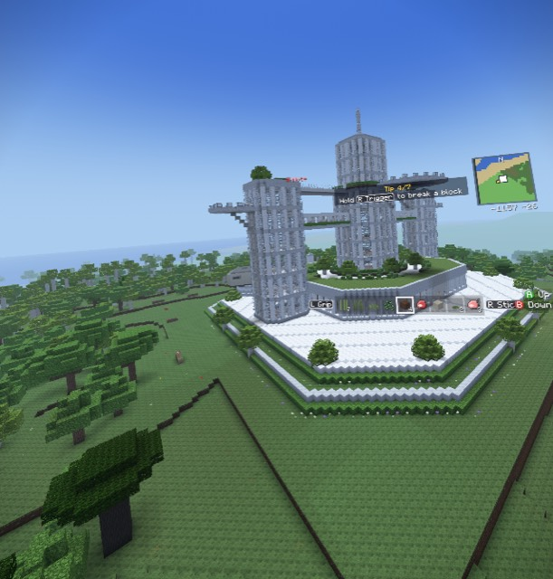

## 09:23:02 - And yeah, okay

- **Transcript:** And yeah, okay
- **Status:** open
- **Build:** 0.95 (2913b0a, M1-M4 (device-tested; ship riding, chests, comfort options, weapon wheel))
- **World:** Quest World (seed 2943808052895834412)
- **Dimension:** Surface
- **Biome:** Beach
- **Position:** -1282.1 113.0 -386.8
- **Facing:** north-west (yaw 333, pitch -64)
- **Held:** Dirt x4
- **Mount:** on foot, flying
- **Looking at:** nothing
- **Mode:** Creative, health 20/20
- **Time:** day 3 12:47, clear
- **Fps:** 71
- **Levels:** mic -31 dBFS, game sound -24 dBFS
- **Length:** 3.4 s (voice 1.1 s)
- **Just before:** -24s walked into Swamp; -20s walked into Beach; -19s message: ♪ Lantern Hours (Creative); -16s message: Flying; -14s walked into Swamp; -13s message: Capital citadel marked on the map; -12s walked into Forest; -7s message: ♪ Slate and Sky (Creative); -4s walked into Beach
- **Repro (Mac):** `./snap.sh note --seed 2943808052895834412 --x -1282.1 --z -386.8 --yaw 27 --pitch -64 --time 0.283`
- **Audio (this Mac):** /Users/darthvadar/Documents/Blocksmith/QuestVoiceNotes/raw/vn-20261010-092302-008.aac

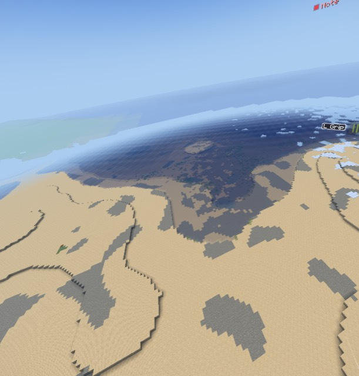

## 09:23:06 - The volcano just looks weird when it's in the background. That shouldn

- **Transcript:** The volcano just looks weird when it's in the background. That shouldn't be there
- **Status:** open
- **Build:** 0.95 (2913b0a, M1-M4 (device-tested; ship riding, chests, comfort options, weapon wheel))
- **World:** Quest World (seed 2943808052895834412)
- **Dimension:** Surface
- **Biome:** Beach
- **Position:** -1141.2 149.0 -475.5
- **Facing:** east (yaw 76, pitch -33)
- **Held:** Dirt x4
- **Mount:** on foot, flying
- **Looking at:** nothing
- **Mode:** Creative, health 20/20
- **Time:** day 3 12:52, clear
- **Fps:** 70
- **Levels:** mic -33 dBFS, game sound -30 dBFS
- **Length:** 4.6 s (voice 2.5 s)
- **Just before:** -28s walked into Swamp; -24s walked into Beach; -22s message: ♪ Lantern Hours (Creative); -20s message: Flying; -18s walked into Swamp; -17s message: Capital citadel marked on the map; -16s walked into Forest; -10s message: ♪ Slate and Sky (Creative); -8s walked into Beach
- **Repro (Mac):** `./snap.sh note --seed 2943808052895834412 --x -1141.2 --z -475.5 --yaw -76 --pitch -33 --time 0.287`
- **Audio (this Mac):** /Users/darthvadar/Documents/Blocksmith/QuestVoiceNotes/raw/vn-20261010-092306-087.aac

## 09:23:10 - The render distance switched down to 15 as I was moving. It'd be nice 

- **Transcript:** The render distance switched down to 15 as I was moving. It'd be nice if we could make it so that it automatically switches back when the, uh
- **Status:** open
- **Build:** 0.95 (2913b0a, M1-M4 (device-tested; ship riding, chests, comfort options, weapon wheel))
- **World:** Quest World (seed 2943808052895834412)
- **Dimension:** Surface
- **Biome:** Taiga
- **Position:** -859.1 149.0 -709.8
- **Facing:** east (yaw 78, pitch -35)
- **Held:** Dirt x4
- **Mount:** on foot, flying
- **Looking at:** nothing
- **Mode:** Creative, health 20/20
- **Time:** day 3 12:57, clear
- **Fps:** 66
- **Levels:** mic -28 dBFS, game sound -24 dBFS
- **Length:** 8.6 s (voice 5.2 s)
- **Just before:** -28s walked into Beach; -27s message: ♪ Lantern Hours (Creative); -24s message: Flying; -22s walked into Swamp; -21s message: Capital citadel marked on the map; -20s walked into Forest; -15s message: ♪ Slate and Sky (Creative); -12s walked into Beach; -3s message: Render distance 15 to keep the frame rate (VR Comfort & Controls); -2s walked into Snowy Taiga; -0s walked into Taiga
- **While talking:** -3s walked into Snowy Taiga; -1s walked into Stony Peaks
- **Position at the end:** -583.5 186.6 -836.3
- **Repro (Mac):** `./snap.sh note --seed 2943808052895834412 --x -859.1 --z -709.8 --yaw -78 --pitch -35 --time 0.290`
- **Audio (this Mac):** /Users/darthvadar/Documents/Blocksmith/QuestVoiceNotes/raw/vn-20261010-092310-767.aac

## 09:23:19 - The frame comes back together. Volcanoes, they don't mesh very well in

- **Transcript:** The frame comes back together. Volcanoes, they don't mesh very well into the, uh
- **Status:** open
- **Build:** 0.95 (2913b0a, M1-M4 (device-tested; ship riding, chests, comfort options, weapon wheel))
- **World:** Quest World (seed 2943808052895834412)
- **Dimension:** Surface
- **Biome:** Stony Peaks
- **Position:** -402.7 192.8 -852.0
- **Facing:** north-east (yaw 64, pitch -39)
- **Held:** Dirt x4
- **Mount:** on foot, flying
- **Looking at:** nothing
- **Mode:** Creative, health 20/20
- **Time:** day 3 13:07, clear
- **Fps:** 72
- **Levels:** mic -31 dBFS, game sound -17 dBFS
- **Length:** 6.9 s (voice 3.5 s)
- **Just before:** -29s message: Capital citadel marked on the map; -29s walked into Forest; -23s message: ♪ Slate and Sky (Creative); -21s walked into Beach; -12s message: Render distance 15 to keep the frame rate (VR Comfort & Controls); -11s walked into Snowy Taiga; -9s walked into Taiga; -7s walked into Snowy Taiga; -5s walked into Stony Peaks; -3s message: Walking; -2s message: Flying
- **While talking:** -3s walked into Taiga
- **Position at the end:** -342.3 192.8 -908.3
- **Repro (Mac):** `./snap.sh note --seed 2943808052895834412 --x -402.7 --z -852.0 --yaw -64 --pitch -39 --time 0.297`
- **Audio (this Mac):** /Users/darthvadar/Documents/Blocksmith/QuestVoiceNotes/raw/vn-20261010-092319-407.aac

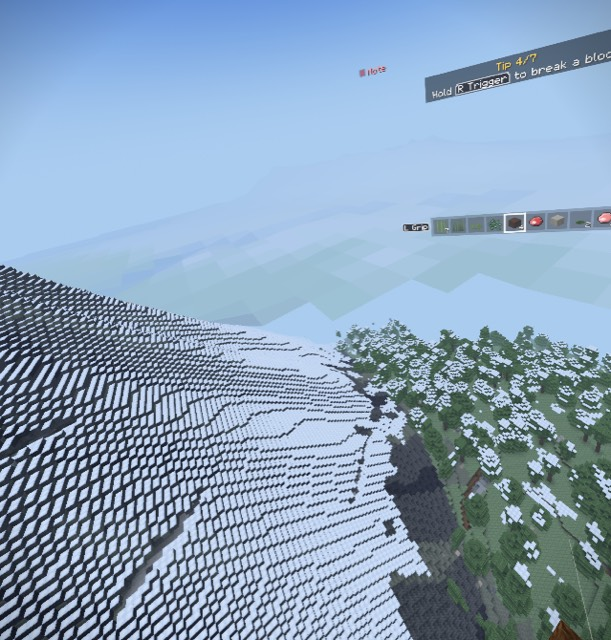

## 09:23:26 - into the environment

- **Transcript:** into the environment
- **Status:** open
- **Build:** 0.95 (2913b0a, M1-M4 (device-tested; ship riding, chests, comfort options, weapon wheel))
- **World:** Quest World (seed 2943808052895834412)
- **Dimension:** Surface
- **Biome:** Taiga
- **Position:** -290.0 195.7 -986.4
- **Facing:** north-east (yaw 41, pitch -58)
- **Held:** Dirt x4
- **Mount:** on foot
- **Looking at:** nothing
- **Mode:** Creative, health 20/20
- **Time:** day 3 13:14, clear
- **Fps:** 67
- **Levels:** mic -53 dBFS, game sound -21 dBFS
- **Length:** 1.9 s (voice 0.5 s)
- **Just before:** -29s message: ♪ Slate and Sky (Creative); -26s walked into Beach; -17s message: Render distance 15 to keep the frame rate (VR Comfort & Controls); -16s walked into Snowy Taiga; -14s walked into Taiga; -12s walked into Snowy Taiga; -10s walked into Stony Peaks; -9s message: Walking; -8s message: Flying; -4s walked into Taiga; -0s message: Walking; -0s message: Village marked on the map
- **Repro (Mac):** `./snap.sh note --seed 2943808052895834412 --x -290.0 --z -986.4 --yaw -41 --pitch -58 --time 0.302`
- **Audio (this Mac):** /Users/darthvadar/Documents/Blocksmith/QuestVoiceNotes/raw/vn-20261010-092326-867.aac

## 09:23:41 - Checking out the town now. I think it would be good if... Oh, yeah, lo

- **Transcript:** Checking out the town now. I think it would be good if... Oh, yeah, look at that. It'd be good
- **Status:** open
- **Build:** 0.95 (2913b0a, M1-M4 (device-tested; ship riding, chests, comfort options, weapon wheel))
- **World:** Quest World (seed 2943808052895834412)
- **Dimension:** Surface
- **Biome:** Taiga
- **Position:** -275.9 76.0 -1018.6
- **Facing:** north (yaw 7, pitch -1)
- **Held:** Dirt x4
- **Mount:** on foot
- **Looking at:** Chest at -276 77 -1025
- **Mode:** Creative, health 20/20
- **Time:** day 3 13:28, clear
- **Fps:** 53
- **Levels:** mic -26 dBFS, game sound -17 dBFS
- **Length:** 8.0 s (voice 3.9 s)
- **Just before:** -29s message: Render distance 15 to keep the frame rate (VR Comfort & Controls); -28s walked into Snowy Taiga; -26s walked into Taiga; -24s walked into Snowy Taiga; -22s walked into Stony Peaks; -20s message: Walking; -19s message: Flying; -16s walked into Taiga; -12s message: Walking; -12s message: Village marked on the map; -11s message: Flying; -11s message: Render distance 14 to keep the frame rate (VR Comfort & Controls); -10s message: Walking; -10s message: Flying; -9s message: Walking
- **While talking:** -5s opened ChestMenu; -3s closed ChestMenu
- **Position at the end:** -272.2 77.0 -1029.8
- **Repro (Mac):** `./snap.sh note --seed 2943808052895834412 --x -275.9 --z -1018.6 --yaw -7 --pitch -1 --time 0.311`
- **Audio (this Mac):** /Users/darthvadar/Documents/Blocksmith/QuestVoiceNotes/raw/vn-20261010-092341-587.aac

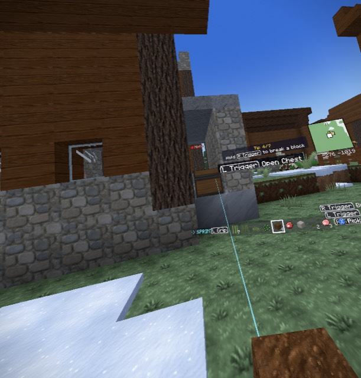

## 09:23:50 - If we'd be able to encounter like little, little camps or whatever lik

- **Transcript:** If we'd be able to encounter like little, little camps or whatever like you do in Red Dead Redemption 2
- **Status:** open
- **Build:** 0.95 (2913b0a, M1-M4 (device-tested; ship riding, chests, comfort options, weapon wheel))
- **World:** Quest World (seed 2943808052895834412)
- **Dimension:** Surface
- **Biome:** Taiga
- **Position:** -276.3 76.9 -1031.3
- **Facing:** west (yaw 287, pitch -50)
- **Held:** Dirt x4
- **Mount:** on foot
- **Looking at:** Dirt Path at -278 76 -1032
- **Mode:** Creative, health 20/20
- **Time:** day 3 13:38, clear
- **Fps:** 72
- **Levels:** mic -29 dBFS, game sound -21 dBFS
- **Length:** 6.8 s (voice 4.4 s)
- **Just before:** -30s walked into Stony Peaks; -28s message: Walking; -28s message: Flying; -24s walked into Taiga; -20s message: Walking; -20s message: Village marked on the map; -20s message: Flying; -19s message: Render distance 14 to keep the frame rate (VR Comfort & Controls); -19s message: Walking; -18s message: Flying; -17s message: Walking; -8s opened ChestMenu; -6s closed ChestMenu
- **While talking:** -5s message: Elias Burke: Afternoon.
- **Position at the end:** -281.9 77.0 -1033.0
- **Repro (Mac):** `./snap.sh note --seed 2943808052895834412 --x -276.3 --z -1031.3 --yaw 73 --pitch -50 --time 0.318`
- **Audio (this Mac):** /Users/darthvadar/Documents/Blocksmith/QuestVoiceNotes/raw/vn-20261010-092350-067.aac

## 09:23:57 - That'd be nice

- **Transcript:** That'd be nice
- **Status:** open
- **Build:** 0.95 (2913b0a, M1-M4 (device-tested; ship riding, chests, comfort options, weapon wheel))
- **World:** Quest World (seed 2943808052895834412)
- **Dimension:** Surface
- **Biome:** Taiga
- **Position:** -284.3 76.9 -1035.7
- **Facing:** west (yaw 267, pitch -8)
- **Held:** Dirt x4
- **Mount:** on foot
- **Looking at:** Cobblestone at -291 77 -1036
- **Mode:** Creative, health 20/20
- **Time:** day 3 13:46, clear
- **Fps:** 72
- **Levels:** mic -46 dBFS, game sound -22 dBFS
- **Length:** 2.0 s (voice 0.5 s)
- **Just before:** -27s message: Walking; -27s message: Village marked on the map; -27s message: Flying; -26s message: Render distance 14 to keep the frame rate (VR Comfort & Controls); -26s message: Walking; -25s message: Flying; -24s message: Walking; -15s opened ChestMenu; -13s closed ChestMenu; -7s message: Elias Burke: Afternoon.
- **Repro (Mac):** `./snap.sh note --seed 2943808052895834412 --x -284.3 --z -1035.7 --yaw 93 --pitch -8 --time 0.324`
- **Audio (this Mac):** /Users/darthvadar/Documents/Blocksmith/QuestVoiceNotes/raw/vn-20261010-092357-167.aac

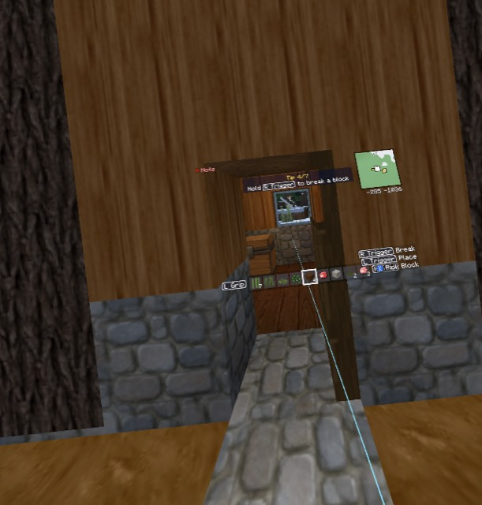

## 09:23:59 - Okay, the bed and everything

- **Transcript:** Okay, the bed and everything
- **Status:** open
- **Build:** 0.95 (2913b0a, M1-M4 (device-tested; ship riding, chests, comfort options, weapon wheel))
- **World:** Quest World (seed 2943808052895834412)
- **Dimension:** Surface
- **Biome:** Taiga
- **Position:** -287.4 77.0 -1035.3
- **Facing:** north-west (yaw 306, pitch -45)
- **Held:** Dirt x4
- **Mount:** on foot
- **Looking at:** Spruce Planks at -289 76 -1036
- **Mode:** Creative, health 20/20
- **Time:** day 3 13:49, clear
- **Fps:** 72
- **Levels:** mic -53 dBFS, game sound -24 dBFS
- **Length:** 3.1 s (voice 1.4 s)
- **Just before:** -30s message: Walking; -30s message: Village marked on the map; -29s message: Flying; -29s message: Render distance 14 to keep the frame rate (VR Comfort & Controls); -28s message: Walking; -27s message: Flying; -27s message: Walking; -18s opened ChestMenu; -16s closed ChestMenu; -9s message: Elias Burke: Afternoon.; -1s opened ChestMenu; -0s closed ChestMenu
- **Repro (Mac):** `./snap.sh note --seed 2943808052895834412 --x -287.4 --z -1035.3 --yaw 54 --pitch -45 --time 0.326`
- **Audio (this Mac):** /Users/darthvadar/Documents/Blocksmith/QuestVoiceNotes/raw/vn-20261010-092359-587.aac

## 09:24:02 - Everything looks good, it's just everything's blurry. It's not sharp, 

- **Transcript:** Everything looks good, it's just everything's blurry. It's not sharp, which
- **Status:** open
- **Build:** 0.95 (2913b0a, M1-M4 (device-tested; ship riding, chests, comfort options, weapon wheel))
- **World:** Quest World (seed 2943808052895834412)
- **Dimension:** Surface
- **Biome:** Taiga
- **Position:** -287.6 77.0 -1035.6
- **Facing:** south-west (yaw 207, pitch -34)
- **Held:** Dirt x4
- **Mount:** on foot
- **Looking at:** Cobblestone at -289 77 -1034
- **Mode:** Creative, health 20/20
- **Time:** day 3 13:52, clear
- **Fps:** 72
- **Levels:** mic -33 dBFS, game sound -22 dBFS
- **Length:** 5.7 s (voice 2.6 s)
- **Just before:** -30s message: Walking; -20s opened ChestMenu; -19s closed ChestMenu; -12s message: Elias Burke: Afternoon.; -4s opened ChestMenu; -3s closed ChestMenu; -2s message: Gideon Merriman: Don't let them sell you nothing you don't need.
- **Position at the end:** -287.3 77.0 -1035.6
- **Repro (Mac):** `./snap.sh note --seed 2943808052895834412 --x -287.6 --z -1035.6 --yaw 153 --pitch -34 --time 0.328`
- **Audio (this Mac):** /Users/darthvadar/Documents/Blocksmith/QuestVoiceNotes/raw/vn-20261010-092402-427.aac

## 09:24:08 - Isn't good. If it were sharp, it would look amazing, but I don't know 

- **Transcript:** Isn't good. If it were sharp, it would look amazing, but I don't know if you can see what I'm seeing. I'm looking at the stone and looking at the chest. It's like
- **Status:** open
- **Build:** 0.95 (2913b0a, M1-M4 (device-tested; ship riding, chests, comfort options, weapon wheel))
- **World:** Quest World (seed 2943808052895834412)
- **Dimension:** Surface
- **Biome:** Taiga
- **Position:** -287.3 77.0 -1035.6
- **Facing:** north (yaw 353, pitch -31)
- **Held:** Dirt x4
- **Mount:** on foot
- **Looking at:** Cobblestone at -288 77 -1038
- **Mode:** Creative, health 20/20
- **Time:** day 3 13:59, clear
- **Fps:** 72
- **Levels:** mic -35 dBFS, game sound -22 dBFS
- **Length:** 8.2 s (voice 5.0 s)
- **Just before:** -26s opened ChestMenu; -24s closed ChestMenu; -18s message: Elias Burke: Afternoon.; -10s opened ChestMenu; -9s closed ChestMenu; -8s message: Gideon Merriman: Don't let them sell you nothing you don't need.
- **Position at the end:** -287.9 77.0 -1035.1
- **Repro (Mac):** `./snap.sh note --seed 2943808052895834412 --x -287.3 --z -1035.6 --yaw 7 --pitch -31 --time 0.333`
- **Audio (this Mac):** /Users/darthvadar/Documents/Blocksmith/QuestVoiceNotes/raw/vn-20261010-092408-127.aac

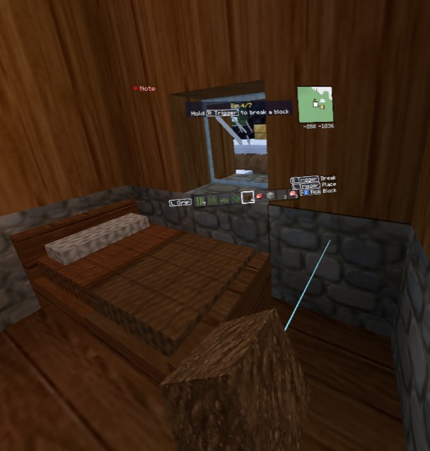

## 09:24:16 - It looks too compressed. Uh, it's just too much

- **Transcript:** It looks too compressed. Uh, it's just too much
- **Status:** open
- **Build:** 0.95 (2913b0a, M1-M4 (device-tested; ship riding, chests, comfort options, weapon wheel))
- **World:** Quest World (seed 2943808052895834412)
- **Dimension:** Surface
- **Biome:** Taiga
- **Position:** -287.9 77.0 -1035.1
- **Facing:** west (yaw 248, pitch -40)
- **Held:** Dirt x4
- **Mount:** on foot
- **Looking at:** Chest at -290 77 -1035
- **Mode:** Creative, health 20/20
- **Time:** day 3 14:09, clear
- **Fps:** 72
- **Levels:** mic -37 dBFS, game sound -22 dBFS
- **Length:** 4.3 s (voice 2.1 s)
- **Just before:** -26s message: Elias Burke: Afternoon.; -18s opened ChestMenu; -17s closed ChestMenu; -16s message: Gideon Merriman: Don't let them sell you nothing you don't need.
- **Repro (Mac):** `./snap.sh note --seed 2943808052895834412 --x -287.9 --z -1035.1 --yaw 112 --pitch -40 --time 0.340`
- **Audio (this Mac):** /Users/darthvadar/Documents/Blocksmith/QuestVoiceNotes/raw/vn-20261010-092416-167.aac

## 09:24:20 - Yeah. Not good enough. Also make it so the villagers get real angry wh

- **Transcript:** Yeah. Not good enough. Also make it so the villagers get real angry when you start stealing from them. Make it so that maybe they might have a sheriff or something that would replace the iron golem
- **Status:** open
- **Build:** 0.95 (2913b0a, M1-M4 (device-tested; ship riding, chests, comfort options, weapon wheel))
- **World:** Quest World (seed 2943808052895834412)
- **Dimension:** Surface
- **Biome:** Taiga
- **Position:** -287.9 77.0 -1034.4
- **Facing:** west (yaw 274, pitch -42)
- **Held:** Dirt x4
- **Mount:** on foot
- **Looking at:** nothing
- **Mode:** Creative, health 20/20, screen ChestMenu
- **Time:** day 3 14:14, clear
- **Fps:** 72
- **Levels:** mic -41 dBFS, game sound -22 dBFS
- **Length:** 12.4 s (voice 7.1 s)
- **Just before:** -22s opened ChestMenu; -21s closed ChestMenu; -21s message: Gideon Merriman: Don't let them sell you nothing you don't need.; -2s opened ChestMenu
- **While talking:** -5s closed ChestMenu; -3s message: Jasper Ingram: Hot one today.
- **Position at the end:** -277.9 76.9 -1031.2
- **Repro (Mac):** `./snap.sh note --seed 2943808052895834412 --x -287.9 --z -1034.4 --yaw 86 --pitch -42 --time 0.344`
- **Audio (this Mac):** /Users/darthvadar/Documents/Blocksmith/QuestVoiceNotes/raw/vn-20261010-092420-527.aac

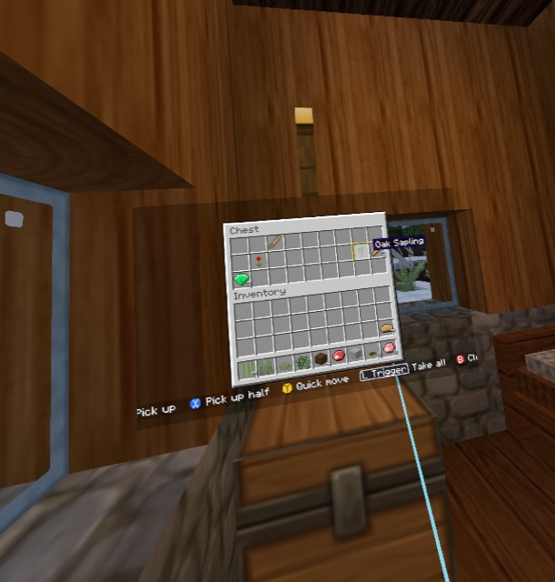

## 09:24:34 - Um, that'd be an idea

- **Transcript:** Um, that'd be an idea
- **Status:** open
- **Build:** 0.95 (2913b0a, M1-M4 (device-tested; ship riding, chests, comfort options, weapon wheel))
- **World:** Quest World (seed 2943808052895834412)
- **Dimension:** Surface
- **Biome:** Taiga
- **Position:** -269.0 76.9 -1031.5
- **Facing:** east (yaw 85, pitch -48)
- **Held:** Dirt x4
- **Mount:** on foot
- **Looking at:** nothing
- **Mode:** Creative, health 20/20
- **Time:** day 3 14:30, clear
- **Fps:** 72
- **Levels:** mic -41 dBFS, game sound -28 dBFS
- **Length:** 2.9 s (voice 1.3 s)
- **Just before:** -15s opened ChestMenu; -13s closed ChestMenu; -6s message: Jasper Ingram: Hot one today.
- **Repro (Mac):** `./snap.sh note --seed 2943808052895834412 --x -269.0 --z -1031.5 --yaw -85 --pitch -48 --time 0.355`
- **Audio (this Mac):** /Users/darthvadar/Documents/Blocksmith/QuestVoiceNotes/raw/vn-20261010-092434-027.aac

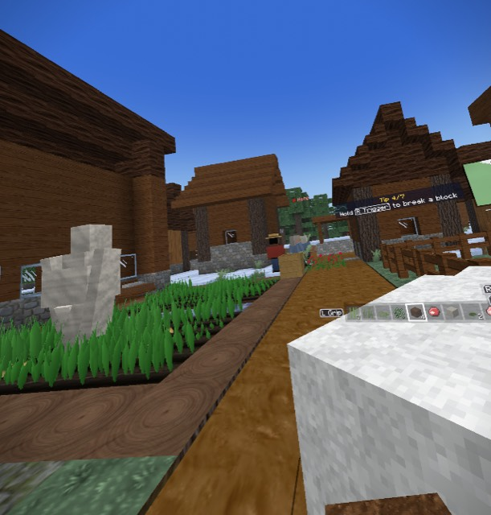

## 09:24:38 - Um, and I could say they speak English too

- **Transcript:** Um, and I could say they speak English too
- **Status:** open
- **Build:** 0.95 (2913b0a, M1-M4 (device-tested; ship riding, chests, comfort options, weapon wheel))
- **World:** Quest World (seed 2943808052895834412)
- **Dimension:** Surface
- **Biome:** Taiga
- **Position:** -260.4 77.0 -1032.8
- **Facing:** east (yaw 98, pitch -0)
- **Held:** Dirt x4
- **Mount:** on foot
- **Looking at:** nothing
- **Mode:** Creative, health 20/20
- **Time:** day 3 14:36, clear
- **Fps:** 72
- **Levels:** mic -30 dBFS, game sound -26 dBFS
- **Length:** 4.1 s (voice 1.8 s)
- **Just before:** -20s opened ChestMenu; -18s closed ChestMenu; -11s message: Jasper Ingram: Hot one today.; -3s message: Otis Ingram: Rain'd do the fields good.; -3s opened MerchantMenu; -1s closed MerchantMenu
- **Repro (Mac):** `./snap.sh note --seed 2943808052895834412 --x -260.4 --z -1032.8 --yaw -98 --pitch -0 --time 0.359`
- **Audio (this Mac):** /Users/darthvadar/Documents/Blocksmith/QuestVoiceNotes/raw/vn-20261010-092438-927.aac

## 09:24:44 - So yeah, bunch of vo-voice lines you're gonna need

- **Transcript:** So yeah, bunch of vo-voice lines you're gonna need
- **Status:** open
- **Build:** 0.95 (2913b0a, M1-M4 (device-tested; ship riding, chests, comfort options, weapon wheel))
- **World:** Quest World (seed 2943808052895834412)
- **Dimension:** Surface
- **Biome:** Snowy Taiga
- **Position:** -251.4 77.0 -1044.3
- **Facing:** north (yaw 359, pitch -22)
- **Held:** Dirt x4
- **Mount:** on foot
- **Looking at:** Glass Pane at -252 78 -1046
- **Mode:** Creative, health 20/20
- **Time:** day 3 14:43, clear
- **Fps:** 69
- **Levels:** mic -36 dBFS, game sound -39 dBFS
- **Length:** 4.0 s (voice 1.9 s)
- **Just before:** -26s opened ChestMenu; -23s closed ChestMenu; -16s message: Jasper Ingram: Hot one today.; -8s message: Otis Ingram: Rain'd do the fields good.; -8s opened MerchantMenu; -6s closed MerchantMenu; -0s message: Zeke Nash: You new around here?
- **Repro (Mac):** `./snap.sh note --seed 2943808052895834412 --x -251.4 --z -1044.3 --yaw 1 --pitch -22 --time 0.363`
- **Audio (this Mac):** /Users/darthvadar/Documents/Blocksmith/QuestVoiceNotes/raw/vn-20261010-092444-387.aac

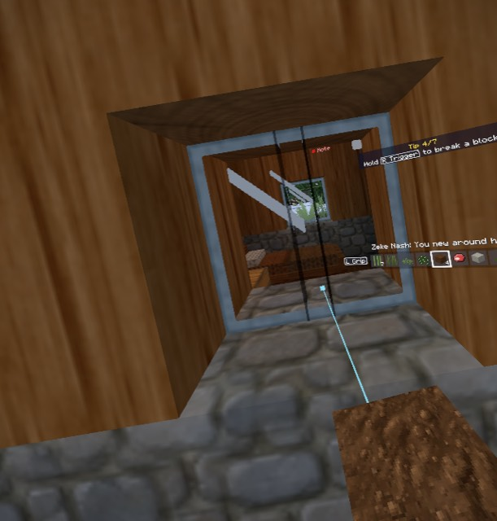

## 09:24:50 - Oh, okay. I see. You have text

- **Transcript:** Oh, okay. I see. You have text
- **Status:** open
- **Build:** 0.95 (2913b0a, M1-M4 (device-tested; ship riding, chests, comfort options, weapon wheel))
- **World:** Quest World (seed 2943808052895834412)
- **Dimension:** Surface
- **Biome:** Taiga
- **Position:** -247.8 77.0 -1047.7
- **Facing:** north (yaw 358, pitch 1)
- **Held:** Dirt x4
- **Mount:** on foot
- **Looking at:** nothing
- **Mode:** Creative, health 20/20
- **Time:** day 3 14:50, clear
- **Fps:** 71
- **Levels:** mic -39 dBFS, game sound -40 dBFS
- **Length:** 3.1 s (voice 1.3 s)
- **Just before:** -30s closed ChestMenu; -23s message: Jasper Ingram: Hot one today.; -15s message: Otis Ingram: Rain'd do the fields good.; -14s opened MerchantMenu; -12s closed MerchantMenu; -7s message: Zeke Nash: You new around here?; -4s message: Flora Wainwright: Work never ends.
- **Repro (Mac):** `./snap.sh note --seed 2943808052895834412 --x -247.8 --z -1047.7 --yaw 2 --pitch 1 --time 0.369`
- **Audio (this Mac):** /Users/darthvadar/Documents/Blocksmith/QuestVoiceNotes/raw/vn-20261010-092450-887.aac

## 09:24:54 - So it's the same thing when you tap on them. Okay. Um, fun. Got a... O

- **Transcript:** So it's the same thing when you tap on them. Okay. Um, fun. Got a... Okay, crafting table looks nice. Yeah, that's a real good job on the crafting table. I mean, still has a pixelated look. The bed looks sharp
- **Status:** open
- **Build:** 0.95 (2913b0a, M1-M4 (device-tested; ship riding, chests, comfort options, weapon wheel))
- **World:** Quest World (seed 2943808052895834412)
- **Dimension:** Surface
- **Biome:** Snowy Taiga
- **Position:** -251.1 77.0 -1047.3
- **Facing:** west (yaw 250, pitch -38)
- **Held:** Dirt x4
- **Mount:** on foot
- **Looking at:** nothing
- **Mode:** Creative, health 20/20, screen ChestMenu
- **Time:** day 3 14:55, clear
- **Fps:** 72
- **Levels:** mic -37 dBFS, game sound -38 dBFS
- **Length:** 16.5 s (voice 8.1 s)
- **Just before:** -26s message: Jasper Ingram: Hot one today.; -18s message: Otis Ingram: Rain'd do the fields good.; -18s opened MerchantMenu; -16s closed MerchantMenu; -11s message: Zeke Nash: You new around here?; -8s message: Flora Wainwright: Work never ends.; -1s opened ChestMenu
- **While talking:** -4s walked into Snowy Taiga; -4s closed ChestMenu; -2s walked into Taiga
- **Position at the end:** -243.4 77.0 -1047.7
- **Repro (Mac):** `./snap.sh note --seed 2943808052895834412 --x -251.1 --z -1047.3 --yaw 110 --pitch -38 --time 0.372`
- **Audio (this Mac):** /Users/darthvadar/Documents/Blocksmith/QuestVoiceNotes/raw/vn-20261010-092454-507.aac

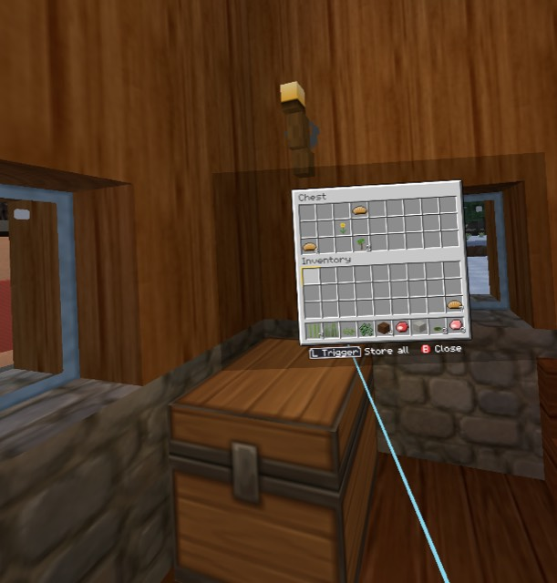

## 09:25:21 - Yeah, work never ends. We're gonna have to find a few more lines besid

- **Transcript:** Yeah, work never ends. We're gonna have to find a few more lines besides that one
- **Status:** open
- **Build:** 0.95 (2913b0a, M1-M4 (device-tested; ship riding, chests, comfort options, weapon wheel))
- **World:** Quest World (seed 2943808052895834412)
- **Dimension:** Surface
- **Biome:** Taiga
- **Position:** -243.4 78.0 -1036.4
- **Facing:** east (yaw 105, pitch -15)
- **Held:** Dirt x4
- **Mount:** on foot
- **Looking at:** Short Grass at -242 78 -1036
- **Mode:** Creative, health 20/20
- **Time:** day 3 15:26, clear
- **Fps:** 70
- **Levels:** mic -36 dBFS, game sound -28 dBFS
- **Length:** 5.6 s (voice 3.4 s)
- **Just before:** -27s opened ChestMenu; -26s walked into Snowy Taiga; -25s closed ChestMenu; -24s walked into Taiga; -8s message: Flora Wainwright: Howdy.; -5s message: Minnie Merriweather: Work never ends.; -2s message: Minnie Merriweather: You new around here?
- **While talking:** -3s message: Flying
- **Position at the end:** -307.3 91.6 -1069.1
- **Repro (Mac):** `./snap.sh note --seed 2943808052895834412 --x -243.4 --z -1036.4 --yaw -105 --pitch -15 --time 0.394`
- **Audio (this Mac):** /Users/darthvadar/Documents/Blocksmith/QuestVoiceNotes/raw/vn-20261010-092521-307.aac

## 09:25:29 - And if we're gonna make the Nether on the ground, probably don't need 

- **Transcript:** And if we're gonna make the Nether on the ground, probably don't need these portals spawning everywhere
- **Status:** open
- **Build:** 0.95 (2913b0a, M1-M4 (device-tested; ship riding, chests, comfort options, weapon wheel))
- **World:** Quest World (seed 2943808052895834412)
- **Dimension:** Surface
- **Biome:** Taiga
- **Position:** -298.2 84.5 -1051.2
- **Facing:** south (yaw 186, pitch -35)
- **Held:** Dirt x4
- **Mount:** on foot
- **Looking at:** nothing
- **Mode:** Creative, health 20/20
- **Time:** day 3 15:35, clear
- **Fps:** 64
- **Levels:** mic -32 dBFS, game sound -100 dBFS
- **Length:** 6.1 s (voice 3.2 s)
- **Just before:** -15s message: Flora Wainwright: Howdy.; -12s message: Minnie Merriweather: Work never ends.; -9s message: Minnie Merriweather: You new around here?; -6s message: Flying; -1s message: Walking
- **While talking:** -4s holding Raw Mutton; -4s message: Raw Mutton; -3s holding White Wool; -3s message: White Wool; -3s holding Lily Pad; -3s message: Lily Pad; -3s holding Raw Porkchop; -3s message: Raw Porkchop; -2s opened ChestMenu
- **Position at the end:** -300.6 78.0 -1046.3
- **Repro (Mac):** `./snap.sh note --seed 2943808052895834412 --x -298.2 --z -1051.2 --yaw 174 --pitch -35 --time 0.400`
- **Audio (this Mac):** /Users/darthvadar/Documents/Blocksmith/QuestVoiceNotes/raw/vn-20261010-092529-486.aac

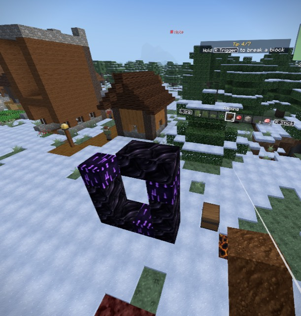

## 09:25:35 - These broken portals, not really any point. Probably a bunch of stuff 

- **Transcript:** These broken portals, not really any point. Probably a bunch of stuff we'll have to decide to get rid of. Gold block looks nice. Very nice
- **Status:** open
- **Build:** 0.95 (2913b0a, M1-M4 (device-tested; ship riding, chests, comfort options, weapon wheel))
- **World:** Quest World (seed 2943808052895834412)
- **Dimension:** Surface
- **Biome:** Taiga
- **Position:** -300.6 78.0 -1046.3
- **Facing:** east (yaw 80, pitch -30)
- **Held:** Raw Porkchop x3
- **Mount:** on foot
- **Looking at:** nothing
- **Mode:** Creative, health 20/20, screen ChestMenu
- **Time:** day 3 15:43, clear
- **Fps:** 68
- **Levels:** mic -42 dBFS, game sound -26 dBFS
- **Length:** 9.7 s (voice 3.8 s)
- **Just before:** -22s message: Flora Wainwright: Howdy.; -18s message: Minnie Merriweather: Work never ends.; -15s message: Minnie Merriweather: You new around here?; -12s message: Flying; -7s message: Walking; -5s holding Raw Mutton; -5s message: Raw Mutton; -5s holding White Wool; -5s message: White Wool; -4s holding Lily Pad; -4s message: Lily Pad; -4s holding Raw Porkchop; -4s message: Raw Porkchop; -3s opened ChestMenu
- **While talking:** -3s closed ChestMenu; -1s message: Gideon Merriman: When I was young this was all prairie.
- **Position at the end:** -291.9 78.0 -1043.5
- **Repro (Mac):** `./snap.sh note --seed 2943808052895834412 --x -300.6 --z -1046.3 --yaw -80 --pitch -30 --time 0.405`
- **Audio (this Mac):** /Users/darthvadar/Documents/Blocksmith/QuestVoiceNotes/raw/vn-20261010-092535-627.aac

## 09:25:54 - Render distance set to 13. So yeah, we're still having issues with the

- **Transcript:** Render distance set to 13. So yeah, we're still having issues with the render distance. So it's just, it's lowering over time. So
- **Status:** open
- **Build:** 0.95 (2913b0a, M1-M4 (device-tested; ship riding, chests, comfort options, weapon wheel))
- **World:** Quest World (seed 2943808052895834412)
- **Dimension:** Surface
- **Biome:** Snowy Plains
- **Position:** -338.8 103.9 -1429.9
- **Facing:** north (yaw 344, pitch -16)
- **Held:** Raw Porkchop x3
- **Mount:** on foot, flying
- **Looking at:** nothing
- **Mode:** Creative, health 20/20
- **Time:** day 3 16:04, clear
- **Fps:** 62
- **Levels:** mic -33 dBFS, game sound -33 dBFS
- **Length:** 8.6 s (voice 5.1 s)
- **Just before:** -30s message: Flying; -25s message: Walking; -23s holding Raw Mutton; -23s message: Raw Mutton; -23s holding White Wool; -23s message: White Wool; -22s holding Lily Pad; -22s message: Lily Pad; -22s holding Raw Porkchop; -22s message: Raw Porkchop; -21s opened ChestMenu; -16s closed ChestMenu; -14s message: Gideon Merriman: When I was young this was all prairie.; -6s message: Flying; -2s message: Render distance 13 to keep the frame rate (VR Comfort & Controls); -1s walked into Snowy Plains
- **While talking:** -3s message: Village marked on the map; -3s message: Walking
- **Position at the end:** -317.9 68.9 -1610.6
- **Repro (Mac):** `./snap.sh note --seed 2943808052895834412 --x -338.8 --z -1429.9 --yaw 16 --pitch -16 --time 0.420`
- **Audio (this Mac):** /Users/darthvadar/Documents/Blocksmith/QuestVoiceNotes/raw/vn-20261010-092554-947.aac

## 09:26:03 - I don't know if you actually made a permanent efficiency improvement i

- **Transcript:** I don't know if you actually made a permanent efficiency improvement in that regard
- **Status:** open
- **Build:** 0.95 (2913b0a, M1-M4 (device-tested; ship riding, chests, comfort options, weapon wheel))
- **World:** Quest World (seed 2943808052895834412)
- **Dimension:** Surface
- **Biome:** Snowy Plains
- **Position:** -328.3 70.0 -1624.7
- **Facing:** north (yaw 347, pitch -59)
- **Held:** Raw Porkchop x3
- **Mount:** on foot
- **Looking at:** Snow Block at -329 71 -1626
- **Mode:** Creative, health 20/20
- **Time:** day 3 16:14, clear
- **Fps:** 71
- **Levels:** mic -25 dBFS, game sound -20 dBFS
- **Length:** 6.5 s (voice 3.3 s)
- **Just before:** -30s opened ChestMenu; -25s closed ChestMenu; -22s message: Gideon Merriman: When I was young this was all prairie.; -14s message: Flying; -11s message: Render distance 13 to keep the frame rate (VR Comfort & Controls); -9s walked into Snowy Plains; -7s message: Village marked on the map; -7s message: Walking
- **While talking:** -5s message: Nell Nash: Take a look, I've got good stock.
- **Position at the end:** -343.4 70.0 -1622.3
- **Repro (Mac):** `./snap.sh note --seed 2943808052895834412 --x -328.3 --z -1624.7 --yaw 13 --pitch -59 --time 0.427`
- **Audio (this Mac):** /Users/darthvadar/Documents/Blocksmith/QuestVoiceNotes/raw/vn-20261010-092603-427.aac

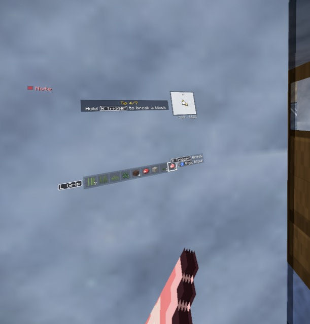

## 09:26:10 - Oh, I like the, the chef building. That's really cool. Oh, and they ta

- **Transcript:** Oh, I like the, the chef building. That's really cool. Oh, and they take money. Okay. So this guy was updated. The rest of them weren't updated. I have a wallet. We should have a, uh, amount of cash up in the side
- **Status:** open
- **Build:** 0.95 (2913b0a, M1-M4 (device-tested; ship riding, chests, comfort options, weapon wheel))
- **World:** Quest World (seed 2943808052895834412)
- **Dimension:** Surface
- **Biome:** Snowy Plains
- **Position:** -342.5 70.0 -1619.6
- **Facing:** south-west (yaw 215, pitch -10)
- **Held:** Raw Porkchop x3
- **Mount:** on foot
- **Looking at:** Furnace at -345 71 -1617
- **Mode:** Creative, health 20/20
- **Time:** day 3 16:23, clear
- **Fps:** 72
- **Levels:** mic -31 dBFS, game sound -32 dBFS
- **Length:** 14.6 s (voice 8.6 s)
- **Just before:** -29s message: Gideon Merriman: When I was young this was all prairie.; -21s message: Flying; -18s message: Render distance 13 to keep the frame rate (VR Comfort & Controls); -16s walked into Snowy Plains; -14s message: Village marked on the map; -14s message: Walking; -7s message: Nell Nash: Take a look, I've got good stock.; -1s message: Silas Coffey: Afternoon.
- **While talking:** -4s opened ShopMenu
- **Position at the end:** -341.7 70.0 -1619.5
- **Repro (Mac):** `./snap.sh note --seed 2943808052895834412 --x -342.5 --z -1619.6 --yaw 145 --pitch -10 --time 0.433`
- **Audio (this Mac):** /Users/darthvadar/Documents/Blocksmith/QuestVoiceNotes/raw/vn-20261010-092610-447.aac

## 09:26:24 - And then I'm not sure how emeralds would feed into that. I guess an em

- **Transcript:** And then I'm not sure how emeralds would feed into that. I guess an emerald would be a dollar. Yeah
- **Status:** open
- **Build:** 0.95 (2913b0a, M1-M4 (device-tested; ship riding, chests, comfort options, weapon wheel))
- **World:** Quest World (seed 2943808052895834412)
- **Dimension:** Surface
- **Biome:** Snowy Plains
- **Position:** -341.7 70.0 -1619.5
- **Facing:** south-west (yaw 229, pitch -9)
- **Held:** Raw Porkchop x3
- **Mount:** on foot
- **Looking at:** nothing
- **Mode:** Creative, health 20/20, screen ShopMenu
- **Time:** day 3 16:40, clear
- **Fps:** 72
- **Levels:** mic -34 dBFS, game sound -32 dBFS
- **Length:** 7.3 s (voice 3.5 s)
- **Just before:** -28s message: Village marked on the map; -28s message: Walking; -21s message: Nell Nash: Take a look, I've got good stock.; -15s message: Silas Coffey: Afternoon.; -14s opened ShopMenu
- **Position at the end:** -341.7 70.0 -1619.5
- **Repro (Mac):** `./snap.sh note --seed 2943808052895834412 --x -341.7 --z -1619.5 --yaw 131 --pitch -9 --time 0.445`
- **Audio (this Mac):** /Users/darthvadar/Documents/Blocksmith/QuestVoiceNotes/raw/vn-20261010-092624-867.aac

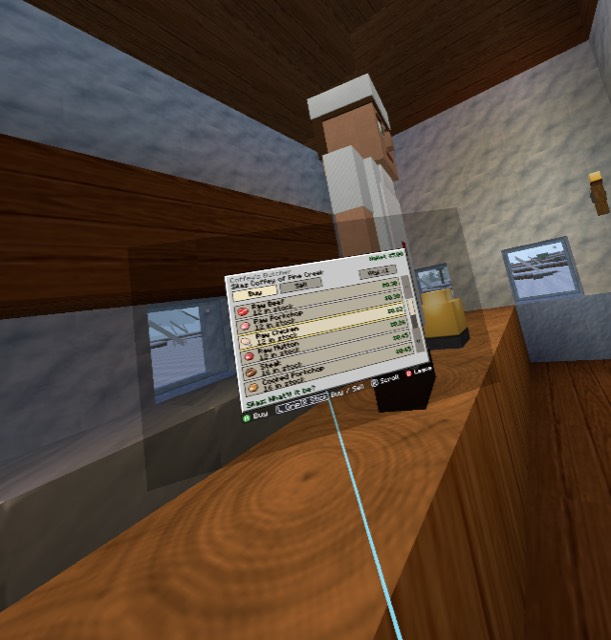

## 09:26:34 - Um, let's see. Okay. Yeah, this is really cool. I really like what was

- **Transcript:** Um, let's see. Okay. Yeah, this is really cool. I really like what was done with the chef. Very good
- **Status:** open
- **Build:** 0.95 (2913b0a, M1-M4 (device-tested; ship riding, chests, comfort options, weapon wheel))
- **World:** Quest World (seed 2943808052895834412)
- **Dimension:** Surface
- **Biome:** Snowy Plains
- **Position:** -341.7 70.0 -1619.5
- **Facing:** south-west (yaw 229, pitch -9)
- **Held:** Raw Porkchop x3
- **Mount:** on foot
- **Looking at:** nothing
- **Mode:** Creative, health 20/20, screen ShopMenu
- **Time:** day 3 16:51, clear
- **Fps:** 72
- **Levels:** mic -32 dBFS, game sound -34 dBFS
- **Length:** 6.7 s (voice 3.6 s)
- **Just before:** -24s message: Silas Coffey: Afternoon.; -23s opened ShopMenu
- **While talking:** -2s closed ShopMenu
- **Position at the end:** -343.3 70.0 -1620.7
- **Repro (Mac):** `./snap.sh note --seed 2943808052895834412 --x -341.7 --z -1619.5 --yaw 131 --pitch -9 --time 0.453`
- **Audio (this Mac):** /Users/darthvadar/Documents/Blocksmith/QuestVoiceNotes/raw/vn-20261010-092634-067.aac

## 09:26:46 - So that's good

- **Transcript:** So that's good
- **Status:** open
- **Build:** 0.95 (2913b0a, M1-M4 (device-tested; ship riding, chests, comfort options, weapon wheel))
- **World:** Quest World (seed 2943808052895834412)
- **Dimension:** Surface
- **Biome:** Snowy Plains
- **Position:** -343.6 69.9 -1623.4
- **Facing:** west (yaw 285, pitch 16)
- **Held:** Raw Porkchop x3
- **Mount:** on foot
- **Looking at:** nothing
- **Mode:** Creative, health 20/20, screen PauseMenu
- **Time:** day 3 17:04, clear
- **Fps:** 72
- **Levels:** mic -41 dBFS, game sound -30 dBFS
- **Length:** 2.1 s (voice 0.4 s)
- **Just before:** -9s closed ShopMenu; -2s opened PauseMenu
- **Repro (Mac):** `./snap.sh note --seed 2943808052895834412 --x -343.6 --z -1623.4 --yaw 75 --pitch 16 --time 0.461`
- **Audio (this Mac):** /Users/darthvadar/Documents/Blocksmith/QuestVoiceNotes/raw/vn-20261010-092646-327.aac

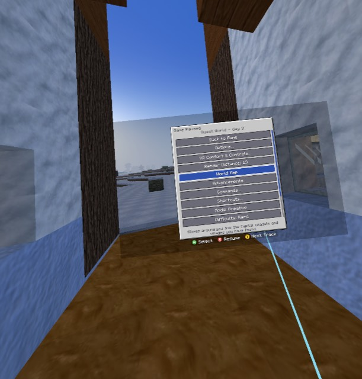
