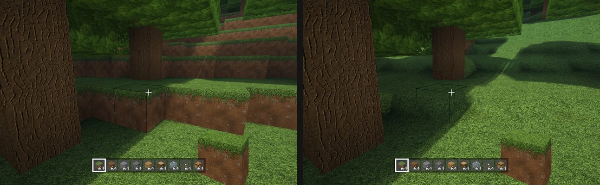
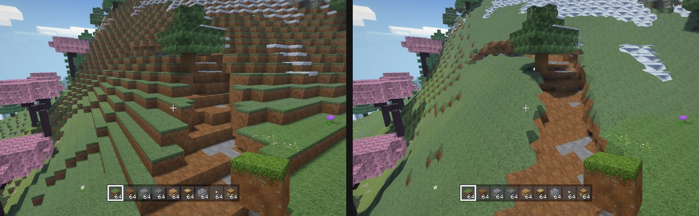
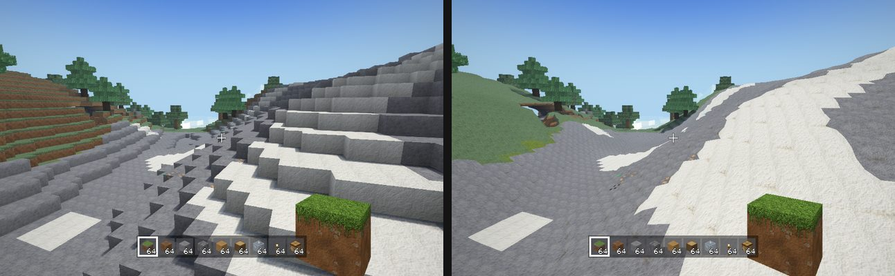
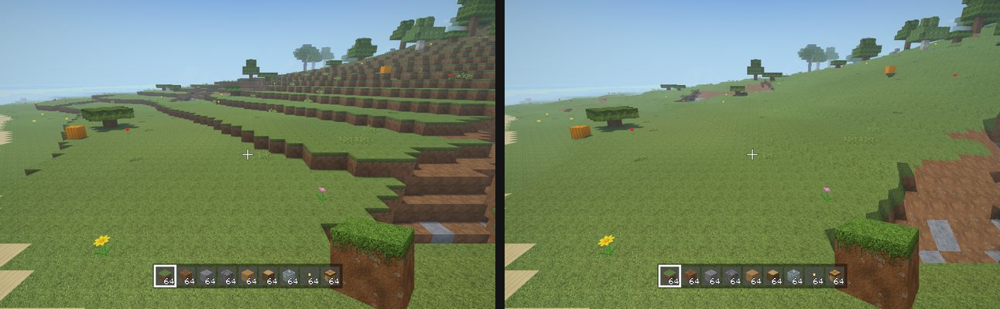
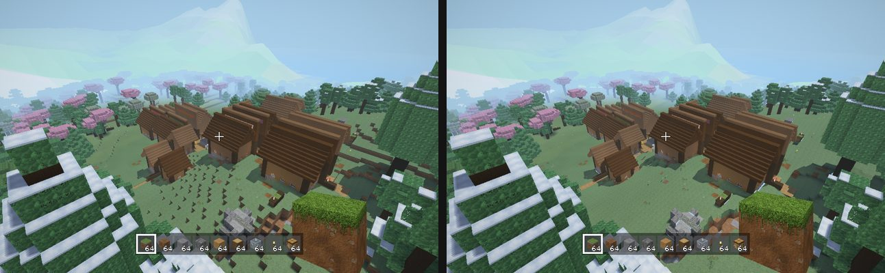
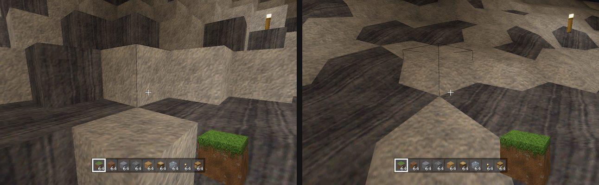

# Smooth terrain — prototype and recommendation (decision pending)

Each pair is cubic (left) vs smooth (right). These are the same 6 places, seed 12345, all on the Mac Fancy renderer. Regenerate them with
`tools/smooth_shots.sh` (1 to 2 minutes).

| | |
|---|---|
| spawn  | hills  |
| peaks  | beach  |
| village  | cave with torches  |

All six pairs on one sheet: [smooth-terrain/sheet.jpg](smooth-terrain/sheet.jpg).

## How to try it
- **Mac:** Pause > Options > Video > **Smooth Terrain (Prototype)**. The world remeshes in the background. On the command line, `--smooth` turns it on and `--cubic` forces it off.
- **Quest:** the same row is on the pause menu's Video page, or put `smoothTerrain = on` in `quest-settings.txt`
  (`adb push quest-settings.txt /sdcard/Android/data/com.blocksmith.quest/files/`).
  The APK with the toggle is on quest-dist (5a27c73, built from b1b5290).
- It is **off by default**, and saves are untouched. Switching it off gives back exactly the old meshes: the verifier found a cubic render byte-identical to one made with no flag.

## What it is (and isn't)
- **The world data stays blocks.** Saves, world gen, mining, drops, AI pathing, copper circuits, structures and light are all unchanged.
- **Only meshing changes, and only for natural blocks:** stone, dirt, grass, sand, gravel, sandstone, clay, mud, snow
  block, deepslate, tuff, granite/diorite/andesite, calcite, terracotta, every `*_ore`, netherrack, blackstone, end stone and
  a few more (`SmoothTerrain.naturalNames`). It uses **surface nets** on the block grid: one vertex per 2x2x2 block
  cluster, at the average of the edge crossings of a lightly blurred density. The blur weights each cell half on itself
  and half on its 3x3x3 neighbourhood, so it always keeps the block's own solid/empty sign. As a result:
  - no block ever vanishes (a lone block becomes a small rounded lump);
  - flat ground stays exactly at the block top;
  - one-block steps become slopes.
- **Crafted blocks stay cubic** (planks, cobblestone, bricks, workbenches, chests, circuits, everything structures
  build with). They count as solid, so the ground blends into them. Surface vertices that touch a built block
  (crafted solid, path, farmland, fence, log) sit exactly on the block corner, and built blocks keep their faces
  against natural ground near the surface. Without this, the verifier saw sky through notches under village paths and
  foundations. Ground right next to buildings is therefore a little blockier.
- **Player-placed natural blocks are smooth too** (a placed dirt block is a lump, not a cube). Decision: this needs no
  "who placed it" bit in the save. Mined stone drops cobblestone, which stays cubic, so most player builds stay crisp
  on their own. If Remington wants placed dirt or sand to stay cubic, that needs one bit per block (a save format
  change), so it was left out of the prototype.
- **No shader changes.** Quads reuse the existing 8-byte vertex: the dominant normal picks the face (texture and shade),
  and u = v = 31 projects the texture from the world position. That projection path already existed for greedy quads,
  and the Mac Fast, Mac Fancy and Quest Vulkan shaders all support it. Grass shows its top texture wherever the
  ground faces up, and dirt under overhangs.
- **Walking:** with the mode on, a one-block step of natural ground is walked up without a jump (players, horses and
  every mob that uses `World.moveBody`). The existing eased view step (ViewStep.swift) makes it a smooth glide. Built
  blocks still need a jump (tested). Collision is still the block boxes, so feet can float or sink up to about half a
  block on rounded edges. You can't see this in first person, but mobs can show it.
- **Breaking:** still one block at a time, with the existing Block Chipping. A chipped natural block shows its cubic
  sub-pieces until it breaks, then the surface around it remeshes smooth (sync remesh radius 2 instead of 1).

## Numbers (M1, 8 GB, low priority; seed 12345)
**Bench routes on the Quest proxy** (`tools/bench_routes.sh --quest --cubic` vs `--smooth`, 2 eyes 1440x1584, rd 12 Quest default):

| route | p99 cubic | p99 smooth | max cubic | max smooth | resident MB cubic | smooth | load ms cubic | smooth |
|---|---|---|---|---|---|---|---|---|
| plains | 7.0 | 8.1 | 43.2 | 26.8 | 306 | 332 | 245 | 270 |
| forest | 8.6 | 8.8 | 16.9 | 22.3 | 330 | 351 | 272 | 292 |
| village | 9.0 | 8.8 | 11.8 | 11.1 | 318 | 349 | 261 | 287 |
| cave | 6.0 | 6.3 | 13.7 | 19.3 | 308 | 332 | 246 | 263 |
| capital | 7.8 | 8.2 | 8.2 | 8.5 | 329 | 353 | 218 | 237 |
| ashvault | 11.4 | 11.4 | 13.0 | 15.9 | 341 | 385 | 393 | 436 |

p99 stays under the 13.9 ms budget on every route in both modes. Hitches are run-to-run noise: plains had one hitch over
25 ms in the cubic run (43 ms) and one in the final smooth run (27 ms), and an earlier smooth run had none. Smooth costs
about **+0.0 to 1.1 ms p99**, **+20 to 44 MB resident** and **+5 to 10 % load time**. With the mode off, the code path is
the old one plus one Bool check per section (a cubic render is byte-identical). These are Mac-proxy numbers; on-device numbers need the headset.

**Mesh build** (the snapshot harness, per section and for the whole view):

| place | 1 section cubic | 1 section smooth | all chunks (wall, parallel) | quads | mesh memory |
|---|---|---|---|---|---|
| spawn (297 chunks) | 0.56 ms | 0.62 ms | 125 -> 153 ms | 995k -> 1053k | 36 -> 36 MB |
| hills (437) | 0.26 | 0.33 | 265 -> 306 | 1.64M -> 1.82M | 56 -> 64 |
| peaks (437) | 0.23 | 0.27 | 195 -> 240 | 1.21M -> 1.44M | 44 -> 52 |
| beach (297) | 0.15 | 0.21 | 101 -> 120 | 750k -> 825k | 28 -> 32 |
| village (437) | 0.63 | 0.74 | 310 -> 344 | 2.20M -> 2.36M | 76 -> 80 |
| cave (193) | 0.18 | 0.24 | 64 -> 77 | 469k -> 518k | 16 -> 20 |

So meshing is about +15 to 35 % per section and there are +5 to 19 % more quads. Smooth ground can't use greedy merging,
which is the main cost: a flat field of 16x16 grass tops that was 1 merged quad becomes 256.

## What breaks or gets harder
1. **Placing blocks against smooth ground.** The raycast and selection box are still the block cube, so the outline can
   float above a rounded edge (see the spawn shot). Placing works, but the hit face is the cube's, not the surface's.
   To fix it, raycast against the smooth surface for natural cells (about 1 day).
2. **Material borders are hard and jagged.** Each quad takes one block's texture, so dirt/grass and stone/snow borders
   zig-zag along the block grid (see the hills shot). Fixing this needs per-vertex material blending: a vertex format
   change in 4 shader sets (Mac Fast, Fancy, Quest, ships).
3. **Faceted lighting.** Shading uses 6 face directions, so slopes read as low-poly facets (see the cave shot). Real
   normals need the same vertex format change.
4. **Water.** Banks blend fine, but the river and sea bed under the water keeps a stair-step outline. Water itself is
   still flat blocks (levels in eighths); smooth water edges would be their own project.
5. **Plants, snow layers and paths** sit on block tops, so they can hover a little on rounded convex edges. Grass and
   flowers already got rarer (the ground-noise pass), so this is mostly visible on path edges and fences.
6. **Structures.** Villages, bases and cities are built of crafted blocks and stay cubic. Their foundations now meet
   rounded ground. That looks fine from a distance but up close it is a visible style clash (see the village shot).
7. **Far detail (LOD) and the world map.** Far-LOD sections use the same mesher, so they are smooth too. But terrain
   beyond the meshed distance (the Quest far-terrain impostor and the world map) is still a block heightmap.
8. **Collision vs looks.** Collision is still boxes, and step-up makes one-block natural steps walkable. Mob pathing
   still plans jumps there (harmless). Arrows, items and dropped blocks rest on cube tops, not on the surface.
9. **Copper circuits on terrain.** Wires and repeaters on natural ground sit on the cube top. Where the ground is rounded
   they float about 1/4 block. Circuits work unchanged.
10. **Saves.** No change and no migration. The mode is purely visual, and it can be switched any time.
11. **Mining feel.** The chip pieces are cubic sub-blocks, so chipping a smooth wall shows a cube being carved. Polygon
   chips would need a smooth-aware chip mesh.
12. **Light/AO** is per vertex from the 8 surrounding cells. That is correct and smooth, but deep crevices get the
   darkest AO step.

## Recommendation: **change it, then ship it as an option, not the default.**
- **What works:** the technique is cheap (inside the Quest budget on every route) and touches no gameplay system. Open
  terrain (hills, peaks, plains) looks clearly more organic and closer to style 3, stylised realism.
- **What doesn't:** the prototype still looks half-done up close. The three things that make it read as "glitchy" rather
  than "organic" are the jagged material borders (2), the faceted lighting (3) and the cube selection outline (1).
- **What it would take:** a real vertex normal plus a material blend weight per vertex, which is one vertex-format change
  done once across the 4 shader sets. Then a surface raycast for selection and placing. Estimate: 2 to 3 focused
  sessions. After that, revisit the default.
- **Drop it** if the long-term look is meant to stay blocky-crafted. In that case this toggle is a curiosity, not a
  direction.
- **Don't** smooth trees or foliage. Leaves and logs are what players chop and build with, and rounding them adds cost
  for little gain.

Code: `Sources/SmoothTerrain.swift` (mesher and natural table), the hooks in `Mesher.buildSection`, `World.moveBody`
(`naturalStep`), `World.setBlock` (remesh radius) and `World.remeshAll`. The check is `--smoothtest`: 8 checks covering the
step-up, a lone block, the vertex range, single ownership of quads at chunk borders, and returning to cubic.
